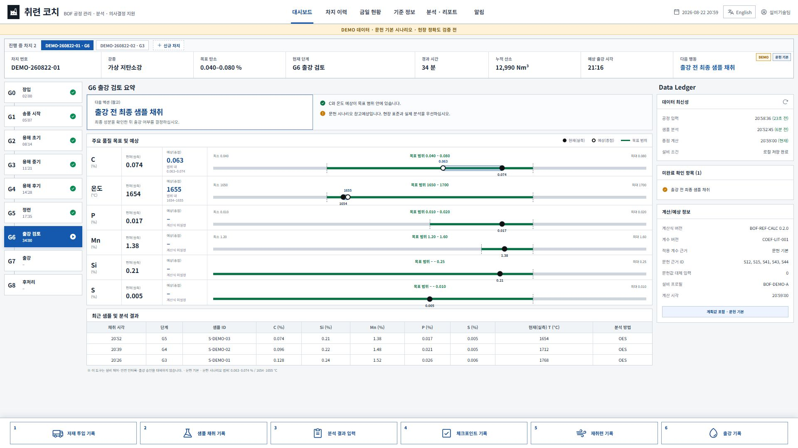
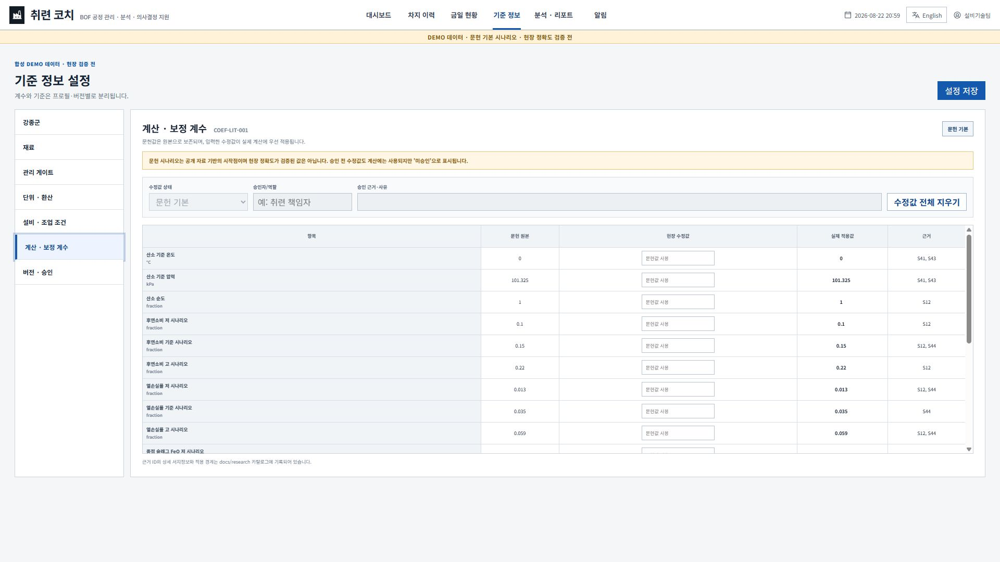
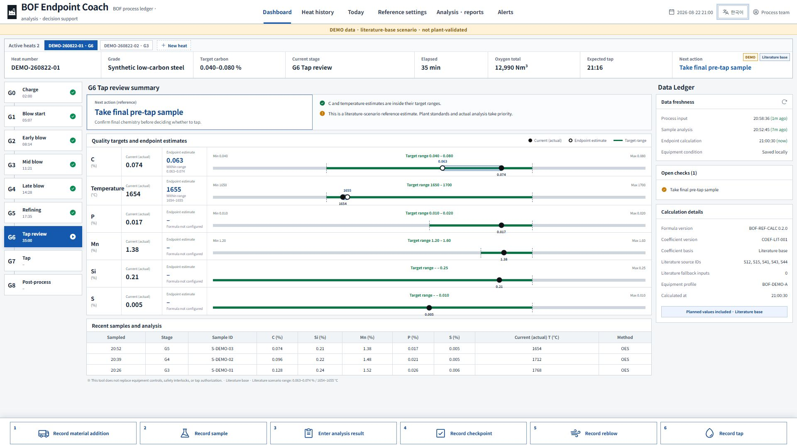

# 취련 코치 · BOF Endpoint Coach

[한국어](#한국어) · [English](#english)

오프라인 공용 PC에서 취련사가 직접 입력한 값으로 **종점 탄소(C)와 온도를 참고 예상**하고, 여러 차지의 공정 이력·샘플·기준·백업을 함께 관리하는 단일 HTML 보조도구입니다.

> **안전·품질 고지:** 현재 소스는 합성 DEMO 차지와 공개 문헌 시나리오를 사용하며 **현장 정확도가 검증되지 않았습니다**. 설비 제어, 안전 인터록, 표준작업, 출강 승인 또는 취련사의 판단을 대체하지 않습니다.



위 화면은 합성 차지의 G6 출강 검토 예시입니다. 검은 점은 최신 실측, 흰 점은 종점 참고 예상, 녹색 구간은 강종 목표 범위입니다. P·Mn·Si·S는 승인된 계산식이 없으므로 실측과 목표만 표시하고 예상값을 만들지 않습니다.

## 한국어

### v0.2.0에서 할 수 있는 것

- C 종점 참고 예상: C·Si·Mn·P·Fe 산화 산소수지와 PCR·슬래그 FeO 문헌 시나리오 계산
- 온도 종점 참고 예상: 원소별 반응열과 용강·슬래그·배가스 엔탈피, 열손실 문헌 시나리오 계산
- 채택 샘플의 당시 누적 산소 스냅샷이 있으면 문헌 모델의 이후 변화량을 실제 C·온도에 더하는 샘플 앵커 계산
- 문헌 원본값을 보존하면서 `현장 승인값 → 사용자 수정값 → 문헌 기본값` 순서로 계산
- 여러 진행 차지를 탭으로 전환하고, G0 신규 차지부터 G7 출강까지 수동 입력
- 자재 투입, 샘플 채취, 분석 결과, 누적 산소·산소 유량·랜스 높이 체크포인트, 재취련, 출강 기록
- 강종을 계속 추가하고 C·온도·P·Mn·Si·S 목표 범위를 직접 설정
- 재료를 추가하고 분류, 기본 단위, C·Si·Mn·P·S·CaO 함량을 관리
- kg·t·g 입력을 kg로 환산해 계산·백업에 보존
- 전로 용량, 취련 방식, 랜스 프로필, 저취 가스, 문헌 원본·수정값·현장 승인 계수 설정
- 브라우저 IndexedDB 자동 저장, SHA-256 무결성 목록이 포함된 UTF-8 CSV ZIP 백업·복원
- 사람이 보는 XLSX 보고서 내보내기
- 한국어·영어 화면 전환

### 바로 사용하기

1. [Releases](https://github.com/fullmetalsonic/bof-endpoint-coach/releases/latest)에서 `BOF_Endpoint_Coach_v0.2.0.html`을 받습니다.
2. 회사 공용 PC의 Edge 또는 Chrome에서 파일을 엽니다. 서버 설치와 인터넷 연결은 필요하지 않습니다.
3. `기준 정보`에서 강종·재료·설비·계수를 검토합니다.
4. 상단 `신규 차지`에서 G0 초기값을 입력합니다.
5. 하단 6개 버튼으로 실제 발생 시각과 값을 계속 기록합니다.
6. 교대·브라우저 초기화 전에 `분석 · 리포트`에서 CSV 백업 ZIP을 저장합니다.

단계별 조작은 [한영 사용 설명서](docs/user-guide.md)에서 확인할 수 있습니다.

초기 공개본은 1280px 이상 데스크톱 화면을 기준으로 설계했습니다. 브라우저 확대/축소는 100%를 권장합니다.

### 화면 설명

| 구역 | 역할 |
| --- | --- |
| 상단 차지 탭·요약 | 동시에 진행 중인 차지를 전환하고 강종, 단계, 경과시간, 산소, 다음 행동을 확인 |
| 좌측 G0~G8 | 장입부터 후처리까지 현재 공정 게이트를 표시 |
| 중앙 다음 행동 | 현재 게이트와 C·온도 예상 상태에 맞춘 확인 항목을 표시 |
| 품질 막대 | 실측·기준 종점 예상·문헌 저/고 시나리오·목표 최소/최대를 같은 축에서 비교 |
| 최근 분석 표 | 채취 시각과 C·Si·Mn·P·S·온도 분석을 확인 |
| 우측 Data Ledger | 입력 최신성, 미완료 확인, 계산식·계수·설비 버전을 표시 |
| 하단 입력 버튼 | 자재·샘플·분석·체크포인트·재취련·출강 이벤트를 기록 |



강종·재료 설정은 계속 추가할 수 있습니다. 코드 중복, 빈 코드, 최소값이 최대값보다 큰 경우에는 저장을 막습니다. 재료 조성은 백업 이력에 보존되지만 합금 수율 계산에는 아직 사용하지 않습니다. `flux` 분류의 투입 중량만 열수지 입력에 반영됩니다.

### 계산 경계

공개 구현의 샘플 앵커 골격은 다음과 같습니다.

```text
C_end = C_sample + C_literature(O_plan) - C_literature(O_sample)
T_end = T_sample + T_literature(O_plan) - T_literature(O_sample)
effective coefficient = site-approved override > user override > literature original
```

- 기준 온도·압력, 화학량론, PCR, 열손실, 종점 슬래그 FeO, 반응열·엔탈피식은 근거 ID와 함께 보존합니다.
- 문헌 저·고값은 통계적 정확도나 신뢰구간이 아닌 조건부 민감도 시나리오입니다.
- 수치 옆에는 계산식 버전, 계수 프로필, 적용 상태, 문헌 근거 ID, 설비 프로필, 실제/계획 입력 사용 여부가 표시됩니다.
- P·Mn·Si·S 종점 예상은 현장별 승인식과 계수가 없어 비활성입니다.
- 과거 이력 자동 학습·자동 재배포·목표 기준 자동 변경은 하지 않습니다. 초기 버전은 과거 차지의 계산 결과도 자동 고정하지 않습니다.
- 현장 적용 전에는 독립 손계산, 가상 차지, 실제 완료 차지 그림자 검증과 현장 승인이 필요합니다.

상세 명세는 [종점 참고 계산식 초안](docs/domain/종점참고계산식_초안.md), [검증·승인 계획](docs/product/종점참고예상_검증및승인계획_초안.md), [국내·해외 공개자료 카탈로그](docs/research/catalog/자료카탈로그_2026-08-22.md)를 참고하십시오.

### 데이터와 보안

- 운영 데이터는 브라우저의 로컬 IndexedDB에만 자동 저장됩니다.
- 복원 기준 파일은 CSV 7종과 `manifest.csv`를 묶은 ZIP이며, 복원 전에 SHA-256을 검증합니다.
- XLSX는 열람·보고용이며 복원 입력으로 사용하지 않습니다.
- 실제 회사 차지, 사내 기준, 개인 정보 또는 기밀 계수를 이 공개 저장소에 커밋하지 마십시오.
- 공개 DEMO 데이터는 모두 합성이며 실제 회사·설비·작업자를 나타내지 않습니다.

자세한 공개 저장소 보안 원칙은 [SECURITY.md](SECURITY.md)에 있습니다.

### 개발과 검증

```powershell
cd app
npm ci
npm run lint
npm run test
npm run build
npm run build:single
npm run test:sites
```

`npm run build:single`은 `app/package.json`의 버전에 맞춰 루트의 `release/BOF_Endpoint_Coach_v0.2.0.html`을 생성합니다.

검증된 v0.2.0 기준:

- ESLint: PASS
- Vitest: 11개 파일, 30개 테스트 PASS
- 일반 Vite 빌드: PASS
- 단일 오프라인 HTML 빌드: PASS
- 오프라인 호스팅/라우팅: 4개 테스트 PASS
- 실제 브라우저 주요 흐름·한영 전환·1920×1080 화면: PASS
- 새 브라우저 세션 콘솔 오류·경고: 0건
- 실제 BOF 종점 예측 정확도: **검증 전**

소스 구조와 결정 이력은 [문서 색인](docs/README.md)과 [누적 이력 관리](docs/governance/누적이력관리.md)에 기록합니다.

## English

BOF Endpoint Coach is a single-file, offline desktop assistant for manual heat logging and **reference endpoint C/temperature estimation**. It supports multiple active heats, G0–G8 event entry, editable grade/material/equipment profiles, unit normalization, local persistence, CSV backup/restore, XLSX reports, and Korean/English UI.



### Important safety boundary

The current source uses synthetic DEMO heats and public-literature scenarios. It is not plant-validated and does not replace equipment control, safety interlocks, standard operating procedures, tap authorization, laboratory results, or operator judgment.

### Quick start

1. Download `BOF_Endpoint_Coach_v0.2.0.html` from the [latest release](https://github.com/fullmetalsonic/bof-endpoint-coach/releases/latest).
2. Open it in Microsoft Edge or Google Chrome on a desktop PC. No server or internet connection is required.
3. Review reference profiles, create a heat, and record actual events with the six bottom action buttons.
4. Export a CSV ZIP backup before browser reset, workstation handover, or shift change.

See the [bilingual user guide](docs/user-guide.md) for the complete operating sequence.

### Current limitations

- Endpoint accuracy has not been validated against plant heats.
- Literature originals are preserved; calculation priority is site-approved override, user override, then literature original. An unapproved override is used but clearly labeled.
- Literature low/high outputs are sensitivity scenarios, not statistically validated confidence intervals.
- Only C and temperature have reference equations. P, Mn, Si, and S predictions remain explicitly unavailable.
- Material composition is retained, but alloy-yield prediction is not implemented.
- There is no PLC, HMI, SCC, MES, or LIMS integration.
- Historical-data correction and model training are not enabled.
- Past-heat calculation outputs are not yet frozen as immutable snapshots when a shared coefficient profile changes.
- The UI targets desktop widths of 1280px or wider.

### Source layout

| Path | Purpose |
| --- | --- |
| `app/src/calculation/` | Endpoint calculation and target-state logic |
| `app/src/components/` | Dashboard, dialogs, action bar, and modular settings editors |
| `app/src/domain/` | Gate guidance and settings consistency rules |
| `app/src/storage/` | IndexedDB and CSV handling |
| `app/src/reports/` | Backup/restore and XLSX report generation |
| `app/src/units/` | Explicit unit normalization |
| `app/tests/` | Calculation, storage, backup, report, i18n, validation, and routing tests |
| `docs/` | Product, domain, UI, research, audit, and governance records |
| `release/` | Public single-file offline build |

## License

[MIT](LICENSE). Public documentation sources retain their original copyrights and licenses; this repository links to them rather than redistributing restricted source documents.
