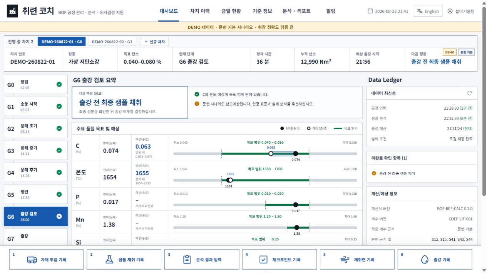
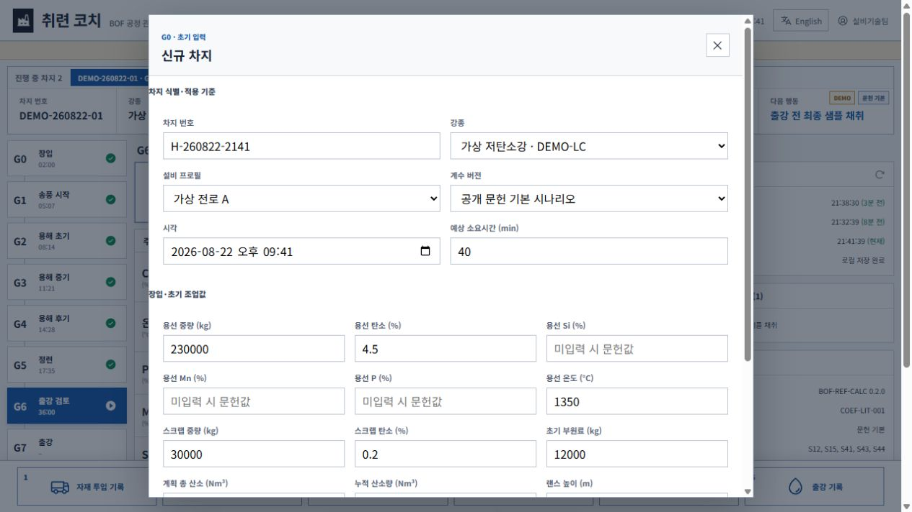
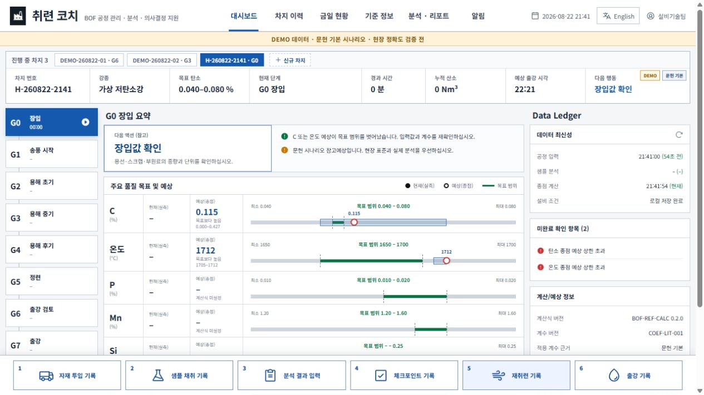
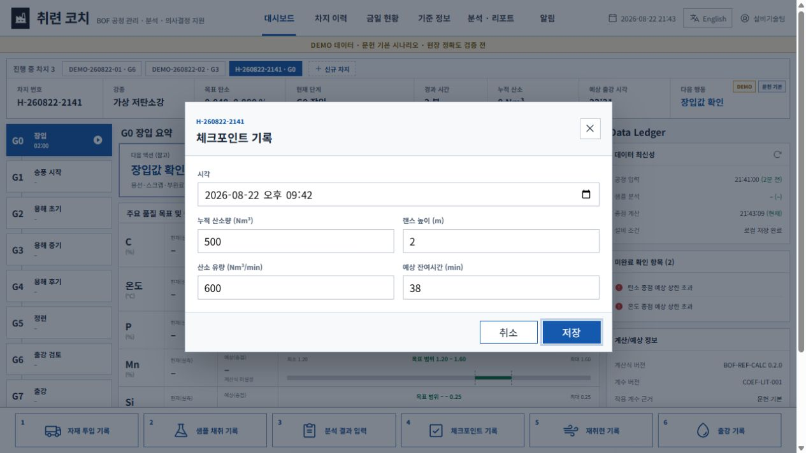
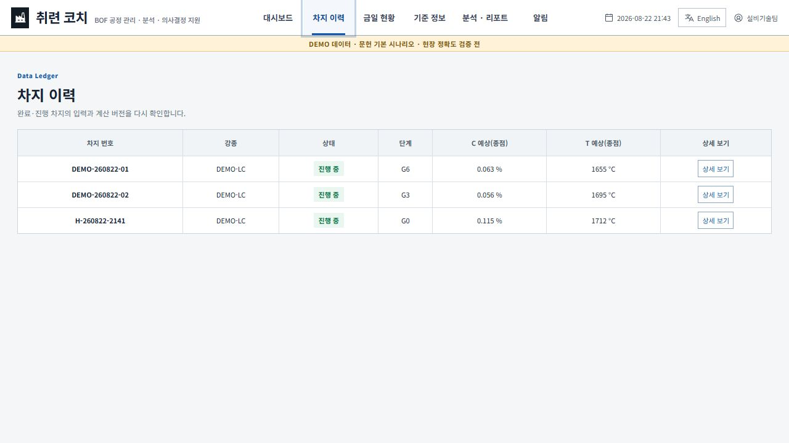
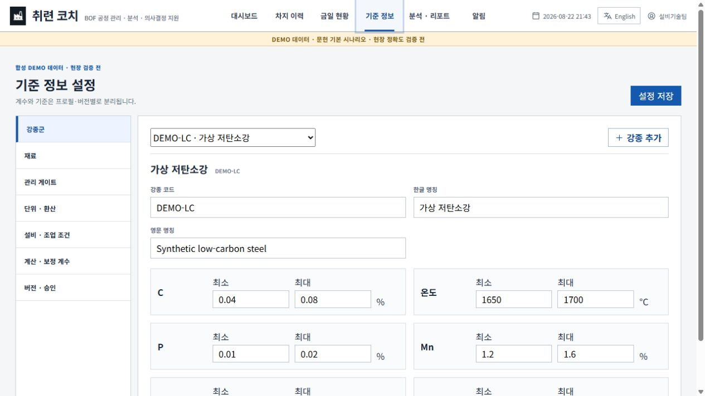
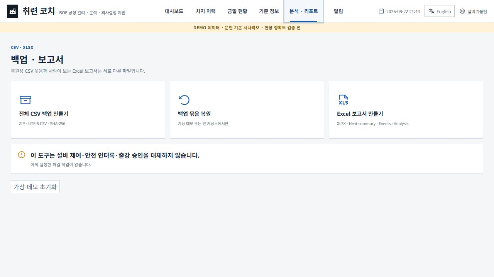
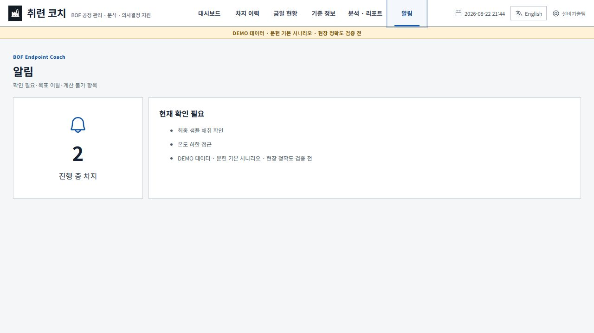

# 취련 코치 v0.2.0 운영 흐름·삭제·고정값 감사

> 후속 상태: 아래 결함의 수정 및 재검증 결과는 [v0.2.1 실사용 흐름 검증](v0.2.1_실사용흐름_검증_2026-08-22.md)에 기록했다. 이 문서는 v0.2.0 당시의 실패 증거로 보존한다.

상태: **FAIL — 수정 전 현장 사용 금지**  
감사일: 2026-08-22  
감사 대상: 공개 v0.2.0 소스의 신규 차지 G0 시작, 이벤트 입력, G0~G8 단계, Data Ledger, 차지·기준정보 생명주기, 초기화, 작업자 표시, 알림  
감사 방법: 새 브라우저 저장소에서 실제 조작 재현, 저장한 화면 재검토, 관련 소스 정적 대조, ESLint·Vitest 재실행

## 결론

현재 v0.2.0은 화면 골격과 C·온도 참고 계산은 존재하지만, 작업자가 한 차지를 G0부터 출강까지 운용하는 제품 흐름은 완성되지 않았다.

- 신규 차지는 G0에서 시작하지만 G1~G6으로 이동시키는 상태 전환 기능이 없다.
- 자재 투입을 제외한 샘플·분석·체크포인트·재취련·출강 저장은 같은 실행 오류로 완료되지 않는다.
- 완료 단계 시각 일부는 실제 기록이 아니라 화면 코드가 만든 가상 문자열이다.
- 기본 DEMO 차지, 고정된 `설비기술팀`, 고정 알림, 장식용 새로고침 아이콘과 임의 입력 기본값이 실제 상태처럼 보인다.
- 차지·강종·재료에 삭제/취소/무효/보관 흐름이 없고, 전체 초기화는 확인 없이 사용자 입력을 지운 뒤 DEMO를 다시 만든다.

따라서 과거 기록의 `브라우저 주요 흐름 PASS`, `CRITICAL/HIGH 0건` 평가는 이번 실제 재현 결과로 **정정되어야 한다**. Lint와 기존 30개 테스트는 통과하지만 핵심 작업 흐름을 검증하지 않아 이 결함들을 잡지 못했다.

## 사용자 목표와 접근성 목표

- 작업자는 여러 차지 중 하나를 선택해 G0 장입부터 G8 후처리까지 실제 발생값을 입력하고, 단계·예상값·누락 항목을 신뢰할 수 있어야 한다.
- 화면의 버튼·아이콘·시간·상태는 실제로 동작하거나 실제 기록에 근거해야 한다.
- 삭제가 필요한 초안·DEMO와 보존해야 하는 실제 운전 이력을 구분하고, 오입력은 이유가 남는 정정/무효 처리로 회복할 수 있어야 한다.
- 아이콘은 버튼인지 상태 표시인지 구분되고, 키보드·보조기술에서도 이름과 현재 상태를 알 수 있어야 한다.

## 실제 흐름 단계

| 단계 | 화면·행동 | 건강도 | 결과 |
| --- | --- | --- | --- |
| 1 | 새 저장소로 대시보드 진입 | FAIL | DEMO 차지 2개가 자동 생성되고 `설비기술팀`이 고정 표시됨 |
| 2 | 신규 차지 입력창 열기 | 위험 | 용선 230,000 kg, C 4.5%, 스크랩 30,000 kg 등 임의 수치가 실제 입력처럼 미리 채워짐 |
| 3 | 기본값으로 차지 시작 | FAIL | G0 장입으로 생성되지만 다음 단계 전환 수단이 없음 |
| 4 | 체크포인트 값 입력 후 저장 | CRITICAL FAIL | 저장 버튼을 눌러도 창이 닫히지 않고 값도 반영되지 않음 |
| 5 | 차지 이력에서 제거·취소 시도 | FAIL | 상세 보기만 있고 삭제·취소·무효·보관 기능이 없음 |
| 6 | 강종·재료·설비 설정 검토 | FAIL | 강종·재료는 추가만 가능하고 삭제/중지 없음. 설비·계수는 사실상 첫 프로필만 편집함 |
| 7 | 가상 데모 초기화 | CRITICAL RISK | 확인·백업·되돌리기 없이 저장소를 지우며, 빈 상태가 아니라 DEMO 2개를 다시 생성함 |
| 8 | 알림 화면 확인 | FAIL | 실제 차지 상태와 무관한 고정 문구가 표시됨 |

## 화면 증거

### 1. 강제 DEMO와 고정 작업자 표시

- 상단 `설비기술팀`은 설정이나 사용자 데이터가 아니라 고정 문구다.
- Data Ledger의 회전 화살표는 버튼이 아니며 실제 새로고침 동작이 없다.

### 2. 실제값처럼 채워진 신규 차지 기본값

- 공개 DEMO 수치가 비어 있는 입력창의 예시가 아니라 제출 가능한 값으로 채워져 있다.
- 사용자가 값을 지우지 않고 차지를 시작하면 임의 수치가 실제 기록처럼 저장된다.

### 3. G0에서 진행 수단 없음

- 다음 행동은 `장입값 확인`이라고 쓰여 있으나 이를 확인하고 G1로 이동시키는 버튼이나 규칙이 없다.
- 하단의 여섯 기록 버튼은 단계와 무관하게 모두 노출된다.

### 4. 체크포인트 저장 실패

- `저장`을 클릭·Enter 입력한 뒤에도 모달이 유지됐고 누적 산소는 0 Nm³, 단계는 G0 그대로였다.
- 원인은 비자재 이벤트에서도 자재 요약문을 미리 만들며 `null.toLocaleString()`을 호출하는 코드다. 브라우저 오류 기록에서도 `TypeError: Cannot read properties of null (reading 'toLocaleString')`를 확인했다.

### 5. 차지 삭제·취소·무효 처리 없음

- DEMO, 잘못 만든 초안, 진행 차지, 완료 차지에 같은 단일 `상세 보기` 동작만 있다.

### 6. 강종·재료 설정이 추가 전용

- 강종과 재료는 계속 늘릴 수 있지만 정리할 수 없다.
- 실제 이력에서 참조한 기준은 삭제보다 중지/보관이 필요하지만, 그 상태도 없다.

### 7. 확인 없는 전체 초기화

- 실제 입력 차지가 있어도 한 번의 클릭으로 지운다.
- 초기화 후 빈 작업공간으로 가지 않고 DEMO 차지 2개를 재생성한다.

### 8. 실제 데이터와 연결되지 않은 알림

- `최종 샘플 채취 확인`, `온도 하한 접근`은 선택 차지나 계산 결과에서 만든 항목이 아니라 고정 문구다.

## 심각도별 발견 사항

### CRITICAL

| ID | 발견 사항 | 근거 | 영향 |
| --- | --- | --- | --- |
| C-01 | 자재 투입 외 5개 이벤트의 저장 경로가 실행 오류로 중단 | `EventModal.jsx`의 모든 요약 문자열 생성 중 비자재 이벤트가 `normalizedAmountKg.toLocaleString()` 호출 | 샘플·분석·체크포인트·재취련·출강 불가 |
| C-02 | G0~G8 상태 전환 모델이 없음 | 신규 차지는 G0, 출강 이벤트만 G7을 직접 지정. G1~G6·G8 전환 코드 없음 | 처음부터 출강까지 진행 불가 |
| C-03 | 완료 게이트 시각이 실제 이벤트가 아닌 산술 문자열 | `ProcessRail.jsx`의 `index * 3 + 2`, `index * 7 % 60` | 가짜 조업 이력이 실제처럼 보임 |
| C-04 | 전체 초기화가 확인 없이 사용자 데이터를 제거 | 초기화 버튼이 바로 IndexedDB 상태 삭제 후 DEMO 재생성 | 복구 불가능한 데이터 손실 |

### HIGH

| ID | 발견 사항 | 영향 |
| --- | --- | --- |
| H-01 | DEMO 차지 자동 생성·개별 삭제 불가·빈 상태 불가 | 실제 작업 시작점과 DEMO가 섞임 |
| H-02 | `설비기술팀` 고정, 작업자 설정과 `recordedBy` 없음 | 누가 입력·수정했는지 추적 불가 |
| H-03 | Data Ledger의 새로고침 아이콘은 장식, `종점 계산 현재`는 15초 로컬 시계 재계산, `설비 조건` 값은 로컬 저장 상태 | 실시간 설비 데이터처럼 오인 가능 |
| H-04 | 차지·이벤트·샘플의 정정/무효/취소/보관/되돌리기 없음 | 오입력 복구와 감사 추적 불가 |
| H-05 | 신규 차지와 이벤트에 임의 수치가 제출 가능 기본값으로 존재 | 잘못된 수치가 실제 기록으로 들어갈 위험 |
| H-06 | 알림·금일 현황의 확인 항목이 고정 문자열 | 실제 위험과 관계없는 안내를 신뢰하게 됨 |
| H-07 | 단계와 무관하게 모든 기록 버튼 노출, 출강은 중간 단계 검증 없이 G7 직접 완료 가능 | 정상 순서를 건너뛰는 조작 가능 |

### MEDIUM

| ID | 발견 사항 | 영향 |
| --- | --- | --- |
| M-01 | 강종·재료는 추가만 가능, 설비·계수는 첫 프로필 중심 편집 | 기준 데이터가 누적되고 프로필 생명주기 관리 불가 |
| M-02 | 복원 가능 여부를 데이터 속성이 아닌 차지 ID의 `DEMO-` 접두어로 판정 | 이름만으로 실제/DEMO를 잘못 분류할 수 있음 |
| M-03 | 샘플 ID 중복을 막지 않고 같은 ID를 추가할 수 있음 | 분석 선택·React 키·CSV 분석 ID 충돌 가능 |
| M-04 | 분석 입력이 별도 분석 시각 대신 샘플 채취 시각을 덮어쓸 수 있음 | 채취·분석 이력 분리 원칙 훼손 |
| M-05 | 기존 30개 테스트에 EventModal 제출·상태 전환·삭제/취소·빈 상태 검증이 없음 | Lint·테스트가 PASS여도 핵심 흐름 회귀를 탐지하지 못함 |

## 확정해야 할 수정 원칙

1. **첫 실행 선택**: `DEMO로 체험`과 `빈 작업 시작`을 분리한다. DEMO 차지는 개별 즉시 삭제할 수 있어야 한다.
2. **작업자 표시명**: 로그인 없이 로컬 작업자 이름을 입력·수정하게 한다. 이름 변경은 과거 기록을 바꾸지 않고 이벤트마다 `recordedBy` 스냅샷을 남긴다.
3. **단계 상태기계**: G0→G1→…→G8의 허용 전환, 단계별 필수 입력, 전환 시각, 되돌림/취소 사유를 데이터로 관리한다.
4. **실제 시각만 표시**: 이벤트가 없으면 `–`를 표시한다. 추정·가상 시각은 실제 이력 영역에 표시하지 않는다.
5. **삭제 정책 분리**: DEMO·미저장 초안은 완전 삭제, 진행 차지는 사유 있는 취소/무효, 완료 차지는 일반 작업자의 완전 삭제 대신 보관/무효 처리로 한다.
6. **Data Ledger 정직성**: 새로고침 기능이 없으면 아이콘을 제거한다. `로컬 저장 상태`, `마지막 입력 시각`, `마지막 계산 시각`을 정확히 이름 붙이고 PLC/HMI 미연동을 명시한다.
7. **입력 기본값 안전화**: 실제 수치 입력은 비워 두거나, 명시적으로 선택한 `DEMO/현장 템플릿에서 불러오기`로만 채운다.
8. **실제 알림 연결**: 모든 진행 차지의 단계·필수값·목표이탈 계산에서 알림을 생성하고 고정 문구를 제거한다.
9. **회귀 테스트 추가**: 여섯 이벤트 저장, G0~G8 전환, 작업자 스냅샷, DEMO 삭제, 차지 취소/무효, 초기화 확인·복구, 빈 상태, 고정 가짜 문구 금지를 브라우저 수준에서 검증한다.

## 검증 결과

| 항목 | 상태 | 결과 |
| --- | --- | --- |
| 새 브라우저 저장소 초기 상태 | FAIL | DEMO 2개 강제 생성, 고정 팀 표시 |
| 신규 차지 생성 | 부분 PASS | 생성은 되지만 임의 기본값과 G0 고착 문제 존재 |
| 자재 투입 저장 | 코드상 가능 | 이번 감사에서는 제출하지 않음 |
| 샘플·분석·체크포인트·재취련·출강 저장 | FAIL | 공통 실행 오류 경로 확인, 체크포인트 실제 재현 |
| G0~G8 단계 진행 | FAIL | 상태 전환 기능 없음 |
| 차지·설정 생명주기 | FAIL | 삭제·취소·무효·보관 미구현 |
| Data Ledger 정합성 | FAIL | 장식 아이콘, 잘못된 라벨, 시계 기반 재계산 표시 |
| 브라우저 오류 기록 | FAIL | 체크포인트 저장 시 `null.toLocaleString()` TypeError 확인 |
| ESLint | PASS | 오류 0건 |
| Vitest | PASS / 불충분 | 11개 파일·30개 테스트 통과, 핵심 UI 흐름 테스트 누락 |
| 실제 BOF 정확도 | 미검증 | 이번 감사 범위 밖, 완료 차지와 현장 승인값 필요 |

## 접근성·검증 한계

- 스크린샷에서 회전 아이콘이 버튼처럼 보이지만 실제 DOM에서는 이름·버튼 역할·키보드 동작이 없다.
- 모달의 포커스 가두기, ESC 닫기, 포커스 복귀, 표의 스크린리더 읽기 순서는 이번 감사에서 완전 검증하지 않았다.
- 캡처는 인앱 브라우저의 1280×720 표면에서 수행했다. 사용자의 1920×1080 모니터 적합성은 별도 반응형 검증이 필요하다.
- 실제 현장 데이터·계수·작업자 개인정보는 사용하지 않았다.
