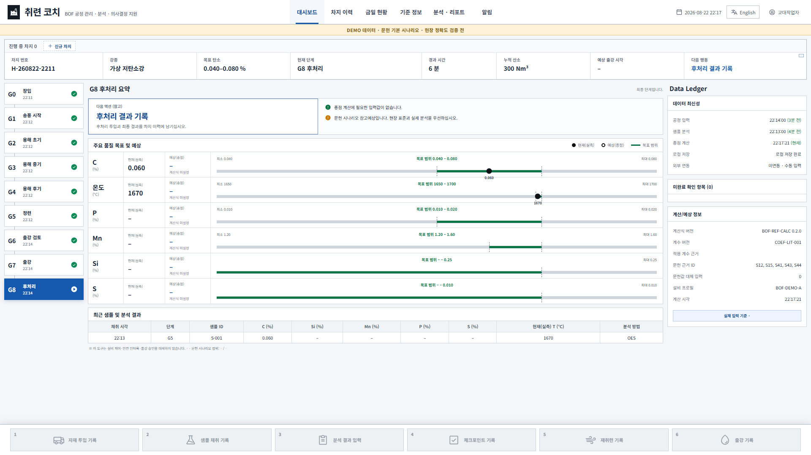

# 취련 코치 v0.2.1 실사용 흐름 검증

검증일: 2026-08-22  
대상: `app` 소스, 개발 서버, 단일 오프라인 HTML  
판정: **초기 수동 입력 흐름 PASS / 실제 BOF 정확도 검증 전**

## 1. v0.2.0 차단 결함 재검증

| 항목 | v0.2.1 결과 | 확인 내용 |
| --- | --- | --- |
| 첫 시작 | PASS | 합성 차지 자동 생성 없음. 작업자 이름 입력 후 빈 작업 또는 DEMO 선택 |
| 고정 소속명 | PASS | `설비기술팀` 제거. 작업자 이름 수정 및 이후 기록자 스냅샷 저장 |
| 신규 차지 기본값 | PASS | 차지 ID·현재 시각·프로필 외 조업 수치는 빈칸, 누적 산소만 중립값 0 |
| G0~G8 진행 | PASS | 실제 시각을 입력하는 수동 전환 9단계 확인 |
| 이벤트 저장 | PASS | 자재·샘플·분석·체크포인트·재취련·출강 6종 자동/브라우저 검증 |
| G5→G6 게이트 | PASS | 채택 샘플에 C·온도가 없으면 차단, 입력 후 해제 |
| 출강·완료 구분 | PASS | G6 출강 이벤트로 G7 `tapped`, G7→G8 전환으로 `completed` |
| G7 후처리 입력 | PASS | 자재·샘플·분석만 허용하고 체크포인트·재취련·중복 출강은 차단 |
| 단계 시각 | PASS | `stageHistory.occurredAt`만 표시. 산술 생성 시각 제거 |
| Data Ledger | PASS | 새로고침 장식 제거, 단계 전환을 최신 공정 입력에 포함, 분석 입력 시각 사용, 로컬 저장과 외부 미연동·수동 입력 분리 표시 |
| 차지 생명주기 | PASS | DEMO/G0 초안 삭제, 진행 취소, 완료/취소 보관 |
| 초기화 | PASS | 선택 확인, 직전 상태 별도 복구 슬롯, 브라우저에서 복구 확인 |
| 정적 화면 | PASS | 금일 현황·알림을 진행 차지와 실제 확인 항목으로 생성 |
| 강종·재료 삭제 | PASS | 미참조 추가 항목 삭제, 참조 중·마지막 항목 삭제 차단 |

## 2. 자동 검증

`app`에서 `npm run check`를 실행했다.

| 검증 | 결과 |
| --- | --- |
| ESLint | PASS |
| Vitest | 14개 파일, 48개 테스트 PASS |
| 일반 Vite 빌드 | PASS |
| 단일 HTML 빌드 | PASS, `release/BOF_Endpoint_Coach_v0.2.1.html` |
| Sites 라우팅 | 4개 테스트 PASS |
| 백업 | 작업자·단계·생명주기·채취/분석 시각·분석 스냅샷 v0.2.0 왕복, v0.1.0 복원 마이그레이션, 무결성·정합성 회귀 PASS |

## 3. 실제 브라우저 검증

Chromium 자동 브라우저에서 새 저장소로 다음 순서를 실제 클릭했다.

```text
작업자 이름 → 빈 작업 → 신규 차지 G0
→ G1 → G2 → G3 → G4 → G5
→ 샘플 채취 → C 0.060%, T 1670°C 분석
→ 체크포인트 → 재취련 300 Nm³
→ G6 → 출강 기록 → G7 → G8 완료
→ 보관 → G0 초안 생성·삭제
→ 작업자 이름 수정 → 빈 초기화 → 직전 상태 복구
```

저장된 상태를 IndexedDB에서 다시 읽어 다음을 확인했다.

- `stage=G8`, `status=completed`, `stageHistory=9`
- 이벤트 종류: `heat_created`, `sample`, `analysis`, `checkpoint`, `reblow`, `tap`
- 마지막 단계 기록자: 입력한 작업자 이름
- 1920×1080에서 `body.scrollWidth=1920`, 가로 넘침 없음
- Vite 오류 오버레이·페이지 오류 없음

서버 없는 단일 HTML을 `file://`로 직접 열고 작업자 이름을 저장한 뒤 새로고침했다. 작업자 이름, 최초 설정 완료 상태, 빈 작업 화면이 IndexedDB에서 복원됐다.



## 4. 남은 검증 경계

- 실제 BOF 완료 차지에 대한 C·온도 예측 정확도는 검증하지 않았다.
- P·Mn·Si·S 종점 계산식은 제공하지 않는다.
- PLC·HMI·SCC·MES·LIMS와 연결하지 않는다.
- Edge는 이번 자동화에서 별도로 실행하지 않았다. Chrome/Chromium 계열 단일 HTML 동작만 확인했다.
- 설비·계수는 초기 공개본에서 기본 프로필 1개를 편집하는 구조이며, 완전한 다중 프로필 생명주기는 후속 범위다.

따라서 v0.2.1은 **수동 기록과 참조 계산을 시험하는 보조 도구 흐름**으로만 사용할 수 있다. 현장 조업 판단과 출강 승인을 맡겨서는 안 된다.
