# v0.3.0 확장 사용성·복구·동시작업 감사

> **후속 상태(2026-08-23):** 이 문서의 P0-A01~A06과 연계 P1 항목은 v0.4.0 후보에서 통합 보강했다. 구현·재현·회귀 결과는 [v0.4.0 통합 운영 저장·사용성 검증](v0.4.0_통합_운영저장_사용성_검증_2026-08-23.md)을 따른다. 아래 내용은 수정 전 발견 증거로 보존한다.

감사일: 2026-08-23  
대상: 취련 코치 v0.3.0 공개본과 현재 `main` 소스  
범위: 앞선 G0→G8 정상 흐름 감사에서 다루지 않은 확대 표시, 키보드·모달 접근성, 입력 중단 복구, 설정 초안, 동시 차지, 복수 창 저장 충돌, 대량 이력 확장성, 저장 실패 경계, 계산 근거 표시  
변경 경계: 이번 작업에서는 제품 코드와 배포본을 수정하지 않았다. 감사 문서와 증거만 추가한다.

## 결론

기존 정상 흐름과 회귀시험은 유지되지만, 공유 PC에서 실제 사용하기 전에 처리해야 할 새 P0가 확인됐다. 가장 큰 문제는 두 개의 HTML 창이 서로의 최신 상태를 모른 채 전체 작업공간을 덮어쓰는 `마지막 저장 우선` 충돌이다. 실제 재현에서 한 창의 작업자명 저장만으로 다른 창에서 만든 최신 차지 1건이 사라졌다.

입력 중인 신규 차지와 기준 설정도 닫기·메뉴 이동 시 경고나 임시 저장 없이 사라진다. 저장소 읽기 실패는 빈 작업공간으로 조용히 전환되고 `저장 완료`로 표시될 수 있으며, 저장 실패는 우측 Ledger에 영문 상태값만 표시된다. 문헌·DEMO 기준을 사용한 사용자 차지의 표시와 설정 버전 갱신도 계산 신뢰 경계를 충분히 드러내지 못한다.

따라서 `동시 창·저장 복구·초안 보존·근거/버전 신뢰 표시`를 다음 보강의 P0 묶음으로, `200% 재배치·접근성·동시 차지 우선순위·대량 이력 탐색`을 P1 묶음으로 관리한다.

## 이번에 새로 적용한 감사 기준

| 기준 | 확인 방법 | 판정 |
| --- | --- | --- |
| 키보드 첫 진입·포커스 가시성 | 첫 실행 모달과 Tab 이동을 화면·DOM으로 확인 | 부분 통과 |
| 125%·150%·200% 상당 확대 | 1920×1080 모니터의 CSS 표시영역을 각각 1536×864, 1280×720, 960×540으로 재현 | 125% 통과, 150% 주의, 200% 실패 |
| 입력 중단·취소 복구 | 신규 차지 값을 입력한 뒤 닫고 다시 열어 값 보존 여부 확인 | 실패 |
| 설정 초안 이탈 복구 | 강종명을 수정하고 저장 전 다른 메뉴로 이동한 뒤 복귀 | 실패 |
| 동시 차지 인지성 | 진행 차지 4~5건의 탭·요약·이력 화면 비교 | 부분 통과 |
| 복수 HTML 창 저장 정합성 | 동일 출처 두 창에서 서로 다른 상태를 만든 뒤 오래된 창 저장·새로고침 | 실패 |
| 저장장치 장애 대응 | IndexedDB 초기 읽기·자동 저장 오류 경로와 회귀시험을 코드 검토 | 실패/시험 없음 |
| 계산 근거·DEMO·버전 신뢰 표시 | 사용자 차지의 기준 프로필, 계산 근거 문구, 설정 저장 버전 경로 확인 | 실패 |
| 대량 이력 확장성 | 차지 이력의 검색·필터·정렬·페이지 처리와 행 정보 확인 | 미구현 |
| 모달·색·글자·조작 크기 접근성 | ARIA 연결, 닫기 이름, focus trap/Escape, 글자 크기·명암·버튼 높이 검토 | 부분 실패 |

## P0 — 다음 수정 묶음에 포함할 항목

| ID | 발견 | 증거 | 완료 기준 |
| --- | --- | --- | --- |
| P0-A01 | 복수 창에서 오래된 전체 상태가 최신 상태를 덮어씀 | 5차지 창과 4차지 창을 병행한 뒤 오래된 창의 작업자명만 저장하자 최신 차지 `STRESS-03` 소실 | 한 창만 쓰기 허용 또는 상태 revision 비교·충돌 경고·보조 창 읽기 전용·충돌 회귀시험 |
| P0-A02 | 저장소 읽기 실패가 빈 작업공간으로 조용히 전환되고 성공 상태가 됨 | `useCoachState`의 초기 `catch`가 `createEmptyState()` 후 `saved` 처리 | 읽기 실패 시 원본 덮어쓰기 금지, 명확한 오류 화면, 재시도·비상 내보내기·복구 슬롯, 장애 시험 |
| P0-A03 | 신규 차지와 설정 초안이 경고 없이 사라짐 | 신규 차지 입력 후 X, 설정 수정 후 메뉴 이동 재현 | dirty 표시, 닫기/이동 확인, 로컬 임시 초안, 저장·버리기·계속 편집 선택, 새로고침 복구 시험 |
| P0-A04 | 저장 실패가 Ledger의 `saving/error` 원문에 머물고 복구 행동이 없음 | `DataLedger`와 저장 effect 코드 | 한글/영문 상태 통일, 화면 상단 지속 경고, 재시도·비상 백업, 저장 성공 전 창 닫기 경고 |
| P0-A05 | 사용자 차지가 DEMO 설비·계수·강종을 써도 차지 탭에 DEMO/문헌 기준 경계가 약하고 `실제 입력 기준`이 강조됨 | `STRESS-*` 차지 대시보드와 계산 정보 | 차지별 `DEMO/문헌/현장 승인` 근거 배지, 입력값과 계수 근거를 분리 표시, 현장 승인 전 안전 문구 유지 |
| P0-A06 | 설정값을 바꿔 저장해도 설정 버전 문자열이 자동 변경되지 않음 | `SettingsScreen.save()`가 현재 `draft.version`을 그대로 저장하며 버전 입력·발행 절차 없음 | 변경 감지 시 새 버전 필수, 변경자·시각·사유·이전 버전 보존, 진행 차지 스냅샷과 새 차지 적용 경계 시험 |

## P1 — P0와 함께 설계하되 후속 구현 가능한 항목

| ID | 발견 | 권장 보강 |
| --- | --- | --- |
| P1-A01 | 150% 상당부터 하단 고정 입력바와 본문이 겹치고, 200% 상당에서는 `body min-width: 1160px` 때문에 우측 Ledger와 헤더가 잘림 | 200%에서 2열/1열 재배치, 하단 바 고정 해제 또는 축약 모드, 가로 스크롤 없이 핵심 작업 완료 |
| P1-A02 | 작업자·단계·차지 생명주기·초기화 모달 일부가 제목과 연결되지 않고 아이콘 닫기 버튼 이름이 없으며 focus trap/Escape가 없음 | 모든 dialog에 제목 연결, 첫/마지막 포커스 순환, Escape 정책, 닫은 뒤 호출 버튼으로 포커스 복귀 |
| P1-A03 | 8~9px 설명 글자와 24~28px 버튼이 많고 `#768496`/흰색 명암비가 약 3.81:1 | 핵심 정보 최소 글자·줄높이 상향, 일반 텍스트 4.5:1 이상, 주요 클릭 영역 40~44px 수준 검토 |
| P1-A04 | 여러 차지 탭에 단계만 있고 최근 활동, 미완료 수, 위험도, 저장 상태가 없음 | 차지별 위험/지연/미완료 수와 최근 입력 시각을 요약하고 우선순위 정렬·고정 제공 |
| P1-A05 | 차지 이력은 전체 행을 그대로 표시하며 검색·상태/강종/기간 필터·정렬·페이지 처리가 없음 | 검색, 필터, 최근 활동/작업자/경고 열, 기본 최근순, 대량 행 성능 시험 |
| P1-A06 | 설정 저장 버튼은 항상 활성화되어 변경 전/후와 저장되지 않은 상태를 구별하기 어려움 | 변경 없음/변경됨/검증 오류/저장 중/저장됨 상태를 버튼과 상단에 명확히 표시 |

## 유지할 강점

- 첫 실행 작업자 입력에 자동 포커스가 있고 일반 Tab 포커스가 시각적으로 보인다.
- 125% 상당에서는 핵심 다음 행동, 진행 차지, Data Ledger가 유지된다.
- 진행 차지 4건 수준에서는 탭 전환과 현재 차지 구분이 깨지지 않는다.
- 기록 완료 알림은 `role=status`, 검증 오류는 `role=alert`를 사용한다.
- 기존 1920×1080 정상 흐름, 단위 환산, G0→G8, 정정·무효·한 단계 복귀, 백업·복원 시험은 유지된다.

## 자동 검증 결과와 새 시험 공백

- 이번 감사 중 `npm run lint`: PASS.
- 이번 감사 중 Vitest: 18개 파일, 91개 테스트 PASS.
- 이번 감사 중 Chromium E2E: `.last-run.json` 기준 PASS, 실패 테스트 0건. 실행 대상은 17개였다.
- 기존 자동시험에 없는 항목: 복수 창 충돌, IndexedDB 읽기/쓰기 실패, dirty form, 200% reflow, 모달 focus trap/Escape, 대량 이력, 색 명암 자동검사.
- 제품 코드는 수정하지 않았으므로 위 실패가 해결됐다는 의미는 아니다.

## 시각 증거

### 1. 첫 실행과 키보드

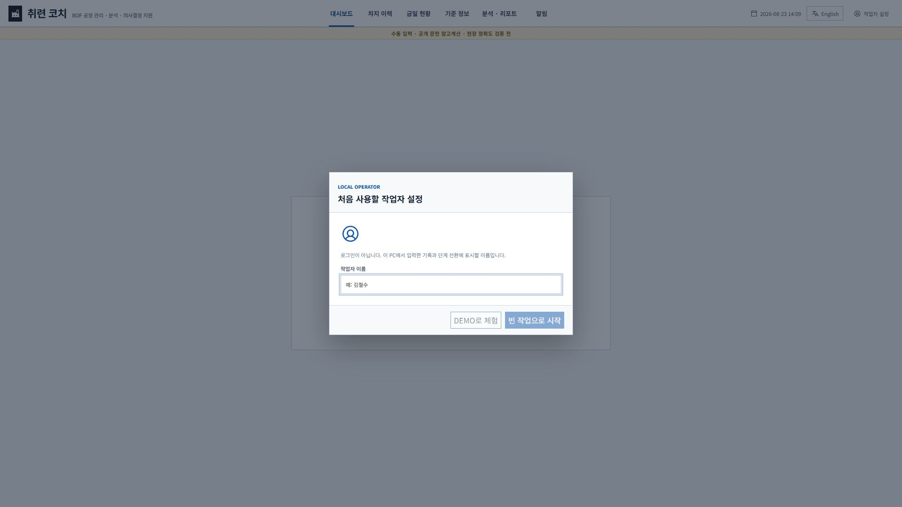

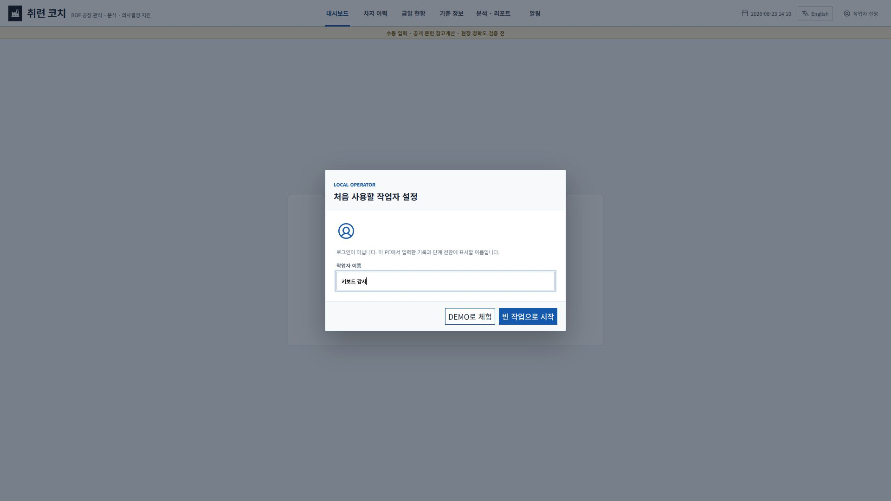

### 2. 확대 표시

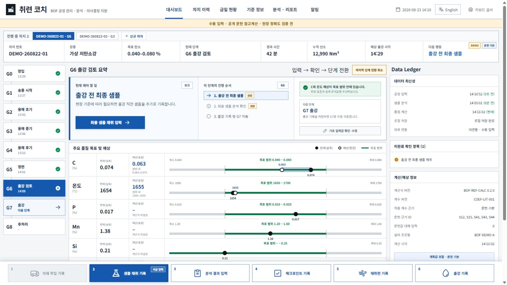

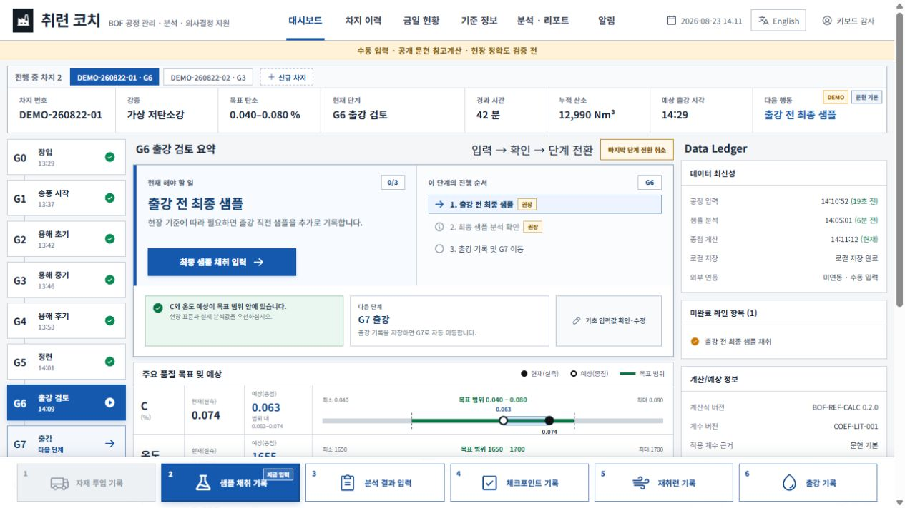

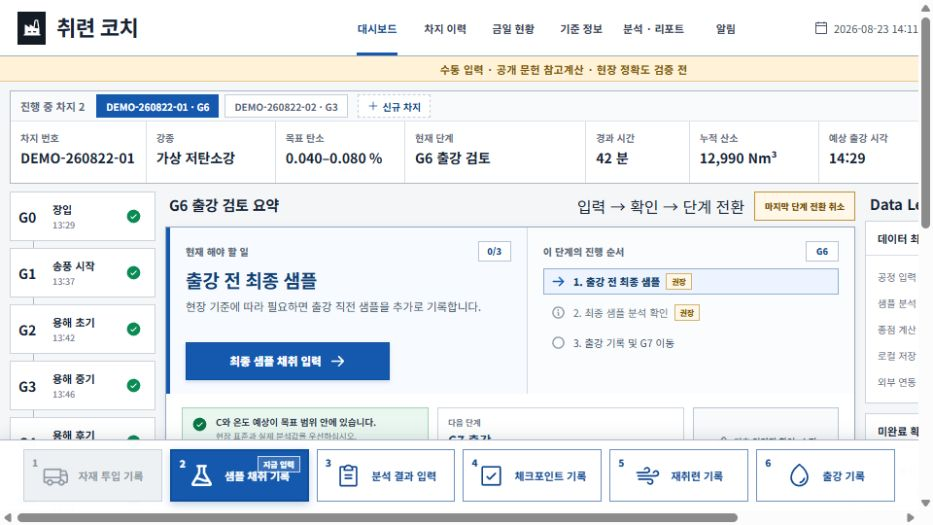

### 3. 입력 중단 복구

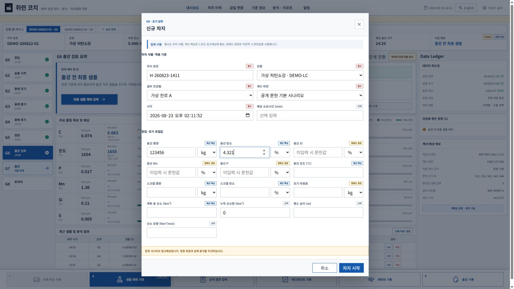

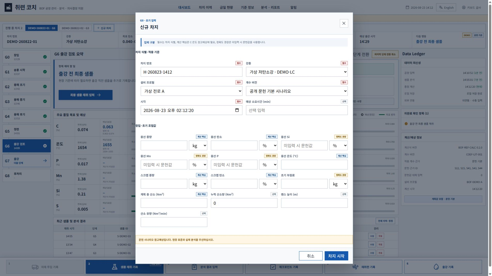

### 4. 동시 차지와 이력

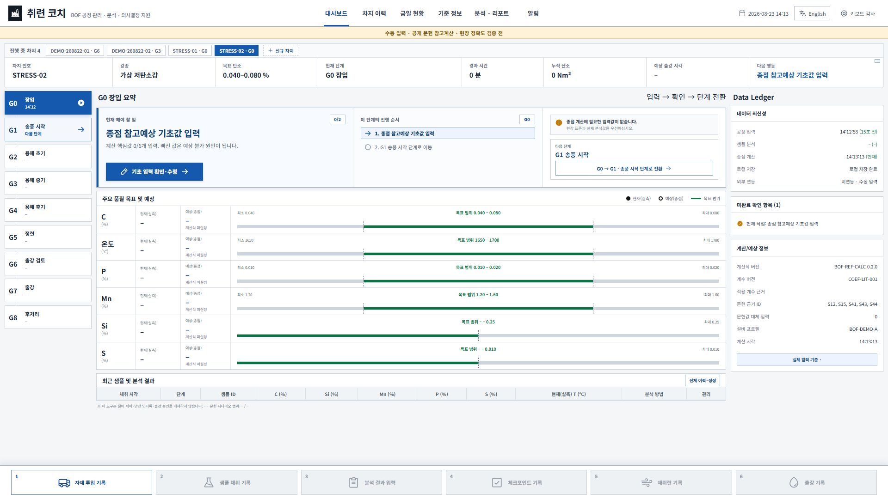

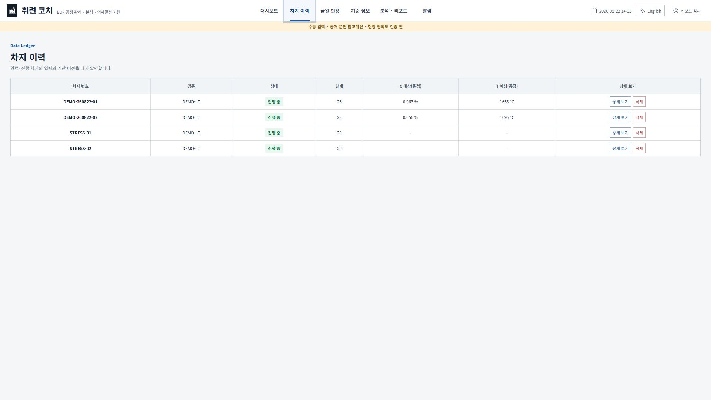

### 5. 복수 창 저장 충돌

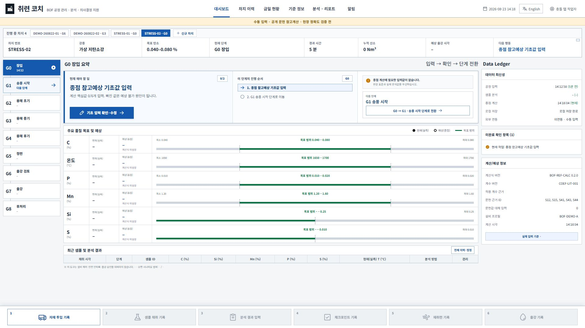

### 6. 설정 초안 이탈

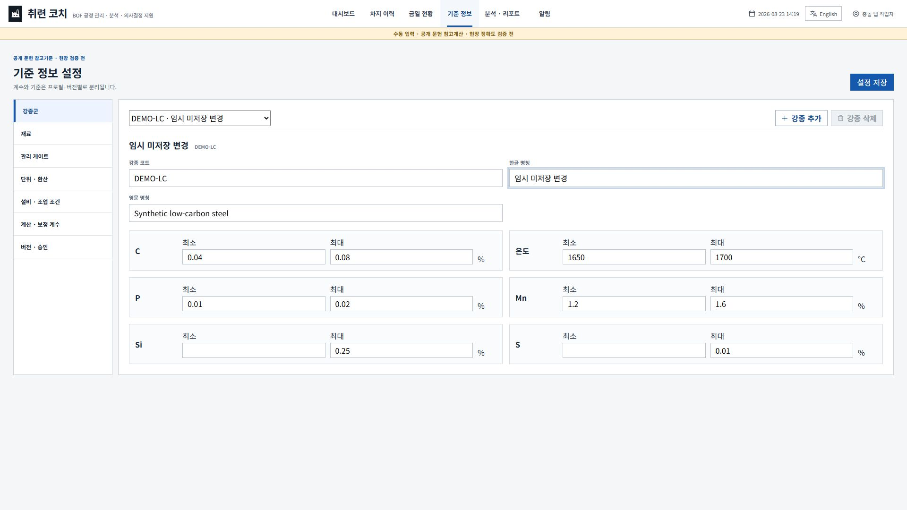

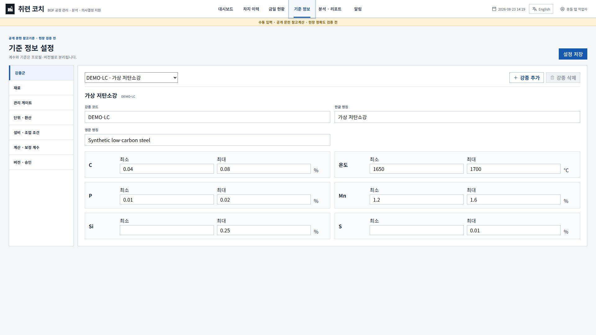

## 화면만으로 완료할 수 없는 감사

- 실제 취련사가 장갑·보호구·공장 조명·소음·거리 조건에서 3~5분 안에 작업을 끝낼 수 있는지
- 회사 PC의 다운로드 차단, 브라우저 데이터 삭제 정책, 계정 전환, 보안 프로그램과 IndexedDB 동작
- 정전·강제 종료·디스크 부족·저장소 quota·브라우저 업데이트 중단 복구
- 실제 완료 차지로 계산 정확도, 경고 적중률, 누락률을 검증하는 그림자 운전
- 실제 화면 낭독기와 고대비 모드에서의 전체 조작

## 다음 구현 묶음

다음 변경은 `운영 저장·신뢰성 보강` 한 묶음으로 계획한다. P0-A01~A06을 먼저 구현하고, 그 설계와 겹치는 P1-A01·A02·A04·A06을 함께 반영한다. P1-A03·A05는 별도 화면 밀도·대량 데이터 묶음으로 나누어도 된다. 구현 전에 변경 파일, 데이터 마이그레이션, 단일 HTML 호환, 새 회귀시험을 구체적으로 정한다.
