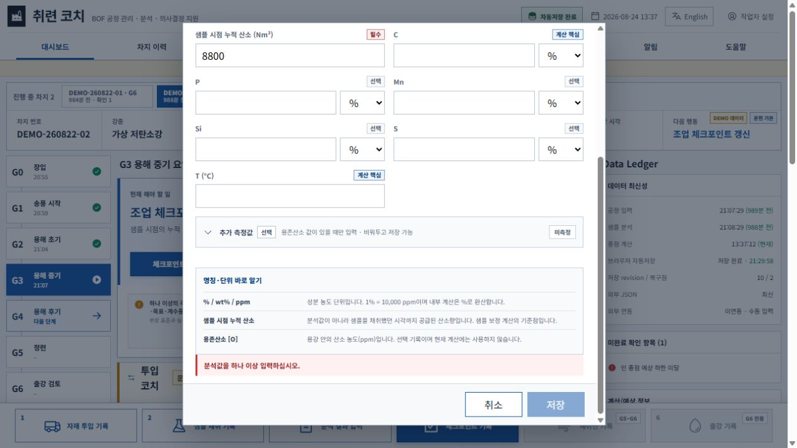
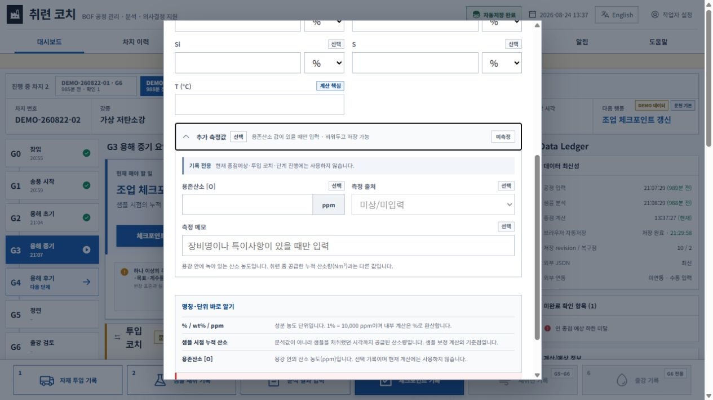
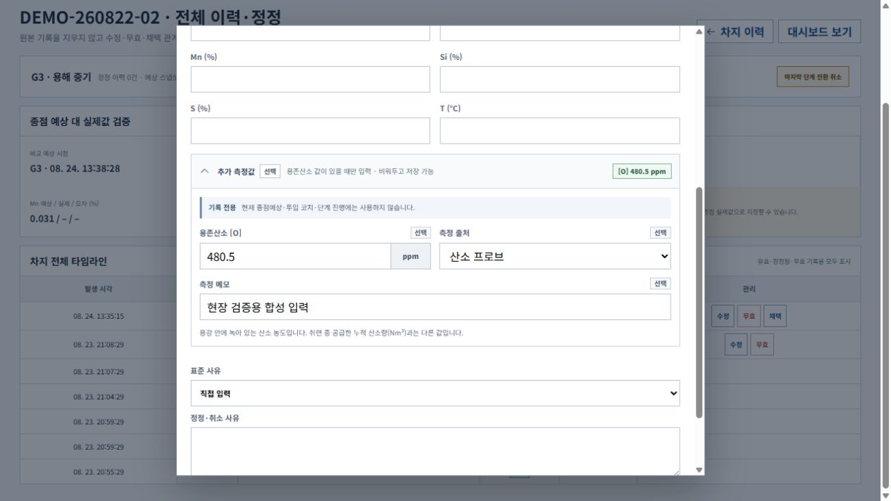

# v0.7.3 선택형 용존산소 기능·UI·UX·데이터·회귀 종합감사

감사일: 2026-08-24  
대상: v0.7.3 로컬 릴리스 후보  
기획 기준: [v0.7.3 선택형 용존산소 기록 기획안](../product/v0.7.3_선택형_용존산소_기록_기획안_2026-08-24.md)

## 1. 판정

- 릴리스 후보 판정: **PASS**
- 미해결 CRITICAL: 0
- 미해결 HIGH: 0
- 미해결 MEDIUM: 0
- 현장 검증으로 남긴 N/A: 실제 회사 PC 정책·관찰거리, 화면낭독기 실사용, 고대비 모드, 실제 BOF 데이터 정확도와 모델 활용성

용존산소 `[O]`는 값이 있을 때만 ppm으로 기록하고, 공란은 `미측정`으로 보존한다. 현재 종점예상·투입 코치·단계 진행·학습계수에는 반영하지 않는다. 기록·정정·IndexedDB·JSON·CSV·Excel 연결과 구버전 호환은 자동시험과 실제 브라우저 흐름에서 확인했다.

## 2. 실제 화면 흐름

### 1단계 — 분석 입력의 접힌 선택 영역: 정상

- `추가 측정값`, `선택`, `비워두고 저장 가능`, `미측정`이 한 줄에 보여 초보자에게 필수값처럼 보이지 않는다.
- 기존 C·P·Mn·Si·S·온도 입력 밀도를 늘리지 않고 기존 전문형 모달 구조를 유지한다.
- 아래 명칭 도움말에서 누적 공급 산소 Nm³와 용존산소 ppm을 분리 설명한다.

### 2단계 — 선택 영역 펼침: 정상

- `기록 전용`과 `현재 종점예상·투입 코치·단계 진행에는 사용하지 않음`을 입력 전에 표시한다.
- 값이 없을 때 출처와 메모는 비활성화되어 불필요한 입력 순서를 만들지 않는다.
- 키보드로 native `details/summary`를 열고 닫을 수 있고, 760px·200% 상당 폭에서는 한 열로 재배치된다.

### 3단계 — 값·출처·메모 입력: 정상

- 값 입력 뒤 상태가 `[O] 480.5 ppm`으로 즉시 바뀐다.
- 출처는 산소 프로브·분석실·기타 중 선택하고 메모는 선택사항이다.
- 공란은 `not_recorded/null`, 숫자 0은 실제 `0 ppm`으로 분리한다. 음수·NaN·무한대·허용하지 않은 출처는 검증에서 거부한다.

### 4단계 — 저장 후 전체 이력: 정상

- O 단독 결과도 별도 분석 기록으로 보존한다.
- O 단독 결과는 기존 C·온도 채택 분석을 자동 교체하지 않고 종점 숫자를 바꾸지 않는다.
- 측정값은 `[O] n ppm`, 구버전·공란 자료는 `용존산소 미측정`으로 읽힌다.

### 5단계 — 기록 정정: 정상

- 기록값이 있는 분석을 수정할 때 선택 영역을 자동으로 펼쳐 기존 값·출처·메모를 바로 확인한다.
- 480→다른 값과 480→공란 정정을 지원하고, 원본·대체 기록·정정 사유를 기존 Correction Ledger 규칙으로 보존한다.
- 초기 실화면 감사에서 기록값이 있어도 정정 영역이 접혀 보이는 문제를 발견했고, 기록값이 있으면 열림 상태가 되도록 수정한 뒤 재캡처·재검증했다.

## 3. 기능·데이터 감사

| 항목 | 결과 | 근거 |
| --- | --- | --- |
| 공란 저장 | PASS | 미측정 상태·null 값·null 출처·null 메모 |
| 단일 O 입력 | PASS | 480.5 ppm, 출처, 메모 이력 저장 |
| O 단독 분석 | PASS | 저장 가능, 기존 채택 분석 유지 |
| 계산 격리 | PASS | C·온도·P·Mn·Si·S·시나리오 결과 불변 시험 |
| 정정·공란 전환 | PASS | 값 변경과 미측정 전환, 정정 로그 보존 |
| JSON 왕복 | PASS | 신규 필드 상태·값·출처·메모 보존 |
| v0.7.2 이하 복원 | PASS | 필드 없음 → 미측정으로 정규화 |
| CSV | PASS | 상태·ppm·출처·메모 4열 |
| Excel | PASS | Analysis 시트에 상태·ppm·출처·메모 |
| 상태 무결성 | PASS | 음수·잘못된 출처·상태 불일치 복원 거부 |
| 다중 차지·자동저장 | PASS | 기존 다중차지·IndexedDB·단일파일 E2E 회귀 |

## 4. UI·UX·접근성 감사

### 확인된 장점

- 필수 입력과 선택 기록을 시각적 밀도와 문구로 분리했다.
- 색에만 의존하지 않고 `미측정`, `[O] n ppm`, `기록 전용` 텍스트를 함께 쓴다.
- 공급 산소와 용존산소의 단위·뜻을 같은 입력 화면에서 대조한다.
- 기존 분석표에 넓은 열을 항상 추가하지 않고 기록값이 있을 때만 분석방법 칸과 전체 이력에 보조 표시한다.

### 수정한 문제

1. 기록값이 있는 정정 화면의 선택 영역이 접혀 보일 수 있었다.
2. v0.7.3 전체 E2E가 요구하는 발표·구두 소개·메일 미리보기 산출물이 처음에는 생성되지 않았다.
3. 두 문제를 각각 열림 상태 규칙과 v0.7.3 문서 원본·생성 경로로 수정하고 전체 시험을 다시 실행했다.

### 증거 한계

- DOM 이름, native summary, 키보드 닫기와 폭별 배치는 확인했지만 실제 화면낭독기 음성 순서와 고대비 Windows 테마는 이번 장비에서 확인하지 않았다.
- 스크린샷은 약 1264×708 인앱 브라우저이고, 1920×1080·1280·760·200% 상당 폭은 Playwright 자동조작으로 확인했다.
- 실제 회사 공용 PC의 보안정책, 브라우저 정책, 배율, 관찰거리와 작업자의 입력시간은 현장 시험 항목이다.

## 5. 자동 검증

| 검증 | 결과 |
| --- | --- |
| ESLint | PASS |
| Vitest | 36파일·182시험 PASS |
| 일반 Vite·Sites·단일 HTML 빌드 | PASS |
| Sites worker | 4시험 PASS |
| Chromium | 31/31 PASS |
| 설치형 Chrome | 31/31 PASS |
| 설치형 Edge | 31/31 PASS |
| 1920·1280·760px, 200% 상당 폭 | PASS |
| 오프라인 단일 HTML·새로고침·다중 창 충돌 | PASS |
| 사용자·상세·발표·구두·README·메일 미리보기 HTML | PASS |
| `npm audit --audit-level=moderate` | 알려진 취약점 0 |
| 추적 소스 비밀정보 패턴 | 0건 |
| 실행 HTML 외부 HTTP(S) src/href | 0건 |
| `git diff --check` | PASS |

## 6. 안전 경계

- 공개 DEMO 값은 합성이며 회사·설비·작업자를 나타내지 않는다.
- 용존산소는 현재 기록 전용이다. 현장 승인식과 실제 분포 없이 종점·투입 계산에 넣지 않는다.
- 이 기능은 실험실 분석, 표준작업, 인터록, 출강 승인과 취련사의 판단을 대체하지 않는다.
- 실제 데이터, 사내 기준, 현장 계수, 개인정보와 복구카드 사본은 공개 저장소에 커밋하지 않는다.

## 7. 최종 결론

v0.7.3은 기존 흐름을 복잡하게 만들지 않으면서 용존산소 자료를 잃지 않고 축적하는 선택형 기록층으로 구현됐다. 자동검증과 실제 화면 감사에서 발견한 두 회귀를 수정한 뒤 재시험했고, 공개 배포를 막는 미해결 CRITICAL/HIGH/MEDIUM은 없다. 실제 회사 PC와 실제 차지에서의 업무성·정확도는 별도 그림자 운전으로 검증해야 한다.
