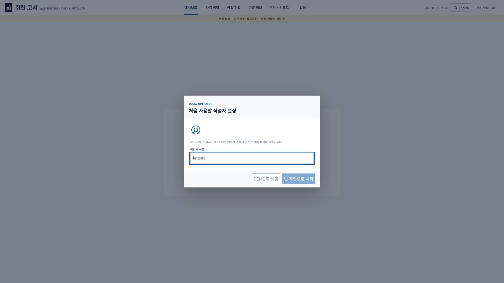
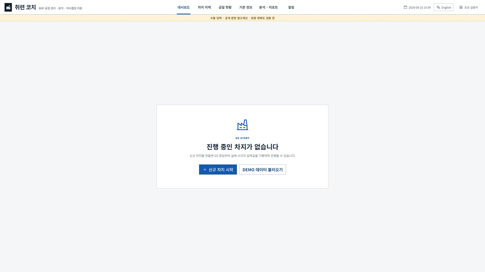
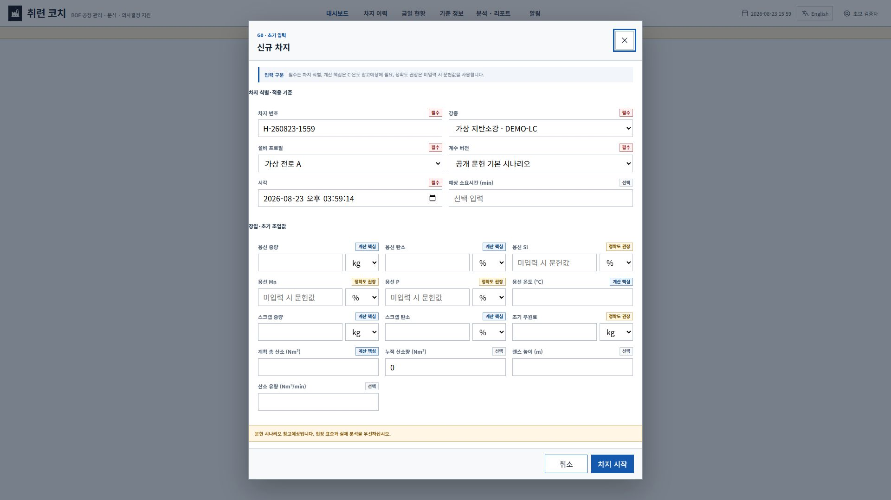
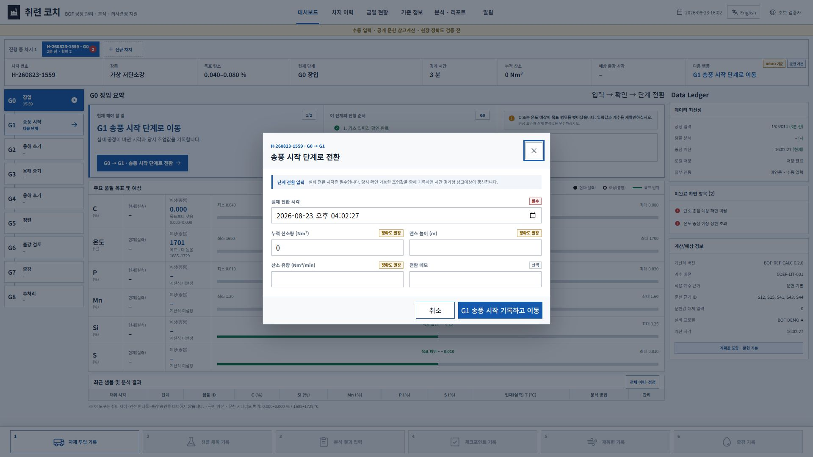
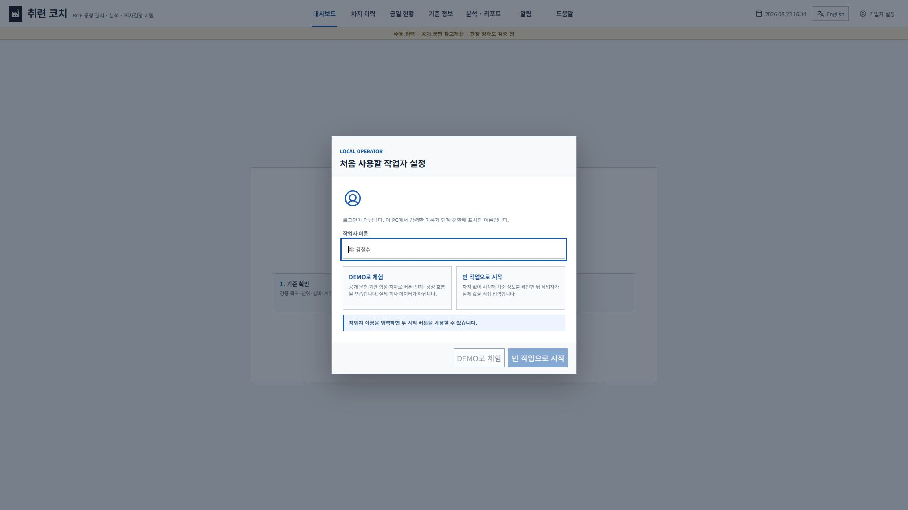
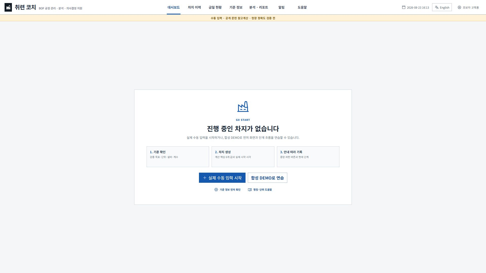
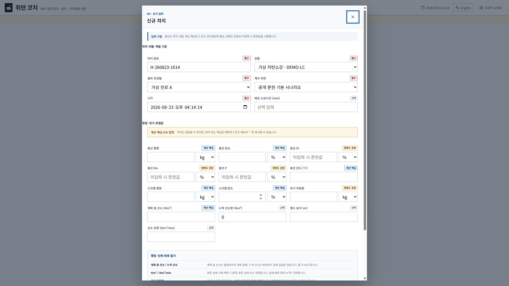
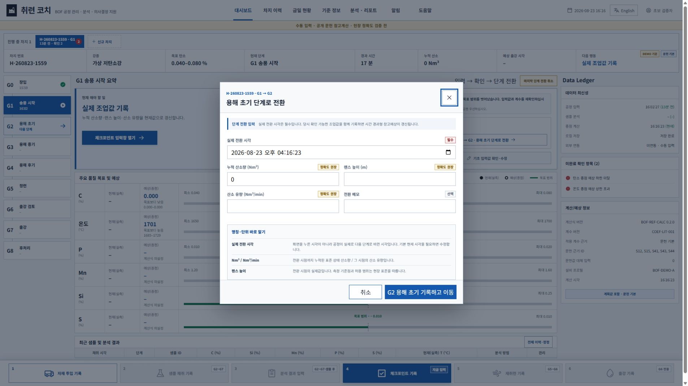
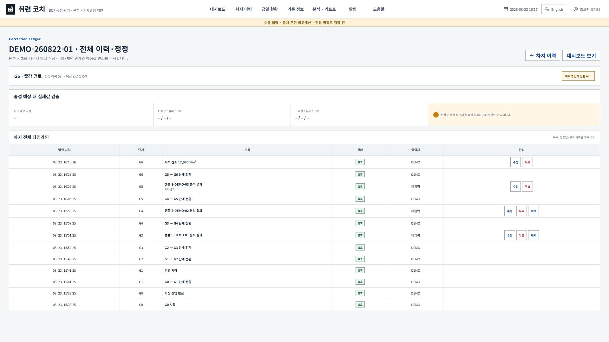
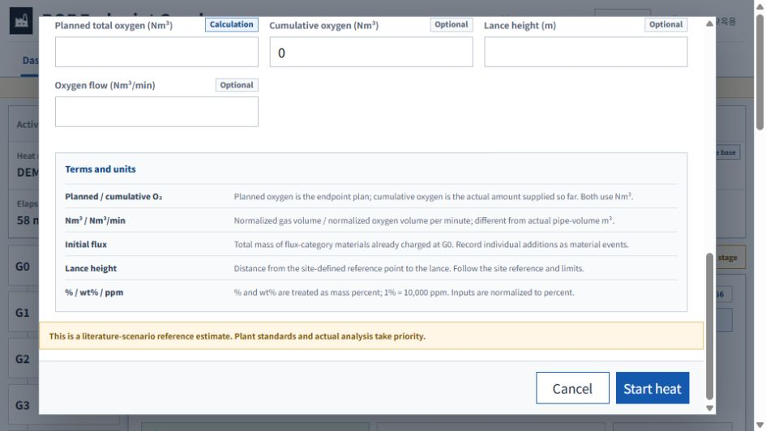

# 취련 코치 v0.4.0 초보자 학습성 감사

- 감사일: 2026-08-23
- 대상: 오프라인 단일 HTML 초기 공개본 후보
- 기준 화면: 1920×1080, 한국어, Edge/Chrome 계열 브라우저 동작
- 방법: 처음 보는 작업자를 가정한 인지적 워크스루, 현재 실행 화면 DOM·스크린샷 확인, 컴포넌트·회귀 테스트
- 제한: 실제 취련사 또는 완전 초보 참여자를 관찰한 사용성 시험은 아직 수행하지 않았다. 따라서 이 문서의 PASS는 `전문가 워크스루 기준 잠정 PASS`이며 현장 학습시간을 확정하지 않는다.

## 1. 감사 과업과 수용 기준

| 번호 | 초보자 과업 | 수용 기준 |
| --- | --- | --- |
| L01 | 첫 실행에서 작업자 이름의 목적 이해 | 로그인과 구분되고 기록에 남는 이름임을 화면에서 확인 |
| L02 | DEMO와 빈 작업 중 선택 | 두 모드의 데이터 성격과 다음 행동 차이가 선택 전에 보임 |
| L03 | 빈 화면에서 시작점 찾기 | 기준 확인, 신규 차지, 도움말이 첫 화면에서 직접 보임 |
| L04 | 신규 차지로 종점 참고예상 준비 | 계산 핵심 6개 값, 부족 시 결과 영향, 단위 의미를 확인 가능 |
| L05 | 현재 단계에서 다음 조작 찾기 | 중앙 현재 행동과 하단 권장 버튼이 일치 |
| L06 | 비활성 버튼 이유 이해 | 잠긴 버튼에 사용 가능 단계·추가 조건이 직접 표시 |
| L07 | 샘플·분석·체크포인트 용어 이해 | 샘플 ID, 샘플 시점 산소, Nm³, 랜스, 잔여시간 설명 제공 |
| L08 | 목표·실측·예상 구분 | 마커·색·계산식 미설정의 의미를 도움말과 설명서에서 확인 |
| L09 | 잘못 입력한 기록 정정 | 수정·무효·한 단계 복귀·출강 정정의 선택 기준 확인 |
| L10 | 백업과 Excel 구분 | 복원용 CSV ZIP과 열람용 XLSX가 다른 파일임을 화면에서 확인 |
| L11 | 설정의 영향 범위 이해 | 강종·재료·단위·설비·계수·버전의 의미와 단위를 설명서에서 확인 |

## 2. 수정 전 확인 결과

### 화면 1 — 첫 실행

- [HIGH] `DEMO로 체험`과 `빈 작업으로 시작`의 데이터 성격·후속 절차가 선택 전에 설명되지 않았다.
- [MEDIUM] 이름이 비어 두 버튼이 잠겨도 잠긴 이유를 직접 설명하지 않았다.

### 화면 2 — 빈 작업공간

- [HIGH] 신규 차지와 DEMO 버튼만 있어 `기준 정보 확인 → 차지 생성 → 안내 따라 기록`이라는 최초 학습 순서가 보이지 않았다.
- [MEDIUM] 넓은 빈 공간에 비해 초보자가 사용할 설명과 지원 경로가 부족했다.

### 화면 3 — 신규 차지

- [HIGH] `계획 총 산소`와 `누적 산소`, `Nm³`와 `Nm³/min`, 랜스 높이 기준점의 차이가 화면에서 설명되지 않았다.
- [HIGH] 계산 핵심값을 비워도 기록용 차지를 만들 수 있지만 C·온도 예상이 `–`가 될 수 있다는 영향이 저장 전에 보이지 않았다.
- [MEDIUM] `초기 부원료`가 재료별 투입인지 합계인지 불명확했다.

### 화면 4 — 단계 전환·하단 작업

- [HIGH] 회색 하단 버튼이 언제 활성화되는지 보이지 않았다.
- [MEDIUM] 단계 전환 시각이 버튼 클릭 시각이 아니라 실제 공정 전환 시각이라는 설명이 충분히 구체적이지 않았다.

## 3. 반영한 보완

| 문제 | 반영 내용 | 관련 화면·파일 |
| --- | --- | --- |
| 첫 실행 선택지 불명확 | DEMO는 합성 연습, 빈 작업은 실제 수동 입력 준비라는 설명과 이름 필수 상태 추가 | `OperatorModal.jsx` |
| 빈 화면 시작점 부족 | 기준 확인→차지 생성→중앙 안내의 3단계, 기준 정보·도움말 직접 버튼 추가 | `EmptyDashboard.jsx` |
| 용어·단위 오해 | 상시 `도움말` 화면과 입력창별 `명칭·단위 바로 알기` 추가 | `HelpScreen.jsx`, `TermHelp.jsx` |
| 계산 준비 상태 불명확 | 신규 차지에 계산 핵심 `n/6`과 부족 시 예상 `–` 가능 경고 추가 | `HeatModal.jsx` |
| 비활성 버튼 이유 없음 | 하단 버튼에 `G2~G7`, `G2~G7·샘플 후`, `G6 전용` 등 직접 표시 | `ActionBar.jsx` |
| 화면별 설명서 부족 | 1920×1080 회사 PC 화면에서 26개 세부화면을 캡처하고 항목·단위·주의사항 설명서 작성 | `docs/manual`, `release` |

## 4. 수정 후 재감사

### 화면 1 — 첫 실행 선택

- L01 PASS: 로그인 계정이 아니라 기록·단계 전환에 남는 표시 이름임을 확인할 수 있다.
- L02 PASS: DEMO와 빈 작업의 데이터 성격과 다음 행동이 선택 전에 보인다.

### 화면 2 — 빈 작업 시작

- L03 PASS: 기준 확인, 실제 수동 입력, 합성 연습과 단위 도움말이 첫 화면에서 직접 보인다.

### 화면 3 — 도움말

- L07 PASS: 차지, 계획/누적 산소, 랜스, 채택 분석, 종점 실제값과 Data Ledger 정의를 한 화면에서 찾을 수 있다.
- L08 PASS: 녹색·주황·빨강, 회색 버튼, 검은·흰 점과 계산 경계를 구분한다.

### 화면 4 — 신규 차지

- L04 PASS: 계산 핵심 6개 값의 충족도를 저장 전에 확인한다.
- L04 PASS: 부족해도 차지는 만들 수 있으나 C·온도 예상이 `–`가 될 수 있음을 직접 경고한다.

### 화면 5 — 대시보드

- L05 PASS: 중앙 현재 행동과 같은 하단 버튼에 `지금 입력`이 표시된다.
- L06 PASS: 잠긴 버튼에 사용 가능 단계 또는 샘플 선행 조건이 직접 표시된다.

### 화면 6 — 단계·체크포인트

- L07 PASS: 실제 전환 시각, Nm³, Nm³/min, 랜스 기준점, min의 뜻을 입력창에서 바로 확인한다.

### 화면 7 — 정정 이력

- L09 PASS: 원본 보존, 채택, 수정·무효, 한 단계 복귀 경로가 유지되고 세부 설명서에 상황별 선택 기준이 있다.

### 화면 8 — 200% 상당 확대의 신규 차지

- 960×540 논리 화면에서 페이지 가로 넘침은 없고, 신규 차지 입력창은 내부 세로 스크롤로 `명칭과 단위`와 `차지 시작` 버튼까지 접근할 수 있다.
- 화면 확대는 학습성 UI의 회귀 확인이며 실제 회사 PC 적합성 판정을 대신하지 않는다.

## 5. 자동검증

| 검증 | 결과 |
| --- | --- |
| ESLint | PASS |
| Vitest | PASS, 20개 파일 99개 테스트 |
| 신규 학습성 컴포넌트 테스트 | PASS, 첫 실행·빈 작업·계산 핵심·비활성 이유·도움말 |
| 1920×1080 실제 브라우저 DOM·화면 확인 | PASS |
| 영문 도움말 정의 | PASS, 단계 목적·명칭·단위가 일반 문구가 아닌 실제 영문 정의로 표시됨 |
| 200% 상당 960×540 재배치 | PASS, 가로 넘침 없음·입력창 하단 주 버튼 접근 가능 |
| 상세 설명서 화면 캡처 | PASS, 26개. 1920×1080 전체 화면 18개와 브라우저 내용 영역 1905×1072 캡처 8개 |
| 이미지 포함 HTML 설명서 | PASS, PNG 26개 내장·외부 스크립트 0·깨진 이미지 링크 0 |
| 실제 초보자 관찰 시험 | 미실시, 회사 PC 적합성·모의조업 단계와 함께 수행 필요 |

## 6. 잠정 결론과 다음 검증

초보자가 첫 행동과 주요 용어를 화면만으로 찾는 경로는 보완되었다. 전문가 인지적 워크스루 기준 L01~L11은 잠정 PASS다. 다만 실제 학습성 완료 판정에는 아래 현장 관찰이 남아 있다.

1. 설명 없이 처음 실행한 참여자가 5분 안에 DEMO와 빈 작업 차이를 말할 수 있는지 확인한다.
2. 10분 안에 DEMO 차지 전환, 체크포인트, 샘플, 분석 입력창을 찾아 취소까지 수행하는지 측정한다.
3. 계획 총 산소와 누적 산소, Nm³와 Nm³/min을 자기 말로 구분하게 한다.
4. 비활성 출강 버튼을 보고 G6 전용임을 별도 질문 없이 알아내는지 확인한다.
5. CSV ZIP은 복원, XLSX는 열람용이라고 구분하는지 확인한다.
6. 오입력 상황을 제시하고 단계 복귀 대신 과거 기록 정정을 선택하는지 확인한다.

실제 참여자 시험에서 80% 이상이 힌트 없이 핵심 과업을 완료하고, 안전 경계를 잘못 설명한 참여자가 0명일 때 초보자 학습성을 최종 PASS로 전환한다.
