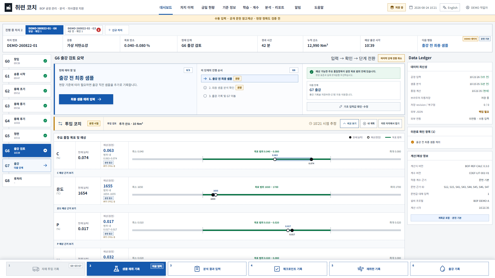
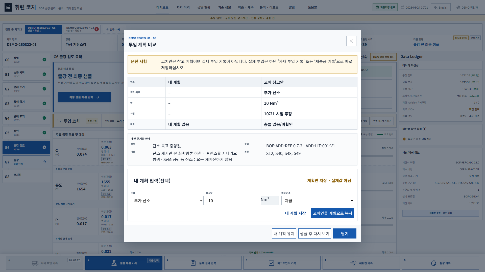
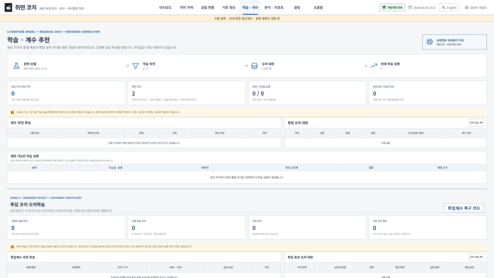
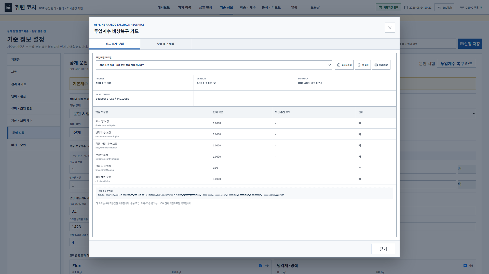
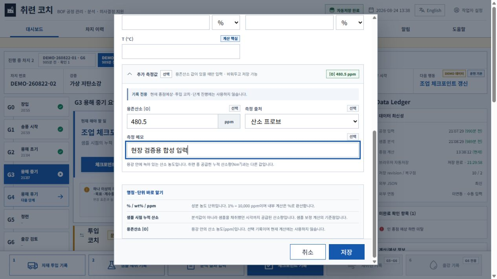
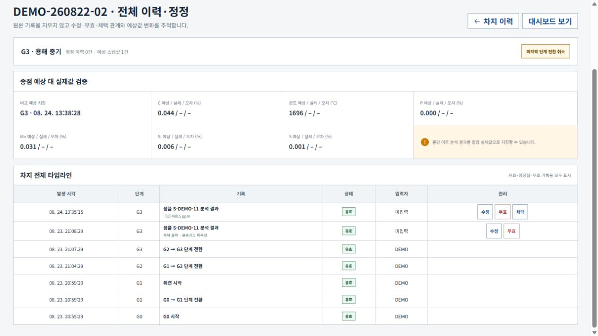
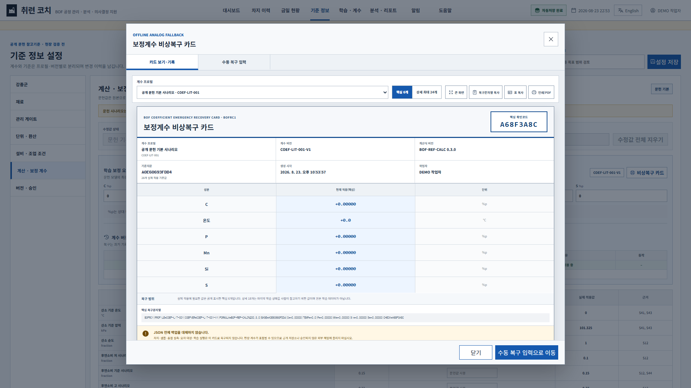

# 취련 코치 v0.7.3 발표용 설명서

대상: 취련사, 현장 관리자, 설비·공정·품질 담당자, 시스템 제안 검토자  
권장 발표시간: 10~15분  
발표 목적: 취련 코치가 무엇을 해결하고, 어떤 자료로 어떻게 동작하며, 현재 어디까지 검증되었는지를 과장 없이 설명한다.

> **발표에서 반드시 유지할 경계:** 취련 코치는 PLC·HMI·SCC와 연결된 자동제어 시스템이 아니다. 공개 문헌과 수동 입력으로 시작하는 오프라인 종점 참고예상 보조도구이며, 실제 BOF 정확도와 사업소 적합성은 완료 차지 그림자 운전으로 검증해야 한다.

## 발표 1. 한 문장 소개

### 화면에 보여줄 핵심 문구

> 작업자가 조업·샘플·종점·실제 투입을 직접 입력하면, C·온도·P·Mn·Si·S 종점과 부원료·냉각재·합금·추가 산소의 양·시점을 참고 계산하고, 사용할수록 사업소·설비 특성에 맞는 두 종류의 보정계수를 제안하는 오프라인 학습형 취련 보조도구

### 발표 대본

안녕하세요. 지금부터 소개할 도구는 **취련 코치, BOF Endpoint Coach**입니다.

취련 코치는 전로를 직접 제어하는 자동화 시스템이 아닙니다. 취련사가 조업 중 확인한 값들을 직접 입력하면 현재 차지의 종점 성분과 온도뿐 아니라 필요한 투입량과 시점도 선택적으로 비교하고, 실제 결과가 쌓일수록 해당 사업소와 설비 특성에 맞는 종점계수·투입계수 후보를 만드는 **설명 가능한 오프라인 학습형 조업 보조도구**입니다.

## 발표 2. 왜 필요한가

### 화면에 보여줄 핵심 문구

- 장입·산소·랜스·부원료·샘플·재취련·출강 정보가 시간에 따라 계속 변한다.
- 중간 분석이 들어올 때마다 종점 상태를 다시 판단해야 한다.
- 경험과 판단의 근거가 여러 화면·메모·사람에게 흩어지면 다음 차지 개선자료로 남기 어렵다.

### 발표 대본

취련사는 장입부터 출강까지 용선과 스크랩의 양과 성분, 산소 누적량과 유량, 랜스 높이, 부원료 투입, 중간 샘플, 재취련 여부와 목표 성분을 동시에 판단합니다.

문제는 이 정보가 계속 바뀌며, 중간 샘플이 들어오면 종점 상태를 다시 판단해야 한다는 점입니다. 또한 한 차지에서 예상이 빗나간 이유가 다음 차지의 체계적인 보정자료로 남지 못하면 같은 편향이 반복될 수 있습니다.

취련 코치는 이 정보를 차지별 시간순으로 묶고, 현재 예상과 실제 결과의 차이를 다음 보정 검토자료로 연결합니다.

## 발표 3. 전체 화면과 여러 차지 관리


### 화면에서 짚을 위치

| 위치 | 설명할 내용 |
| --- | --- |
| 상단 차지 탭 | 여러 진행 차지를 클릭해 전환하며 각 차지 데이터는 분리 |
| 좌측 G0~G8 | 장입부터 후처리까지 현재 공정 단계와 실제 전환시각 |
| 중앙 현재 해야 할 일 | 지금 필요한 입력과 한 개의 주 행동 버튼 |
| 품질 막대 | 최신 실측·종점 참고예상·목표 범위·문헌 시나리오 비교 |
| Data Ledger | 입력·분석·계산·자동저장의 최신성 |
| 하단 6개 버튼 | 자재·샘플·분석·체크포인트·재취련·출강 실제 기록 |

### 발표 대본

화면 상단에서는 여러 진행 차지를 탭으로 전환합니다. 차지마다 현재 단계, 조업값, 샘플, 예상값과 정정이 독립적으로 저장되므로 차지 A와 B의 데이터가 섞이지 않습니다.

좌측에는 G0 장입부터 G8 후처리까지 공정 단계가 있고, 중앙에는 지금 무엇을 입력해야 하는지 큰 주 행동으로 표시됩니다. 화면 하단의 여섯 입력 버튼은 실제로 발생한 자재 투입, 샘플, 분석, 체크포인트, 재취련과 출강을 기록합니다.

## 발표 4. 처음부터 출강까지 어떻게 동작하는가

### 동작 흐름

```text
강종·재료·설비·계수 기준 확인
              ↓
신규 차지와 G0 장입값 입력
              ↓
산소·랜스·자재·샘플·분석을 실제 시각으로 기록
              ↓
입력마다 6성분 종점 참고예상 재계산
              ↓
출강 전 예상 스냅샷 저장
              ↓
출강 후 확정 종점 분석 지정
              ↓
실제값과 예상값의 오차 누적
              ↓
같은 조건의 반복 편향으로 계수 후보 생성
```

### 발표 대본

첫 사용 전에 강종 목표, 재료 조성, 설비 프로필과 계수 기준을 확인합니다. 신규 차지에서는 용선·스크랩 질량과 성분, 초기 온도, 계획 산소 같은 G0 값을 입력합니다.

조업 중에는 실제 발생시각과 함께 산소 누적량, 랜스, 자재, 샘플과 분석값을 기록합니다. 입력창의 기본 시각은 현재 PC 시각이지만 실제 발생시각으로 바꿀 수 있습니다.

유효한 입력이 들어올 때마다 종점 참고예상을 다시 계산합니다. 출강 후에는 확정 분석 하나를 종점 실제값으로 지정하고, 출강 전에 저장한 예상과 비교해 오차대장에 남깁니다.

## 발표 5. 종점값은 어떻게 계산하는가


### 핵심 산식

> 표시 종점 참고예상 = 문헌 기본예상 + 최신 채택 샘플 보정 + 승인된 현장 보정 오프셋

| 대상 | 현재 계산 성격 |
| --- | --- |
| C | 장입 질량·성분과 산소 조건을 이용한 정적 물질수지 기반 참고계산 |
| 온도 | 장입 열량·산소·시간 영향을 이용한 정적 열수지 기반 참고계산 |
| P·Mn·Si·S | 공개 문헌 시나리오와 조업 진행 궤적 기반 참고계산 |

### 발표 대본

현재 화면에 보이는 예상값은 하나의 검은상자 모델이 아닙니다. 문헌 기본예상, 현재 차지의 최신 채택 샘플 보정, 사람이 승인한 현장 오프셋을 분리해 보여줍니다.

C와 온도는 물질수지와 열수지 성격의 참고계산을 사용합니다. P·Mn·Si·S는 슬래그, 교반, 원료와 회수율의 현장 의존성이 크기 때문에 공개 문헌 시나리오에서 시작합니다.

문헌 저·고 범위는 통계적 신뢰구간이 아니라 입력과 계수 변화에 따른 시나리오 범위입니다. 실제 분석과 현장 기준을 항상 우선해야 합니다.

## 발표 6. 중간 샘플이 들어오면 어떻게 바뀌는가

### 핵심 비교

> 중간 샘플 오차 = 실제 샘플값 − 같은 시점의 문헌 궤적 기대값

```text
문헌 진행 궤적
      ↓
1차 샘플 실제오차 반영
      ↓
수정된 종점예상
      ↓
2차 샘플 실제오차 재확인
      ↓
다시 수정된 종점예상
```

### 발표 대본

예를 들어 현재 산소 진행률에서 문헌모델은 C 0.20%를 예상했지만 실제 샘플이 0.23%라면, 현재 차지는 문헌 궤적보다 C가 높게 진행된 것으로 해석합니다. 이 차이를 현재 차지의 종점예상에 반영합니다.

두 번째 샘플이 들어오면 다시 같은 비교를 수행합니다. 최신 채택 샘플 하나가 현재 예상의 기준점이 되고 이전 샘플은 삭제하지 않고 오차 흐름으로 남습니다.

## 발표 7. 사용할수록 어떻게 학습하는가


### 학습 선순환

```text
문헌모델 초기예상
        ↓
출강 전 예상 저장
        ↓
출강 후 확정 실제값 입력
        ↓
종점 오차 = 실제값 − 예상값
        ↓
같은 강종·설비·식·계수버전끼리 편향 분석
        ↓
설명 가능한 보정계수 후보
        ↓
작업자 검토·현장 승인·새 버전 저장
```

| 같은 그룹 실제 오차 수 | 화면의 해석 |
| ---: | --- |
| 1~9 | 오차 원장 축적 |
| 10~29 | 편향 방향 참고 |
| 30~49 | 임시 후보 |
| 50~69 | 독립 검증표본 대기 |
| 70 이상 | 앞쪽 n−20 학습, 최신 20 검증 가능 |

### 발표 대본

한 차지가 끝나면 확정 실제값에서 출강 전 예상값을 빼 종점 오차를 만듭니다. 이 오차는 강종, 설비, 계산식, 계수버전과 실제·DEMO 여부별로 분리합니다.

현재 학습 방식은 신경망이나 강화학습이 아닙니다. 반복되는 성분별 편향을 설명 가능한 보정 오프셋으로 제안합니다. 70건은 정확도 보장이 아니라 학습자료와 최신 검증자료를 분리하기 위한 최소 운영 관문입니다.

추천은 자동 적용되지 않습니다. 사람이 이상치, 단위 오류, 설비변경과 검증성능을 확인하고 변경 사유와 함께 새 계수버전으로 저장해야 이후 신규 차지에 적용됩니다.

## 발표 8. 부원료·냉각재·산소도 어떻게 돕는가



### 작업을 방해하지 않는 선택형 흐름

```text
현재 차지·강종·설비·샘플·산소 상태
        ↓
문헌 투입모델의 양·시점 참고안
        ↓
작업자 수기 계획과 선택 비교
        ↓
실제 투입은 기존 입력창에서 별도 기록
        ↓
투입 전·후 분석의 실제 변화와 모델 예상 변화 비교
        ↓
사람이 검토할 투입계수 후보
```



### 발표 대본

v0.7.2에서는 부원료와 냉각재, 합금·가탄재, 추가 산소를 별도 투입 코치로 계산합니다. 대시보드에는 한 줄만 보이고, 작업자가 필요할 때 자신의 예상량·시각과 코치안을 비교합니다. 이 화면을 한 번도 열지 않아도 G단계는 그대로 진행됩니다.

코치안과 작업자 계획은 실제 투입이 아닙니다. 실제로 넣은 값은 기존 자재 투입 또는 재송풍 기록으로 저장해야 합니다. 이렇게 계획·권고·실제를 분리해야 나중에 어느 판단이 어떤 결과로 이어졌는지 정확하게 비교할 수 있습니다.

초기에는 공개 문헌 시험값으로 계산하되 현장 승인값처럼 표시하지 않습니다. 실제 투입 전·후 분석과 종점 결과가 쌓이면 `실제 변화 − 모델 예상 변화`를 오차로 축적합니다. 70건, 최신 20건 검증, 기간·작업자·투입량·시점 분포를 모두 통과해야 승인 검토 가능한 후보가 되며 자동 적용은 하지 않습니다.



핵심 투입 보정값 6개는 별도 `BOFARC1` 카드로 사진·인쇄·수기 복구할 수 있습니다. 양 보정의 `1.0000 배`는 무보정, 권장 시점 이동의 `0분`은 이동 없음입니다. 복구값은 확인코드와 기준지문을 검사해도 설정 초안으로만 들어갑니다.



## 발표 8-1. 용존산소는 왜 선택 기록인가



### 발표 대본

v0.7.3에서는 분석 결과에 용존산소 `[O]` ppm을 선택 기록할 수 있습니다. 공급한 산소량 `Nm³`와 용강 안에 녹아 있는 산소 농도 `ppm`은 서로 다른 값입니다.

값이 없으면 접힌 영역을 열지 않고 넘어가며 `미측정`으로 보존합니다. 값·출처·메모는 전체 이력, 정정, JSON, CSV와 Excel에 남지만 현재 종점예상·투입 코치·단계 진행·학습계수에는 사용하지 않습니다. 먼저 현장 자료를 손상 없이 쌓고, 충분한 분포와 승인식을 확인한 뒤에만 계산 활용 여부를 별도로 판단하기 위한 안전한 기록층입니다.



## 발표 9. 잘못 입력했을 때 데이터가 꼬이지 않는가

### 처리 원칙

| 상황 | 기능 |
| --- | --- |
| 방금 수치가 틀림 | 기록 수정 또는 무효 처리 |
| 마지막 단계 전환 오조작 | 마지막 단계 전환 취소 |
| 몇 단계 전 값이 틀림 | 단계 유지, 과거 기록 정정, 이후 계산 재검증 |
| 실제 조업 중단 | 차지 취소 |
| 출강 후 오류 | 출강 기록 정정과 종점 실제값 재지정 |

### 발표 대본

취련 코치는 잘못된 원본을 조용히 삭제하지 않습니다. 원본, 정정값, 관계, 작업자, 사유, 실제 발생시각과 기록시각을 남깁니다.

이미 몇 단계가 지난 기록은 공정 단계를 억지로 되돌리지 않고 해당 과거 기록만 정정한 뒤 이후 계산을 다시 검증합니다. 출강 이후에는 일반 되돌리기와 분리된 출강 정정 흐름을 사용합니다.

## 발표 10. 데이터 저장과 복구


| 저장 방식 | 역할 |
| --- | --- |
| IndexedDB 자동저장 | 같은 PC·브라우저에서 작업 이어가기 |
| 내부 복구점 | 단계 전환·출강·계수 변경·전체복원 전 되돌리기 |
| 단일 JSON | 전체 작업공간 외부 백업·PC 이동·전체 복원 |
| CSV ZIP | 구형 호환과 사람이 원시 행 확인 |
| XLSX | 열람·보고용, 복원 입력으로 사용하지 않음 |

### 발표 대본

작업 중 데이터는 브라우저 IndexedDB에 자동저장됩니다. 다른 창에 더 최신 revision이 있으면 오래된 창의 덮어쓰기를 막습니다.

외부 백업은 단일 JSON이 기준입니다. JSON에는 차지, 이벤트, 샘플, 종점, 설정, 계수버전, 오차대장, 학습실행과 복구점이 포함됩니다. 불러오기 전에 SHA-256, 스키마, ID 관계, 시각과 수치 정합성을 검사하고 현재 자료와 비교한 뒤 전체 교체합니다.

## 발표 11. 종점 보정계수 비상복구 카드



### 핵심 기능

- 현재 적용 C·온도·P·Mn·Si·S 보정값 6개
- 선택 학습 실행의 당시값·추천 증감·후보값 18개를 더한 최대 24개 보기
- 프로필·계수버전·계산식·기준지문·확인코드
- 스크린샷·인쇄/PDF·복구문자열·수기 입력
- 검증→현재값 비교→설정 초안→정식 저장

### 발표 대본

IndexedDB와 JSON을 모두 잃는 최악의 상황에 대비해 핵심 보정계수 6개를 한 장으로 남길 수 있습니다. 사진, 인쇄물, 수기 메모와 한 줄 복구문자열을 사용할 수 있습니다.

복구할 때는 프로필, 계산식, 문헌 기준지문, 확인코드, 값의 부호와 범위를 검사합니다. 통과해도 바로 적용하지 않고 현재값과 비교한 뒤 설정 초안으로 보냅니다.

이 카드는 보정계수의 최후 복구수단입니다. 차지·샘플·오차·학습 근거 전체를 복구하지 못하므로 정상적인 전체 백업은 계속 JSON입니다.

## 발표 12. 현재의 AI는 무엇인가

### 정확한 표현

1. 공개 문헌 기반 종점 계산모델
2. 현재 차지의 최신 채택 샘플 오차 보정
3. 완료 차지의 반복 편향을 학습하는 설명 가능한 종점 보정모델
4. 실제 투입 전·후 효과 오차를 학습하는 독립 투입 보정모델

### 발표 대본

현재 취련 코치는 대화형 생성 AI나 강화학습 제어기가 아닙니다. 공개 문헌모델, 현재 차지의 샘플 보정, 완료 차지의 반복 편향 학습, 실제 투입효과 오차학습을 결합한 시스템입니다.

왜 값이 바뀌었고 왜 계수 변경을 추천하는지 사람이 확인할 수 있다는 점에서, 현재 단계의 가장 정확한 명칭은 **설명 가능한 오프라인 학습형 취련 코치**입니다.

## 발표 13. 하지 않는 일과 안전 경계

### 취련 코치가 하지 않는 일

- PLC·HMI·SCC·MES와 실시간 통신
- 산소·랜스·부원료 자동제어
- 출강 가능 여부 자동 승인
- 작업자 승인 없는 계수 자동 적용
- 강종 목표값 자동 변경
- 실험실 분석과 표준작업 대체
- 취련사의 최종 판단 대체

### 발표 대본

이 도구는 설비 제어, 안전 인터록, 실험실 분석, 출강 승인 또는 취련사의 판단을 대신하지 않습니다. 공개 문헌과 합성 DEMO는 현장 성능을 뜻하지 않습니다.

실제 적용 전에는 독립 손계산, 가상 차지, 완료 실제차지 그림자 운전, 성분별 정확도 검증과 현장 승인이 필요합니다.

## 발표 14. 기대효과와 다음 검증단계

### 기대효과

- 현재 해야 할 입력과 확인사항을 한 화면에서 정리
- 여러 차지의 정보 혼입 방지
- 예상과 실제 오차를 다음 차지의 검토자료로 보존
- 작업자의 수기 투입계획과 코치안, 실제 투입과 실제 효과를 분리 비교
- 보정계수 변경의 근거·작업자·사유·버전 추적
- JSON·복구점·비상카드를 이용한 데이터 손실 위험 완화
- 정식 시스템 제안 전 수동 오프라인 방식으로 효과 확인

### 남은 단계

```text
회사 PC 적합성 시험
        ↓
실제 작업자 모의조업
        ↓
완료 차지 그림자 운전
        ↓
성분별 정확도·편향·범위 검증
        ↓
제한 시범운영
        ↓
정식 제안 여부 판단
```

### 발표 대본

현재 기능 안정성과 자동화된 사용성 검증은 통과했습니다. 다음 핵심은 실제 회사 PC에서 파일·브라우저 저장·인쇄 정책을 확인하고, 실제 작업자가 모의조업과 그림자 운전으로 입력 가능성과 정확도를 검증하는 것입니다.

처음부터 시스템 연동을 전제로 하지 않고, 수동 오프라인 도구로 실제 가치와 위험을 확인한 뒤 정식 제안 여부를 판단할 수 있습니다.

## 30초 마무리 문구

> 취련 코치는 취련사의 경험을 대신하는 도구가 아닙니다. 장입부터 출강까지 흩어진 판단 근거를 차지별로 연결하고, 중간 샘플이 들어올 때마다 종점 참고예상을 갱신하며, 자신의 투입계획과 코치 참고안을 필요할 때만 비교하게 합니다. 출강 후에는 종점 오차와 실제 투입효과 오차를 서로 분리해 다음 차지의 보정자료로 남깁니다. 처음에는 공개 문헌으로 시작하지만 사용할수록 사업소·설비·강종별 반복오차를 학습하고, 사람이 검토할 수 있는 종점계수·투입계수 후보로 되돌려 줍니다.

## 예상 질문과 답변

### Q1. 이 값만 보고 출강해도 되는가

아니다. 모든 값은 종점 참고예상이며 실제 분석, 현장 표준, 인터록, 출강 승인과 취련사의 판단을 우선한다.

### Q2. 실제 데이터가 없어도 작동하는가

공개 문헌 기본모델과 수동 입력으로 수치 참고예상은 작동한다. 실제 데이터가 쌓이기 전에는 사업소별 정확도를 주장할 수 없으며, 실제 오차가 쌓인 뒤 보정계수 후보가 의미를 갖는다.

### Q3. 왜 계수를 자동 적용하지 않는가

단위 오류, 분석 이상, 설비변경과 공정 예외를 모델이 모두 판단할 수 없기 때문이다. 추천은 검토자료이며 작업자·승인자가 사유와 성능을 확인해 새 버전으로 저장한다.

### Q4. 데이터가 모두 사라지면 어떻게 하는가

전체 JSON이 정상 복구수단이다. JSON도 없으면 비상복구 카드로 핵심 보정값 6개를 다시 입력할 수 있지만 차지·오차·학습 근거는 복원되지 않는다.

### Q5. 오픈파일럿이나 강화학습 모델과 같은가

아니다. 현재는 설명 가능한 문헌모델과 편향 보정 방식이다. 실제 데이터 규모·품질·현장 검증이 충분해진 뒤에만 더 복잡한 통계·머신러닝 모델을 별도 검토할 수 있다.

### Q6. 회사 데이터가 외부로 전송되는가

아니다. 현재 단일 HTML은 네트워크 전송·텔레메트리·클라우드 동기화가 없고 브라우저 IndexedDB와 사용자가 저장한 파일에만 기록한다. 다만 실제 JSON·Excel·복구카드 자체는 민감자료이므로 회사 보안정책에 따라 보관해야 한다.

### Q7. 부원료 권장량과 시각을 그대로 따르면 되는가

아니다. v0.7.2의 투입 코치는 공개 문헌 시험 시나리오와 수동 입력을 이용한 비교용 참고안이다. 현장 재료 로트, 수분, 입도, 슬래그 상태와 조업예외를 모두 알 수 없으므로 실제 기준과 취련사의 판단을 우선한다. 실제 투입 전·후 자료가 쌓여 독립 검증을 통과하고 사람이 승인한 계수만 이후 신규 차지에 적용한다.

## English elevator pitch

BOF Endpoint Coach is a single-file, offline, operator-assistance tool. Operators manually record heat, oxygen, lance, addition, sample, analysis, reblow, and tapping data. The coach combines a public-literature baseline, the latest adopted sample residual, and a reviewed site offset to estimate endpoint C, temperature, P, Mn, Si, and S. Its optional addition coach also compares an operator plan with literature- or field-corrected reference amounts and timing for fluxes, coolants, alloys, carburizers, and additional oxygen. Actual additions remain separate records. Confirmed endpoint and pre/post-addition results create two independent residual ledgers and reviewed coefficient candidates; nothing is applied automatically. It does not control the BOF or replace plant standards, laboratory results, tap authorization, or operator judgment.


