# 취련 코치 v0.4.0 세부화면 사용 설명서

이 문서는 처음 보는 작업자가 화면 명칭, 입력값, 단위, 버튼 활성 조건과 정정·백업 방법을 다른 뜻으로 오해하지 않도록 만든 화면별 설명서입니다. 화면 예시는 모두 합성 DEMO 데이터이며 회사·설비·작업자 실제값이 아닙니다.

> **안전·품질 경계:** C와 온도는 공개 문헌 시나리오 기반 참고예상입니다. 설비 제어, 안전 인터록, 표준작업, 실험실 분석, 출강 승인과 취련사의 판단을 대체하지 않습니다. P·Mn·Si·S는 현장 승인 계산식이 없어 종점 예상값을 만들지 않습니다.

## 1. 첫 실행과 작업자 이름

| 항목 | 뜻과 사용법 |
| --- | --- |
| 작업자 이름 | 로그인 계정이 아닙니다. 이 PC에서 새로 저장하는 이벤트·단계 전환·설정 변경의 입력자 이름입니다. |
| DEMO로 체험 | 공개 문헌 기반 합성 차지를 불러와 버튼·단계·정정 흐름을 연습합니다. 실제 회사 데이터로 해석하지 않습니다. |
| 빈 작업으로 시작 | 진행 차지가 없는 상태로 시작합니다. 기준 정보를 검토한 뒤 작업자가 실제 값을 수동 입력합니다. |

작업자 이름을 입력해야 두 시작 버튼이 활성화됩니다. 이름은 우측 상단 이름 버튼에서 다시 바꿀 수 있으며, 이미 저장된 과거 기록의 입력자 이름은 바뀌지 않습니다.

## 2. 진행 차지가 없는 화면

처음에는 다음 순서로 진행합니다.

1. `기준 정보 먼저 확인`에서 강종 목표, 재료, 단위, 설비, 계수를 확인합니다.
2. `실제 수동 입력 시작`에서 신규 차지를 만듭니다.
3. 대시보드 중앙의 파란 `현재 해야 할 일` 버튼을 따라 기록합니다.

`합성 DEMO로 연습`은 기존 빈 작업공간을 합성 연습 상태로 바꿉니다. 실제 입력을 시작하기 전 조작 연습에만 사용하십시오.

## 3. 앱 안의 도움말

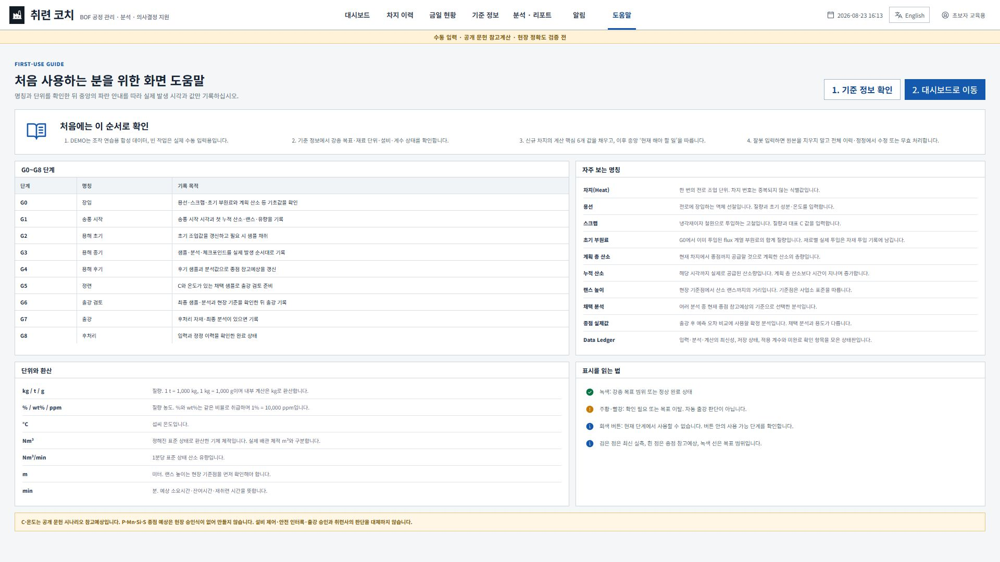

상단 `도움말`은 어느 화면에서도 열 수 있습니다. G0~G8 의미, 자주 보는 공정 명칭, 단위·환산, 색과 마커 읽는 법을 한 화면에 모았습니다.

| 표시 | 뜻 |
| --- | --- |
| 녹색 | 강종 목표 범위 또는 정상 완료 상태 |
| 주황·빨강 | 확인 필요 또는 목표 이탈. 자동 출강 판단이 아님 |
| 회색 버튼 | 현재 단계에서 사용할 수 없음. 버튼 우측 상단에 사용 가능 단계가 표시됨 |
| 검은 점 | 최신 채택 분석의 실측값 |
| 흰 점 | C 또는 온도의 종점 참고예상 |
| 녹색 선 | 선택 강종의 목표 최소~최대 범위 |
| 얇은 예상 범위 | 통계 신뢰구간이 아니라 문헌 저·기본·고 시나리오 범위 |

## 4. 신규 차지 화면

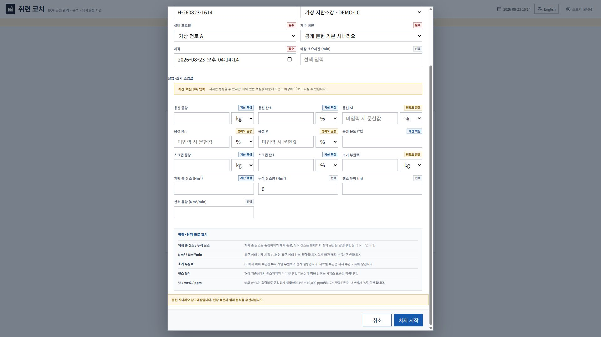

### 4.1 차지 식별·적용 기준

| 항목 | 단위 | 의미·주의사항 |
| --- | --- | --- |
| 차지 번호 | 없음 | 한 번의 조업을 식별하는 중복 없는 번호입니다. 생성 후 바꾸지 않습니다. |
| 강종 | 프로필 | C·온도·P·Mn·Si·S 목표 최소/최대가 들어 있는 기준입니다. |
| 설비 프로필 | 프로필 | 전로 용량, 취련 방식, 랜스 프로필, 저취 가스 같은 계산 조건 묶음입니다. |
| 계수 버전 | 프로필 | 문헌 원본 또는 현장 수정·승인 계수 묶음입니다. Data Ledger에 실제 적용 상태가 표시됩니다. |
| 시각 | 현지 시각 | G0 시작 실제 시각입니다. 기본은 현재 시각이며 실제 시각이 다르면 초까지 수정합니다. |
| 예상 소요시간 | min | G0부터 예상 출강까지의 작업자 계획 시간입니다. 선택 입력이며 실제 전환 시각이 아닙니다. |

### 4.2 계산 핵심 6개 값

화면의 `계산 핵심 0/6`은 아래 여섯 값의 입력 개수입니다. 여섯 값이 없어도 차지 기록은 만들 수 있지만 C·온도 참고예상이 `–`로 남을 수 있습니다.

| 계산 핵심 | 선택 단위 | 내부 기준 | 의미 |
| --- | --- | --- | --- |
| 용선 중량 | kg·t·g | kg | G0에 장입한 액체 선철 질량 |
| 용선 탄소 | %·wt%·ppm | % | 장입 용선의 C 질량 농도 |
| 용선 온도 | °C | °C | 장입 시점 용선 온도 |
| 스크랩 중량 | kg·t·g | kg | 장입한 스크랩 질량 |
| 스크랩 탄소 | %·wt%·ppm | % | 스크랩의 대표 C 질량 농도 |
| 계획 총 산소 | Nm³ | Nm³ | 현재 차지에서 종점까지 공급할 것으로 계획한 산소 총량 |

### 4.3 정확도 권장·선택 값

| 항목 | 단위 | 의미·계산 반영 |
| --- | --- | --- |
| 용선 Si·Mn·P | %·wt%·ppm | 실제값을 알면 입력합니다. 비우면 계수 프로필의 공개 문헌값을 사용하며 Data Ledger의 `문헌값 대체 입력` 수가 증가합니다. |
| 초기 부원료 | kg·t·g | G0에서 이미 들어간 `flux` 계열 부원료의 합계 질량입니다. 재료별 실제 투입은 별도 자재 이벤트로 기록합니다. |
| 누적 산소 | Nm³ | 현재 시각까지 실제 공급된 산소량입니다. 시작 시 0일 수 있지만 계획 총 산소와 같은 뜻이 아닙니다. |
| 랜스 높이 | m | 현장 기준점에서 산소 랜스까지의 실제 거리입니다. 기준점과 허용 범위는 사업소 표준을 따릅니다. |
| 산소 유량 | Nm³/min | 현재 1분당 공급하는 표준 상태 산소 체적입니다. |

`1 t = 1,000 kg`, `1 kg = 1,000 g`, `1% = 10,000 ppm`입니다. `%`와 `wt%`는 이 도구에서 같은 질량비로 취급합니다. 선택 단위와 원래 값은 백업에 보존되고 계산값은 kg와 %로 환산됩니다.

## 5. 대시보드 읽기

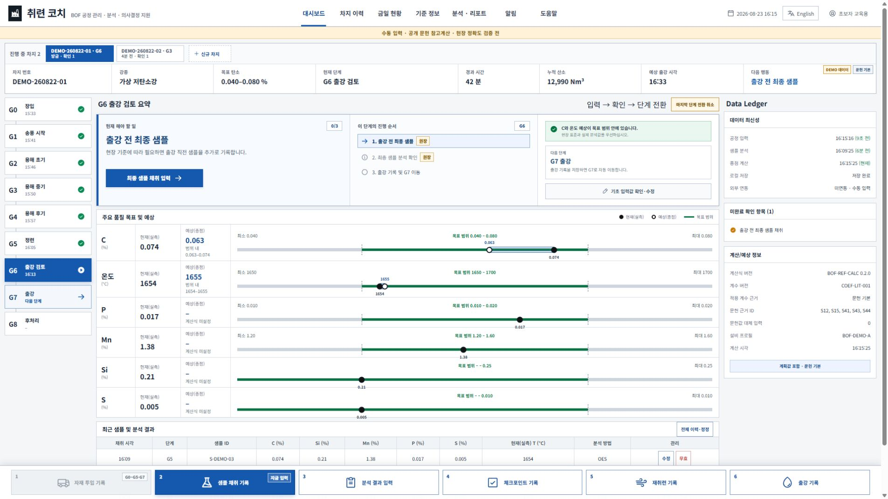

| 화면 구역 | 무엇을 확인하는가 |
| --- | --- |
| 상단 차지 탭 | 여러 진행 차지를 번갈아 선택합니다. 단계, 최근 입력 시각, 확인 필요 수를 비교합니다. |
| 상단 요약 | 차지 번호, 강종, 목표 C, 현재 단계, 경과시간, 누적 산소, 예상 출강시각, 다음 행동을 표시합니다. |
| 좌측 G0~G8 | 현재 단계, 완료한 실제 전환 시각, 다음 단계를 표시합니다. 단계 카드를 직접 눌러 건너뛰는 구조는 아닙니다. |
| 현재 해야 할 일 | 지금 입력할 항목과 입력창을 여는 파란 버튼입니다. 저장 후 다음 항목으로 바뀝니다. |
| 이 단계의 진행 순서 | 현재 단계에서 권장되는 작업과 완료 여부를 순서대로 표시합니다. |
| 주요 품질 목표 및 예상 | C·온도 실측/예상/목표와 P·Mn·Si·S 실측/목표를 한 축에서 비교합니다. |
| 최근 샘플 및 분석 결과 | 채취 시각, 단계, 샘플 ID, 성분, 온도, 분석 방법과 수정·무효 버튼을 표시합니다. |
| Data Ledger | 입력·분석·계산 최신성, 로컬 저장, 외부 미연동 상태, 미완료 확인, 계산식·계수·근거·설비를 표시합니다. |
| 하단 6개 버튼 | 자재, 샘플, 분석, 체크포인트, 재취련, 출강 기록을 엽니다. `지금 입력`이 현재 권장 작업입니다. |

### 5.1 품질 데이터 기호

- `현재(실측)`은 최신 채택 분석값입니다.
- `예상(종점)`은 C·온도에만 제공되는 참고예상입니다.
- `목표보다 낮음/높음`은 강종 목표와의 비교이며 조작 명령이 아닙니다.
- P·Mn·Si·S의 `계산식 미설정`은 오류가 아니라 현장 승인식이 없어 예상을 만들지 않았다는 뜻입니다.

### 5.2 하단 버튼 활성 범위

| 버튼 | 사용 가능 단계 | 추가 조건 |
| --- | --- | --- |
| 자재 투입 | G0~G5, G7 | 실제 투입이 있을 때 |
| 샘플 채취 | G2~G7 | 실제 채취 시각과 고유 샘플 ID 필요 |
| 분석 결과 | G2~G7 | 먼저 유효 샘플이 있어야 함 |
| 체크포인트 | G1~G6 | 누적 산소 필수 |
| 재취련 | G5~G6 | 실제 추가 산소량 필수 |
| 출강 | G6 전용 | 실제 출강 시작 시각 확인 후 저장 |

## 6. 자재·샘플·분석 입력

### 6.1 자재 투입 기록

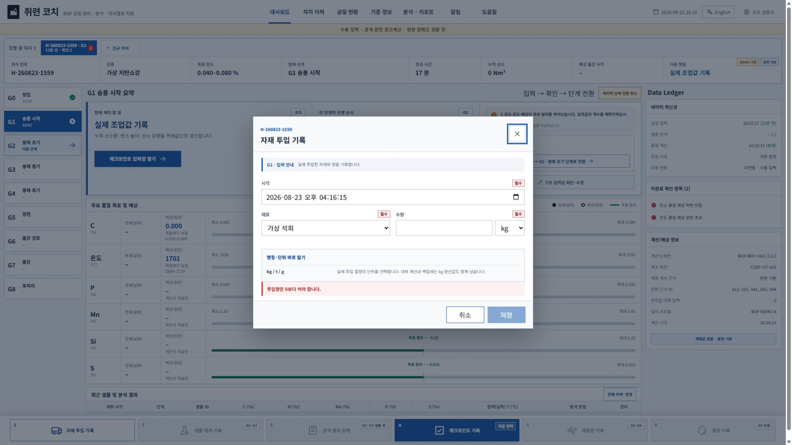

| 항목 | 의미 |
| --- | --- |
| 시각 | 자재를 실제 투입한 시각. 화면을 연 시각과 다르면 수정 |
| 재료 | 기준 정보의 재료 코드·명칭 중 선택 |
| 수량·단위 | 실제 질량과 kg·t·g 단위. 0보다 커야 저장 가능 |

`flux` 분류의 투입 중량만 현재 열수지 입력에 반영됩니다. 합금 조성은 이력에 남지만 합금 수율 계산에는 아직 사용하지 않습니다.

### 6.2 샘플 채취 기록

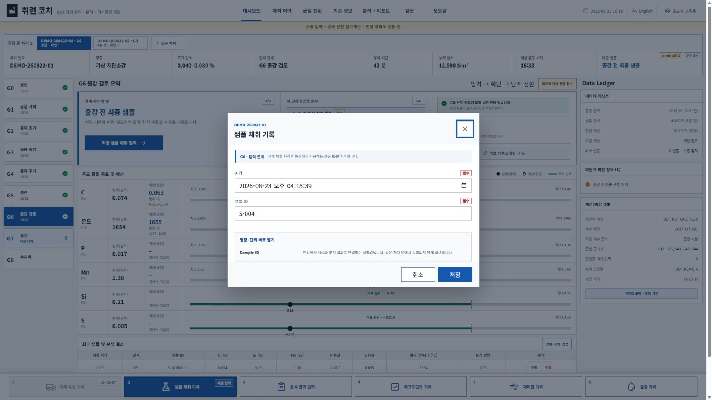

샘플 ID는 현장 시료와 분석 결과를 연결하는 식별값입니다. 같은 차지 안에서 중복되지 않게 입력합니다. 샘플 채취 당시의 공정 단계와 조업 스냅샷이 함께 남습니다.

### 6.3 분석 결과 입력

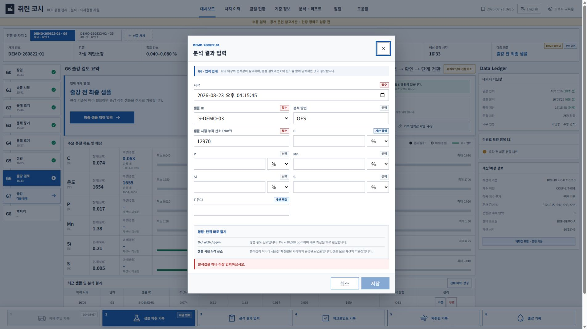

| 항목 | 단위 | 의미 |
| --- | --- | --- |
| 시각 | 현지 시각 | 분석값을 실제 입력·확인한 시각. 샘플 채취 시각은 바뀌지 않음 |
| 샘플 ID | 없음 | 이미 채취한 유효 샘플 중 분석 대상을 선택 |
| 분석 방법 | 없음 | 예: OES. 현장 분석 방법 명칭 |
| 샘플 시점 누적 산소 | Nm³ | 분석 성분이 아니라 샘플을 채취했던 시각까지 실제 공급된 산소량. 샘플 보정 기준점 |
| C·P·Mn·Si·S | %·wt%·ppm | 성분 질량 농도. 하나 이상 필요하며 종점 검토에는 C 입력이 중요 |
| T | °C | 샘플 온도. 종점 검토에는 C와 T를 함께 입력하는 것이 중요 |

한 샘플에 여러 분석을 남길 수 있습니다. 현재 참고예상에 사용할 분석은 `채택`, 출강 후 오차 검증에 쓸 확정 분석은 `종점 실제값`으로 별도 지정합니다.

## 7. 체크포인트·재취련·출강·단계 전환

### 7.1 체크포인트

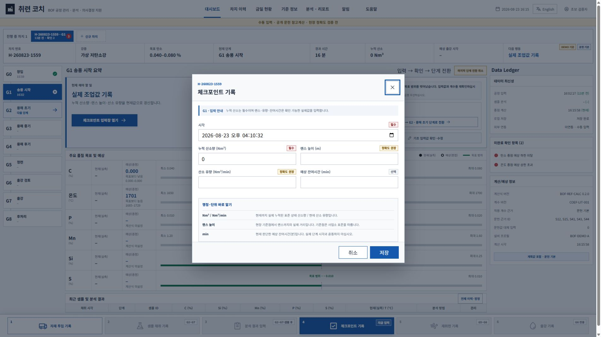

| 항목 | 단위 | 의미 |
| --- | --- | --- |
| 누적 산소량 | Nm³ | 해당 시각까지 실제 공급된 산소 총량. 이전 유효값보다 작아지면 정합성 검사를 받음 |
| 랜스 높이 | m | 현장 기준점에서 랜스까지의 실제 거리 |
| 산소 유량 | Nm³/min | 해당 시각의 실제 산소 유량 |
| 예상 잔여시간 | min | 작업자가 현재 판단한 남은 시간. 실제 단계 시각이 아님 |

### 7.2 재취련

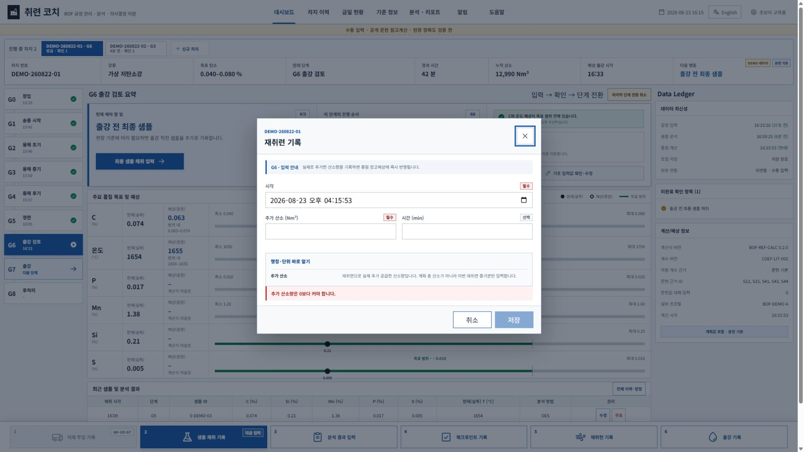

`추가 산소`에는 계획 총 산소가 아니라 이번 재취련으로 실제 증가한 산소량만 입력합니다. 저장 즉시 누적 산소와 C·온도 참고예상이 다시 계산됩니다.

### 7.3 출강

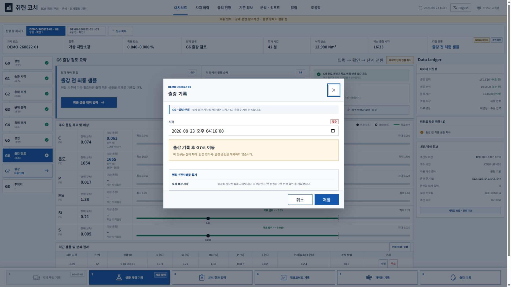

시각은 출강을 시작한 실제 시각입니다. 저장하면 G7로 이동하므로 실험실 분석, 현장 기준과 출강 승인을 별도로 확인한 뒤 기록합니다.

### 7.4 단계 전환

`실제 전환 시각`은 버튼을 누른 시각이 아니라 공정이 실제로 다음 게이트로 바뀐 시각입니다. 당시 누적 산소·랜스·유량을 알면 같이 기록합니다. G5→G6은 C와 온도가 모두 있는 채택 샘플이 필요합니다. G6→G7은 일반 전환 버튼이 아니라 출강 기록으로 이동합니다.

## 8. 기준 정보 화면

기준 정보는 변경 즉시 운영값이 되는 것이 아니라 `변경 사유`를 입력하고 `설정 저장`해야 새 로컬 버전이 됩니다. 실제 회사 기준이나 기밀 계수는 공개 저장소에 넣지 마십시오.

### 8.1 강종군

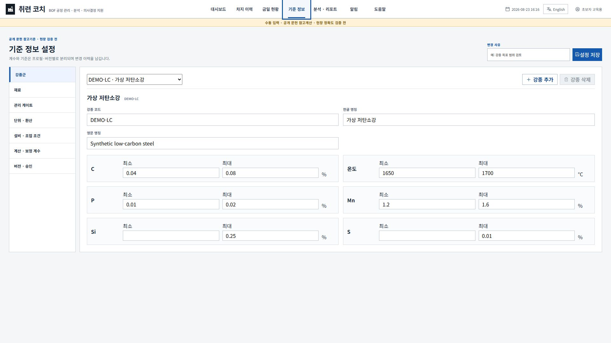

강종 코드와 한글·영문 명칭, C·온도·P·Mn·Si·S 목표 최소/최대를 설정합니다. C·P·Mn·Si·S는 %, 온도는 °C입니다. 한쪽 경계만 있는 Si·S 같은 기준도 허용합니다. 최소가 최대보다 크거나 코드가 중복되면 저장할 수 없습니다.

### 8.2 재료

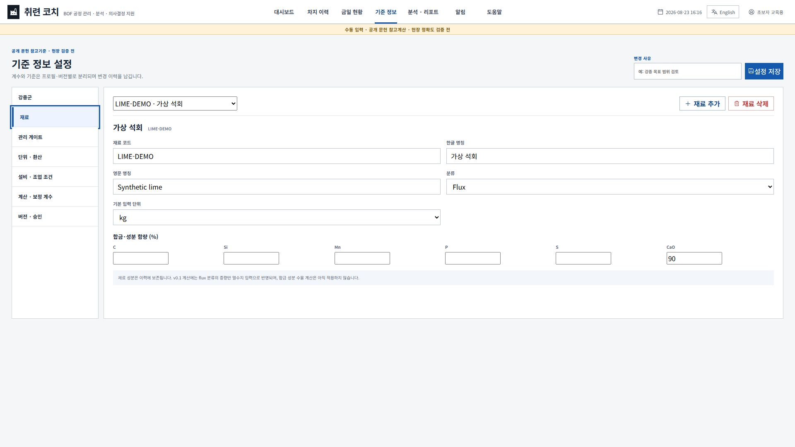

| 항목 | 의미 |
| --- | --- |
| 재료 코드·명칭 | 이벤트에서 선택하는 식별값과 표시명 |
| 분류 | flux, alloy, coolant 등 계산·보고 분류 |
| 기본 입력 단위 | 해당 재료를 처음 선택했을 때 제시할 kg·t·g |
| C·Si·Mn·P·S·CaO | 재료 조성 질량 %. 현재는 이력에 보존하며 합금 수율 계산은 미적용 |

### 8.3 관리 게이트

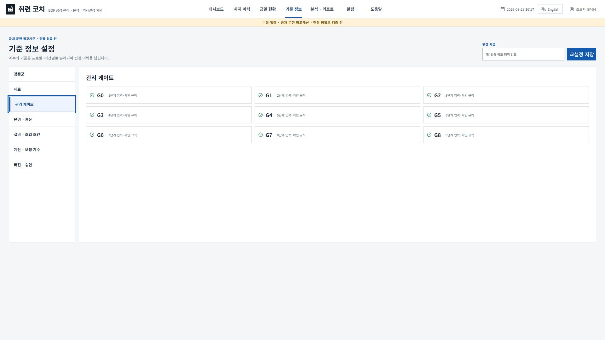

G0~G8 단계 목록과 입력·확인 규칙을 보여 줍니다. 초기 버전에서는 단계 코드를 임의 재배열하는 화면이 아니라 고정 공정 흐름을 확인하는 화면입니다.

### 8.4 단위·환산

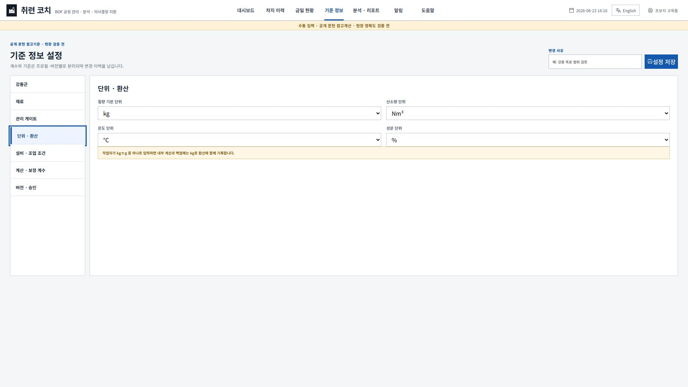

질량, 산소량, 온도, 성분의 기본 표시 단위를 정합니다. 단위를 바꾸면 새 입력의 기본 선택값이 달라지며, 내부 계산 기준과 과거 원본 단위 기록은 유지됩니다.

### 8.5 설비·조업 조건

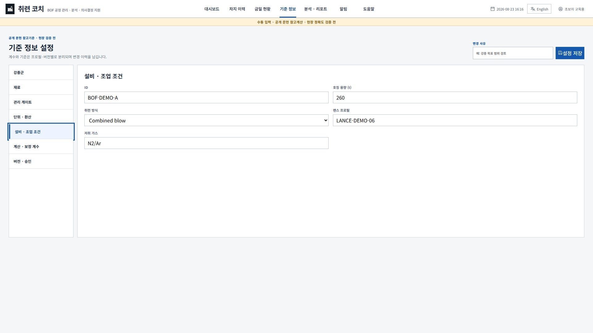

| 항목 | 단위 | 의미 |
| --- | --- | --- |
| ID | 없음 | 설비 프로필 식별자 |
| 호칭 용량 | t | 전로의 대표 용량. 실제 차지 질량과 같은 값으로 단정하지 않음 |
| 취련 방식 | top / combined | 상취 또는 복합취련 구분 |
| 랜스 프로필 | 코드·명칭 | 현장 랜스 사양을 구분하는 식별값 |
| 저취 가스 | 명칭 | 예: N2/Ar. 실제 유량이나 제어값은 별도 실측 입력 대상 |

### 8.6 계산·보정 계수

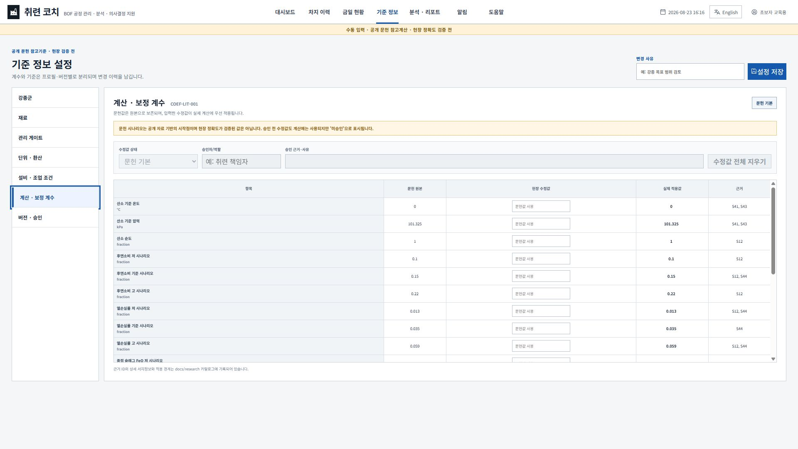

`문헌 원본`, `현장 수정값`, `실제 적용값`, `근거 ID`를 분리합니다. 적용 우선순위는 `현장 승인 수정값 → 사용자 수정값(미승인) → 문헌 원본`입니다. 사용자 수정값을 바꾸면 기존 승인은 자동 해제됩니다. 저·기본·고 값은 통계 신뢰구간이 아니라 민감도 시나리오입니다.

### 8.7 버전·승인

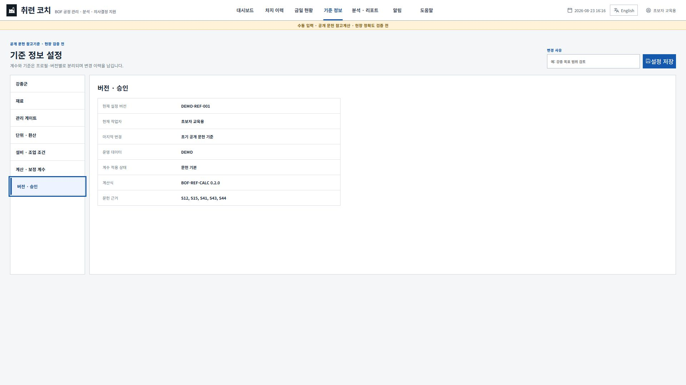

현재 설정 버전, 작업자, 마지막 변경 시각·사유, 운영 데이터 구분, 계수 적용 상태, 계산식 버전과 문헌 근거를 확인합니다. 설정 변경은 새 버전으로 남고 기존 차지는 시작 당시 기준 스냅샷을 유지합니다.

## 9. 차지 이력과 정정

### 9.1 차지 이력

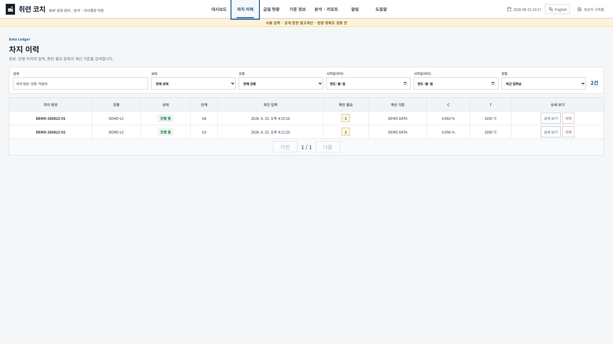

검색어, 상태, 강종, 시작일 범위와 정렬 조건으로 차지를 찾습니다. C·T는 현재 참고예상, `확인 필요`는 열린 점검 항목 수입니다. 합성 DEMO 또는 G0 초안은 삭제할 수 있지만, 진행 이력이 쌓인 실제 차지는 삭제 대신 `취소`, 종료 차지는 `보관`을 사용합니다.

### 9.2 전체 이력·정정

타임라인은 유효·정정됨·무효 원본을 모두 보존합니다. `채택`은 현재 계산 기준 분석, `종점 실제값`은 출강 후 정확도 비교 기준입니다. `마지막 단계 전환 취소`는 한 단계만 복귀합니다. 몇 단계 전 수치 오류는 단계를 되감지 않고 해당 기록만 수정합니다.

### 9.3 정정 대화상자

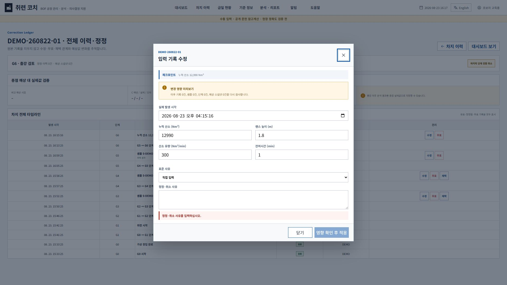

`변경 영향 미리보기`는 이후 이벤트·샘플·단계·예상 스냅샷 중 다시 검사할 건수를 표시합니다. 값을 고치고 표준 사유 또는 직접 사유를 입력해야 적용할 수 있습니다. 원본은 지워지지 않고 정정 관계와 작업자·시각이 남습니다.

| 상황 | 사용할 기능 |
| --- | --- |
| 방금 입력값이 틀림 | 해당 기록 `수정` 또는 `무효` |
| 마지막 단계 전환 오조작 | `마지막 단계 전환 취소` |
| 몇 단계 전 값이 틀림 | 과거 기록만 정정하고 이후 계산 재검증 |
| 실제 조업 중단 | 차지 이력의 `취소`와 사유 |
| 출강 이후 시각 오류 | 별도 `출강 기록 정정` |

## 10. 백업·복원·Excel

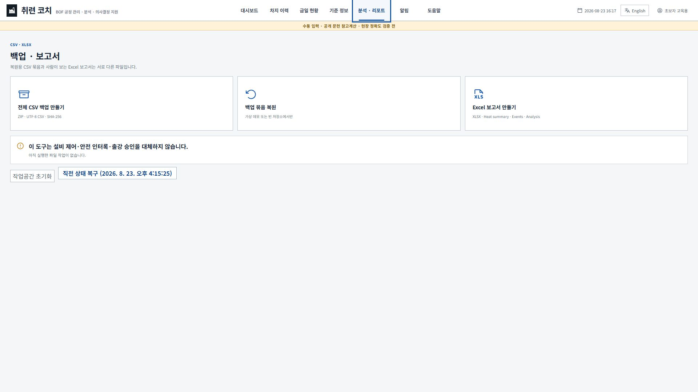

| 버튼 | 결과 파일 | 목적 |
| --- | --- | --- |
| 전체 CSV 백업 만들기 | ZIP 안 CSV 7종 + manifest.csv | 작업공간 복원. SHA-256·행 수·참조를 다운로드 전에 재검증 |
| 백업 묶음 복원 | 이 도구가 만든 ZIP | 다른 PC·브라우저에서 상태 복원. 일부 CSV를 수동 수정하면 무결성 검사 실패 |
| Excel 보고서 만들기 | XLSX | 사람이 열람·보고. 복원 입력 파일로 사용하지 않음 |
| 작업공간 초기화 | 새 빈 작업 또는 DEMO | 초기화 직전 상태를 복구 슬롯에 한 번 보관 |
| 직전 상태 복구 | 로컬 복구 슬롯 | 가장 최근 초기화 직전 상태를 한 번 복구 |

교대, PC 이동, 브라우저 초기화 전에는 반드시 새 CSV ZIP을 내려받으십시오. 같은 HTML을 여러 창에서 열어 충돌 경고가 나오면 새 입력을 멈추고 비상 백업 후 최신 상태를 다시 불러옵니다.

## 11. 금일 현황과 알림

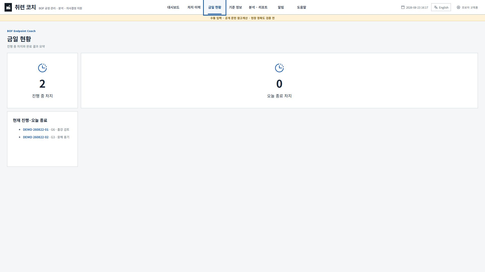

금일 현황은 현재 진행 차지와 오늘 완료·취소·보관된 차지 수와 목록을 보여 줍니다. 차지 번호를 누르면 해당 대시보드로 이동합니다.

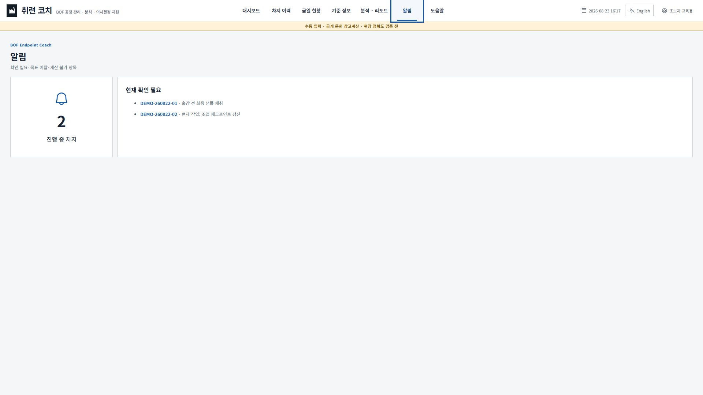

알림은 진행 차지의 목표 이탈, 계산 입력 부족, 미완료 체크를 모아 보여 줍니다. 알림이 없다고 출강 승인이 된 것은 아닙니다.

## 12. 단위·기호 사전

| 기호·단위 | 뜻 |
| --- | --- |
| C | 탄소 |
| Si | 규소 |
| Mn | 망간 |
| P | 인 |
| S | 황 |
| T | 온도 |
| kg / t / g | 질량. 1 t = 1,000 kg, 1 kg = 1,000 g |
| % / wt% / ppm | 질량 농도. 1% = 10,000 ppm |
| °C | 섭씨 온도 |
| Nm³ | 설정된 표준 상태로 환산한 기체 체적. 실제 배관 체적 m³와 구분 |
| Nm³/min | 1분당 표준 상태 기체 체적 유량 |
| m | 미터. 랜스 높이 기준점은 현장 표준 확인 필요 |
| min | 분 |
| OES | Optical Emission Spectroscopy, 광방출분광 분석 방법의 일반 약어 |

## 13. 처음 보는 작업자의 DEMO 연습 순서

1. 작업자 이름을 입력하고 `DEMO로 체험`을 누릅니다.
2. 상단에 G6 차지와 G3 차지가 동시에 보이는지 확인하고 탭을 번갈아 누릅니다.
3. G6 차지에서 중앙 `현재 해야 할 일`과 같은 하단 버튼에 `지금 입력`이 보이는지 확인합니다.
4. 샘플·분석·체크포인트 입력창을 차례로 열어 명칭·단위 설명을 읽고 저장하지 말고 취소합니다.
5. `전체 이력·정정`에서 유효 기록, 채택 결과, 수정·무효 버튼과 영향 미리보기를 확인합니다.
6. `기준 정보`의 모든 탭을 열되 값을 바꾸지 않습니다.
7. `분석 · 리포트`에서 CSV ZIP과 XLSX의 목적 차이를 확인합니다.
8. 연습이 끝나면 실제 입력 전 CSV 백업을 받고 빈 작업으로 초기화합니다.

## 14. English quick reference

- **Heat:** one BOF operating batch identified by a unique heat number.
- **Planned total oxygen (Nm³):** total normalized oxygen planned to the endpoint.
- **Cumulative oxygen (Nm³):** actual normalized oxygen supplied up to a recorded time.
- **Oxygen flow (Nm³/min):** normalized oxygen volume supplied per minute.
- **Lance height (m):** actual distance from the site-defined reference point; follow the site standard.
- **Adopted analysis:** the analysis currently anchoring the reference prediction.
- **Actual endpoint:** the confirmed post-tap analysis used to compare prediction error.
- **CSV ZIP:** restore package. **XLSX:** human-readable report only.
- Always prioritize site standards, laboratory results, safety interlocks, tap authorization, and operator judgment over the public-literature reference estimate.
