# 취련 코치 v0.5.0 초상세 처음사용자 설명서

이 문서는 취련 코치를 처음 보는 작업자가 화면 명칭, 단위, 버튼, 예상값, 오차, 보정계수를 다른 의미로 오해하지 않도록 만든 화면별 설명서입니다. 영문 화면의 주요 명칭도 괄호 안에 함께 적었습니다. 모든 화면과 수치는 합성 DEMO이며 실제 회사·설비·강종·작업자를 나타내지 않습니다.

> **안전·품질 경계:** C·온도·P·Mn·Si·S 값은 공개 문헌식과 합성 DEMO 계수로 계산한 참고예상입니다. 실제 현장 정확도는 검증되지 않았습니다. 설비 제어, 안전 인터록, 표준작업, 실험실 분석, 출강 승인 또는 취련사의 판단을 대체하지 않습니다.

## 1. 3분 안에 전체 구조 이해하기

1. 처음 열면 작업자 표시명과 `빈 작업으로 시작` 또는 `DEMO로 체험`을 선택합니다.
2. `기준 정보`에서 강종 목표, 재료 성분·단위, 설비, 계산계수를 확인합니다.
3. `신규 차지`에서 G0 기초값을 입력합니다.
4. 이후에는 대시보드 중앙의 파란 `현재 해야 할 일` 버튼을 먼저 봅니다.
5. 실제 발생 시각과 실제값을 저장하면 안내와 예상값이 자동 갱신됩니다.
6. 잘못 입력하면 원본을 삭제하지 말고 `전체 이력·정정`에서 수정 또는 무효 처리합니다.
7. 출강 후 확정 분석을 `종점 실제값`으로 지정하면 오차대장에 예상−실측 비교가 쌓입니다.
8. `학습 · 계수`는 충분한 같은 조건의 실제 오차가 모였을 때 검토용 보정 후보를 만듭니다. 자동 적용하지 않습니다.
9. 교대·브라우저 초기화 전에는 `분석 · 리포트`에서 CSV ZIP 백업을 저장합니다.

## 2. 공통 표시와 단위

### 2.1 입력 중요도 표지

| 표시 | 영문 | 뜻 | 미입력 시 |
| --- | --- | --- | --- |
| 필수 | Required | 식별·저장에 반드시 필요한 값 | 저장 버튼 비활성 또는 오류 표시 |
| 계산 핵심 | Calculation core | 6개 종점 참고예상 계산의 기본 조건 | 일부 또는 전체 예상이 `–` |
| 정확도 권장 | Recommended for accuracy | 알고 있다면 실제값을 넣어야 문헌 대체값 의존을 줄이는 항목 | 계수 프로필의 문헌값 사용 가능 |
| 선택 | Optional | 현장에 값이 있을 때만 기록 | 공란 허용 |

### 2.2 단위 사전과 내부 환산

| 기호·단위 | 영문 | 뜻과 환산 | 혼동 금지 |
| --- | --- | --- | --- |
| kg | kilogram | 내부 질량 기준 | t와 숫자를 그대로 섞지 않음 |
| t | tonne | `1 t = 1,000 kg` | 280 t 입력은 내부 280,000 kg |
| g | gram | `1,000 g = 1 kg` | 소량 첨가재용 |
| % / wt% | mass percent | 같은 질량 농도로 처리 | 0.05%는 5%가 아님 |
| ppm | parts per million | `10,000 ppm = 1%` | 500 ppm = 0.05% |
| °C | degrees Celsius | 섭씨 온도 | K가 아님 |
| Nm³ | normalized cubic metre | 설정된 기준 온도·압력으로 환산한 기체 체적 | 실제 배관 체적 m³와 다름 |
| Nm³/min | normalized cubic metres per minute | 1분당 표준상태 산소 유량 | 누적 산소량 Nm³와 다름 |
| m | metre | 랜스 높이. 기준점은 현장 표준 확인 | 절대 위치로 임의 해석 금지 |
| min | minute | 소요·잔여·재취련 시간 | 실제 시각과 다름 |
| C | Carbon | 탄소 농도 | % 기준 |
| Si | Silicon | 규소 농도 | % 기준 |
| Mn | Manganese | 망간 농도 | % 기준 |
| P | Phosphorus | 인 농도 | % 기준 |
| S | Sulfur | 황 농도 | % 기준 |
| T | Temperature | 온도 | °C 기준 |

### 2.3 색과 도형

| 표시 | 뜻 |
| --- | --- |
| 녹색 선 | 강종에 설정한 목표 범위 |
| 검은 점 | 최신 채택 실측값 |
| 흰 점 | 현재 종점 참고예상값 |
| 옅은 범위 | 문헌 저·기준·고 시나리오 범위. 통계 신뢰구간이 아님 |
| 파란 버튼 | 지금 수행할 주 행동 또는 저장 |
| 흰 테두리 버튼 | 보조 행동·다음 단계 미리 전환 |
| 회색 버튼 | 현재 단계에서 사용할 수 없음 |
| 주황·빨강 | 확인 필요 또는 목표 이탈. 자동 출강 판정이 아님 |

## 3. 첫 실행 화면

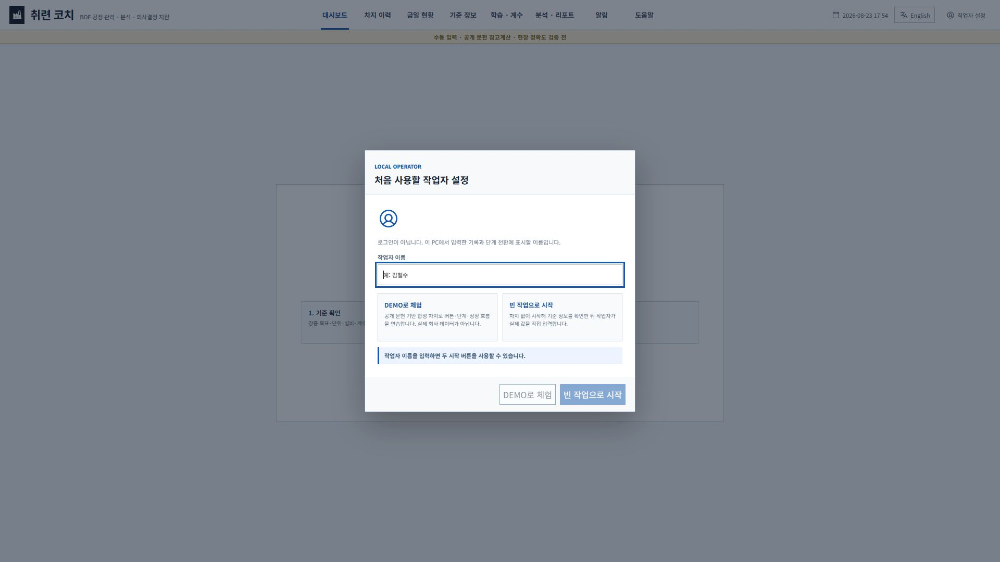

| 항목 | 영문 | 입력 방법 | 저장되는 곳 |
| --- | --- | --- | --- |
| 작업자 이름 | Operator name | 로그인 ID가 아니라 이 PC에서 입력·정정·단계 전환 이력에 표시할 이름 | 브라우저 로컬 저장소와 이후 기록 |
| 빈 작업으로 시작 | Start empty | 실제 수동 입력을 준비할 때 사용 | 차지 0건으로 시작 |
| DEMO로 체험 | Try DEMO | 합성 차지로 기능을 연습할 때 사용 | `demo=true`인 합성 이력 |

작업자 이름은 우측 상단 이름 버튼에서 언제든 바꿀 수 있습니다. 과거 기록의 이름은 바꾸지 않고 변경 이후 기록부터 새 이름을 사용합니다. `설비기술팀` 같은 고정 팀명은 넣지 않습니다.

## 4. 대시보드 전체 읽기

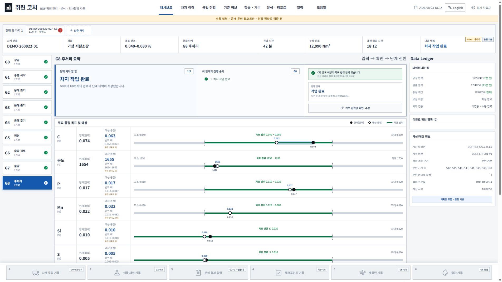

### 4.1 상단 메뉴

| 메뉴 | 역할 |
| --- | --- |
| 대시보드 (Dashboard) | 선택한 차지의 현재 단계, 다음 행동, 6개 예상, 입력 버튼 |
| 차지 이력 (Heat history) | 검색·상태·강종·기간·정렬과 삭제·취소·보관·상세 |
| 금일 현황 (Today) | 진행 중과 오늘 종료 차지 요약 |
| 기준 정보 (Reference settings) | 강종·재료·게이트·단위·설비·계수·버전 |
| 학습 · 계수 (Learning · coefficients) | 종점 오차대장과 보정 후보 |
| 분석 · 리포트 (Reports) | CSV ZIP 백업·복원과 XLSX 출력 |
| 알림 (Alerts) | 진행 차지의 미완료·목표 이탈·계산 불가 |
| 도움말 (Help) | G0~G8, 용어, 단위, 표시 읽는 법 |
| English / 한국어 | 화면 언어 전환. 데이터값은 바꾸지 않음 |
| 작업자 이름 | 로컬 표시명 편집. 회사 로그인 기능이 아님 |

### 4.2 진행 차지 탭과 상단 요약

| 항목 | 뜻 | 확인 예 |
| --- | --- | --- |
| 진행 중 차지 | 동시에 진행 중인 차지 수 | `2`이면 탭 2개 전환 가능 |
| 차지 탭 | 차지 번호·단계·최근 입력·확인 필요 수 | 빨간 숫자는 위험·확인 수 |
| 차지 번호 | 중복되지 않는 조업 식별값 | `H-260823-001` |
| 강종 | 현재 차지가 시작 때 고정한 강종 스냅샷 | 나중에 설정을 바꿔도 과거 차지는 유지 |
| 목표 탄소 | 강종의 C 최소~최대 | `0.040–0.080 %` |
| 현재 단계 | G0~G8 현재 게이트 | `G6 출강 검토` |
| 경과 시간 | 시작 시각부터 현재/완료 시각까지 분 | 실제 공정시간과 입력시각 확인 필요 |
| 누적 산소 | 최신 유효 체크포인트의 총량 | `12,990 Nm³` |
| 예상 출강 시각 | 예상 잔여시간 또는 입력 소요시간 기반 참고 | 확정 일정 아님 |
| 다음 행동 | 중앙 안내의 현재 주 행동 | `출강 전 최종 샘플` |
| DEMO 데이터 | 합성 이력 표시 | 현장 학습·승인 근거에서 제외 |
| 문헌 기본 | 현재 계산계수 상태 | 수정·승인 상태에 따라 바뀜 |

### 4.3 G0~G8 단계

| 단계 | 한글 / English | 기록 목적 |
| --- | --- | --- |
| G0 | 장입 / Charge | 용선·스크랩·초기 부원료·계획 산소 기초값 |
| G1 | 송풍 시작 / Blow start | 실제 시작 시각과 첫 조업값 |
| G2 | 용해 초기 / Early blow | 초기 체크포인트·필요 시 샘플 |
| G3 | 용해 중기 / Mid blow | 샘플→분석→체크포인트 |
| G4 | 용해 후기 / Late blow | 후기 샘플로 종점 예상 갱신 |
| G5 | 정련 / Refining | C·온도가 있는 채택 샘플로 G6 준비 |
| G6 | 출강 검토 / Tap review | 최종 확인 후 출강 기록 |
| G7 | 출강 / Tapping | 후처리 자재·최종 분석 |
| G8 | 후처리 / Post-treatment | 완료·오차검증·정정이력 확인 |

단계 카드를 클릭한다고 임의로 단계를 건너뛰지 않습니다. 현재 단계의 중앙 안내나 `다음 단계` 버튼에서 실제 전환 시각을 기록해야 합니다.

### 4.4 중앙 현재 해야 할 일

중앙은 `입력 → 확인 → 단계 전환` 순서를 고정합니다.

- 큰 제목: 지금 해야 할 한 가지 행동입니다.
- `2/4`: 이 단계의 완료 항목 수/전체 항목 수입니다.
- 큰 파란 버튼: 현재 행동 입력창을 엽니다.
- 진행 순서: 완료, 현재, 권장, 대기 상태를 구분합니다.
- 품질 종합 판정: 목표가 설정된 6개 항목을 함께 봅니다. C·온도만 안전하다고 전체 안전으로 표시하지 않습니다.
- 다음 단계: 실제 공정이 바뀌었을 때만 기록합니다.
- 기초 입력값 확인·수정: 차지 번호·시작 시각을 제외한 G0 값을 정정합니다.

### 4.5 주요 품질 목표 및 예상

| 행 | 기본 단위 | 예상모델 역할 | 초기 문헌 신뢰도 표시 |
| --- | --- | --- | --- |
| C | % | 산소 물질수지와 채택 샘플 이후 변화량 | 중 |
| 온도 | °C | 열수지와 채택 샘플 이후 변화량 | 중 |
| P | % | 슬래그 조성·온도 기반 분배식 | 중 |
| Mn | % | 온도·슬래그 산화 상태 기반 분배식 | 낮음 |
| Si | % | 원소수지·산화 시나리오 | 중 |
| S | % | 슬래그 황분배 경험식 | 매우 낮음 |

`현재(실측)`은 최신 채택 분석입니다. `예상(종점)`은 현재 입력과 계수버전을 사용한 참고값입니다. 예상이 범위 안이어도 출강 가능을 뜻하지 않습니다. `목표 상한 ≤ 0.020`은 최대값만 설정한 단측 기준이며, 빈 최소값을 0으로 오해하지 않습니다.

## 5. 중간 샘플 오차 읽기

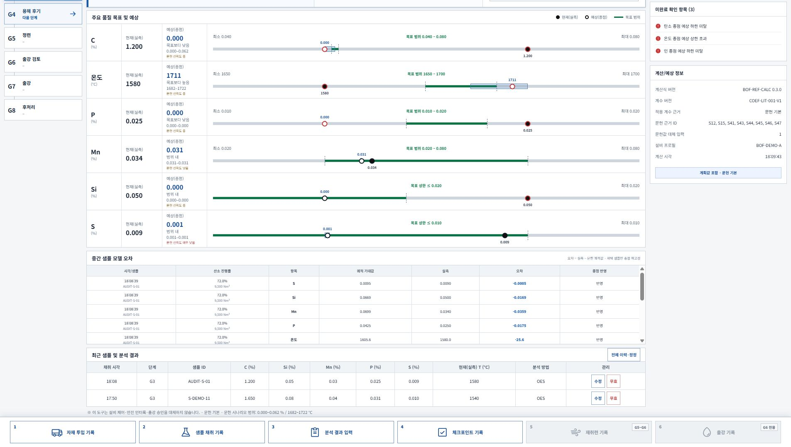

| 열 | 뜻 |
| --- | --- |
| 시각/샘플 | 분석이 입력된 시각과 샘플 ID |
| 산소 진행률 | `샘플 시점 누적 산소 ÷ 계획 총 산소 × 100` |
| 궤적 기대값 | 종점만 맞춘 값이 아니라 해당 산소 진행시점 문헌 궤적값 |
| 실측 | 사용자가 입력한 분석값 |
| 오차 | `실측 − 궤적 기대값`. 양수는 실측이 더 높음 |
| 종점 반영 | 최신 채택 분석만 `반영`, 그 외는 `비교만` |

여러 샘플의 오차를 모두 누적하지만, 현재 종점 재고정에는 최신 채택 분석 하나만 사용합니다. 오래된 샘플까지 동시에 종점에 더해 이중 보정하지 않습니다.

## 6. 신규 차지 G0 입력

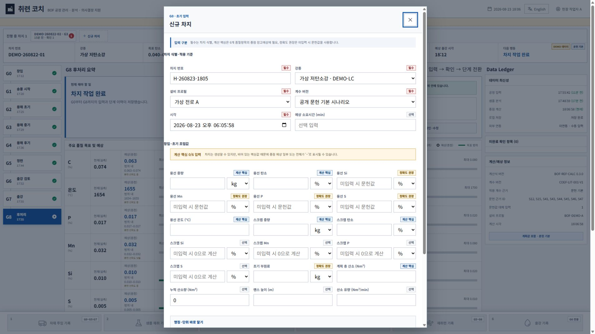

### 6.1 식별·적용 기준

| 필드 | 영문 | 중요도 | 예 | 저장 차단 |
| --- | --- | --- | --- | --- |
| 차지 번호 | Heat ID | 필수 | `H-260823-001` | 빈 값·중복 |
| 강종 | Grade | 필수 | `DEMO-LC` | 프로필 없음 |
| 설비 프로필 | Equipment profile | 필수 | `BOF-A` | 프로필 없음 |
| 계수 버전 | Coefficient profile | 필수 | `COEF-LIT-001` | 프로필 없음 |
| 시각 | Started at | 필수 | 실제 장입 시각 | 미래 시각 |
| 예상 소요시간 | Expected duration | 선택 | `40 min` | 0 이하 |

차지를 만들면 강종·설비·계수의 당시 내용을 차지 안에 스냅샷으로 보존합니다. 이후 전역 설정을 바꿔도 이미 진행 중인 차지의 근거가 몰래 바뀌지 않습니다.

### 6.2 장입·초기 조업값

| 필드 | 단위 선택 | 중요도 | 의미 | 입력 예 |
| --- | --- | --- | --- | --- |
| 용선 중량 | kg/t/g | 계산 핵심 | 전로 장입 용선 질량 | `250 t` |
| 용선 탄소 | %/wt%/ppm | 계산 핵심 | 용선 초기 C | `4.50 %` |
| 용선 Si·Mn·P·S | %/wt%/ppm | 정확도 권장 | 각 원소 초기농도 | `Si 0.60 %` |
| 용선 온도 | °C | 계산 핵심 | 장입 시 실제 온도 | `1,350 °C` |
| 스크랩 중량 | kg/t/g | 계산 핵심 | 장입 스크랩 질량 | `30 t` |
| 스크랩 탄소 | %/wt%/ppm | 계산 핵심 | 대표 C | `0.10 %` |
| 스크랩 Si·Mn·P·S | %/wt%/ppm | 선택 | 공란이면 0으로 계산 | 알 때만 입력 |
| 초기 부원료 | kg/t/g | 정확도 권장 | G0에 이미 들어간 flux 합계 | `8,000 kg` |
| 계획 총 산소 | Nm³ | 계산 핵심 | 종점까지 계획한 총 산소 | `13,000 Nm³` |
| 누적 산소량 | Nm³ | 선택 | G0 현재까지 실제 누적 | 보통 0 |
| 랜스 높이 | m | 선택 | G0 당시 실제값 | `2.0 m` |
| 산소 유량 | Nm³/min | 선택 | G0 당시 실제값 | `650 Nm³/min` |

용선 Si·Mn·P·S를 비우면 계수 프로필의 문헌 대체값을 사용하고 Data Ledger의 `문헌값 대체 입력` 수가 증가합니다. 알고 있는 실제값을 넣는 것이 우선입니다.

## 7. 자재 투입 기록

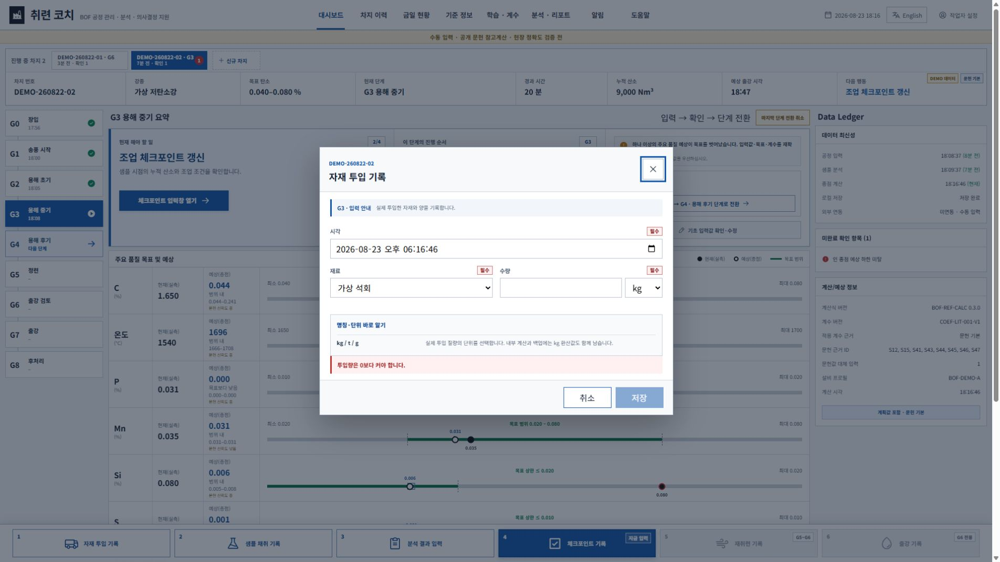

| 필드 | 중요도 | 뜻 | 검증 |
| --- | --- | --- | --- |
| 시각 | 필수 | 실제 투입 시각 | 미래·차지 시작 전·허용 단계 밖 차단 |
| 재료 | 필수 | 기준 정보에 등록한 재료 | 참조 가능한 재료만 선택 |
| 수량 | 필수 | 이번 실제 투입 질량 | 0 이하 차단 |
| 단위 | 필수 | kg/t/g | 내부 kg 환산과 원단위 동시 보존 |

`Alloy`·`Scrap` 분류의 취련 중 투입은 등록 조성과 질량을 원소수지에 넣고, 금속 회수율은 별도 현장계수가 없으므로 **명목 100% 회수 가정**을 사용합니다. 이는 확정 합금 수율이 아니며 Data Ledger의 가정 입력과 실제 오차로 반드시 확인해야 합니다. `Flux`·`Coolant`의 산화물 조성은 슬래그 참고계산에 사용됩니다.

## 8. 샘플 채취와 분석 결과

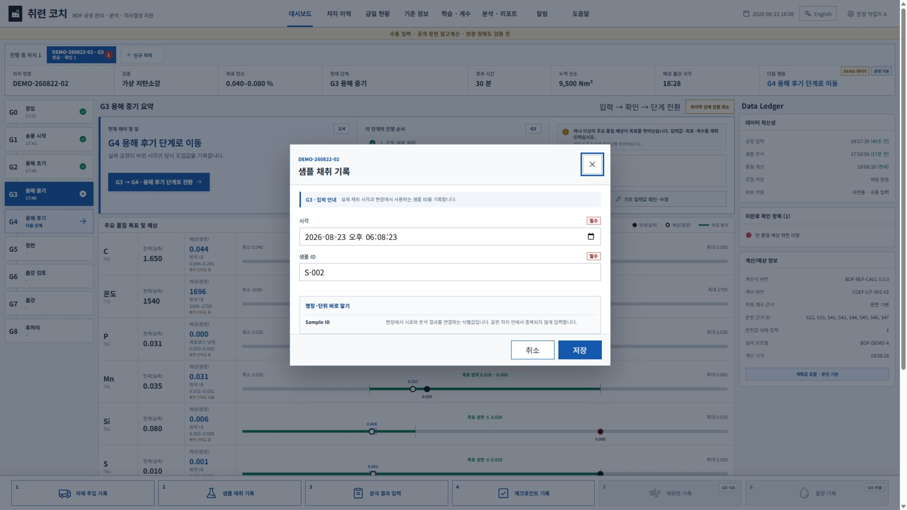

### 8.1 샘플 채취

| 필드 | 중요도 | 뜻 | 검증 |
| --- | --- | --- | --- |
| 시각 | 필수 | 실제 채취 시각 | 미래·차지 시작 전 차단 |
| 샘플 ID | 필수 | 현장 시료와 분석 결과 연결 식별값 | 같은 차지 안 중복 차단 |

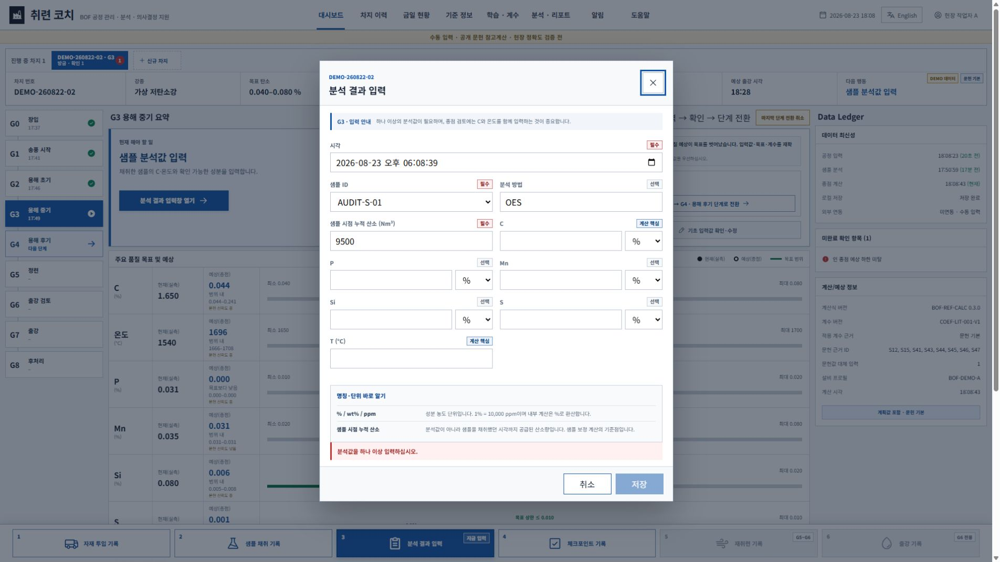

### 8.2 분석 결과

| 필드 | 단위 | 중요도 | 뜻 |
| --- | --- | --- | --- |
| 시각 | 로컬 날짜·시각 | 필수 | 분석값을 실제 기록한 시각 |
| 샘플 ID | – | 필수 | 방금 채취한 미분석 샘플을 기본 선택 |
| 분석 방법 | 텍스트 | 선택 | 예: `OES` |
| 샘플 시점 누적 산소 | Nm³ | 필수 | 분석 시각이 아니라 샘플 채취 시점까지 실제 공급량 |
| C | %/wt%/ppm | 계산 핵심 | G5→G6 종점 검토 게이트에 필요 |
| P·Mn·Si·S | %/wt%/ppm | 선택 | 입력하면 6개 종점 예상과 오차 비교에 사용 |
| T | °C | 계산 핵심 | G5→G6 종점 검토 게이트에 필요 |

분석값은 하나 이상 있어야 저장됩니다. 성분은 0~100%, 온도는 0~2,500°C 범위를 검사합니다. 같은 샘플에 분석 결과를 여러 건 남길 수 있고, 현재 사용할 결과는 `채택`으로 선택합니다.

## 9. 체크포인트와 단계 전환

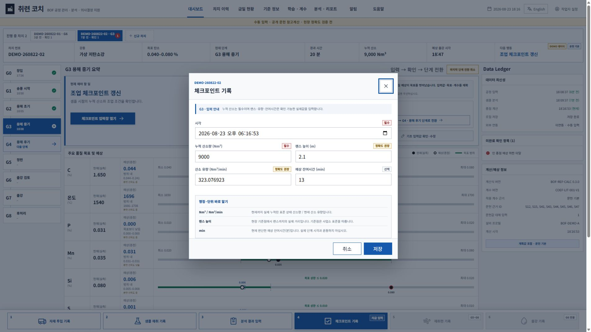

### 9.1 체크포인트

| 필드 | 중요도 | 의미 | 계산 반영 |
| --- | --- | --- | --- |
| 시각 | 필수 | 실제 확인 시각 | 최신성·순서 |
| 누적 산소량 | 필수 | 시점까지 실제 총량 | 감소하면 차단, 산소 진행률·잔여량 |
| 랜스 높이 | 정확도 권장 | 현장 기준점 대비 실제값 | 조업 패턴 이력 |
| 산소 유량 | 정확도 권장 | 현재 유량 | 예상 잔여시간 |
| 예상 잔여시간 | 선택 | 작업자 판단 분 | 예상 출강시각 참고 |

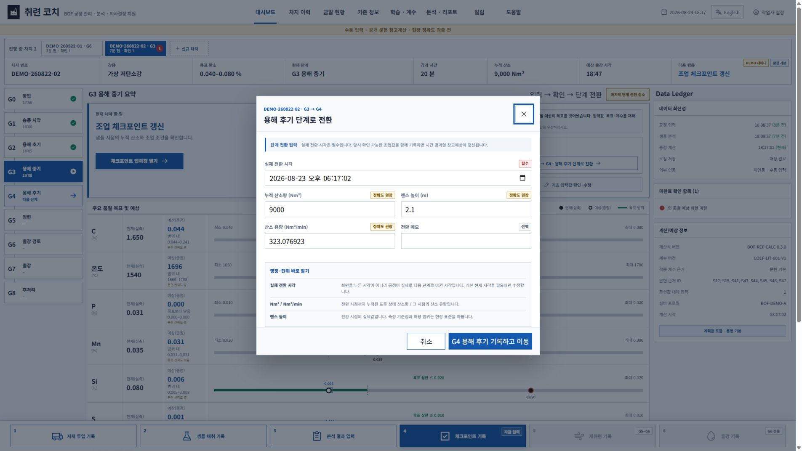

### 9.2 단계 전환

`실제 전환 시각`은 버튼을 누른 시간이 아니라 공정이 실제 다음 단계로 바뀐 시각입니다. 기본값은 현재 시각이지만 수정할 수 있습니다. 이전 단계 전환보다 빠르거나 미래이면 저장되지 않습니다. 누적 산소·랜스·유량을 함께 넣으면 시간 경과형 참고예상과 이력이 갱신됩니다.

## 10. 재취련과 출강

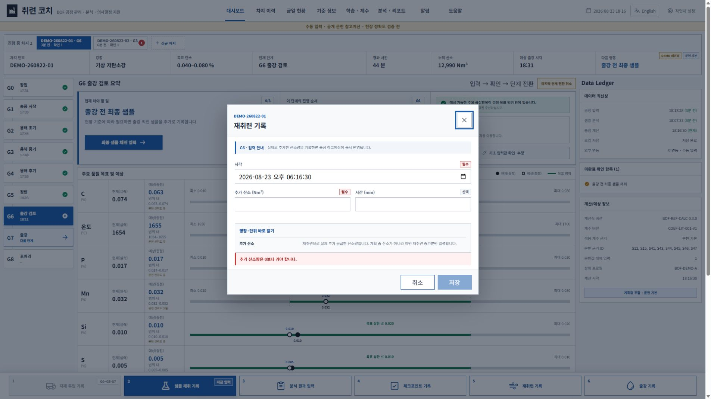

| 재취련 필드 | 단위 | 뜻 |
| --- | --- | --- |
| 시각 | 날짜·시각 | 실제 재취련 시각 |
| 추가 산소 | Nm³ | 계획 총량이 아니라 이번에 실제 추가한 증가분. 0보다 커야 함 |
| 시간 | min | 이번 재취련 시간. 선택 입력 |

추가 산소를 저장하면 종점 참고예상을 즉시 다시 계산합니다.

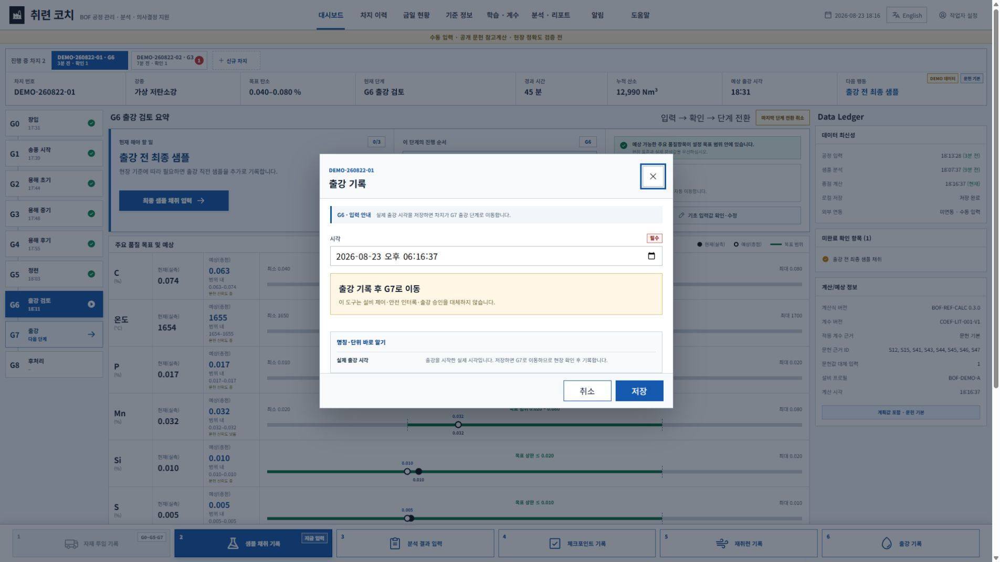

출강 기록의 필수값은 실제 출강 시작 시각입니다. 저장하면 G6에서 G7로 이동하고 출강 직전 예상 스냅샷을 보존합니다. 이 버튼은 출강 승인이 아니라 이미 현장에서 결정·실행한 사실을 기록하는 버튼입니다.

## 11. 품질 예상 대 실제값과 정정 이력

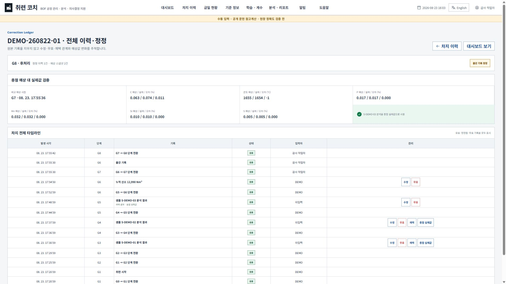

### 11.1 종점 실제값 지정

출강 후 확정된 분석 행에서 `종점 실제값`을 누릅니다. `채택 분석`은 현재 종점 참고예상을 고정하는 값이고, `종점 실제값`은 출강 시점 예상의 사후 오차를 계산하는 값입니다. 둘은 같은 샘플일 수도, 다를 수도 있습니다.

비교표는 C·온도·P·Mn·Si·S 각각 `예상 / 실제 / 오차`를 표시합니다. 오차는 항상 `실제 − 예상`입니다.

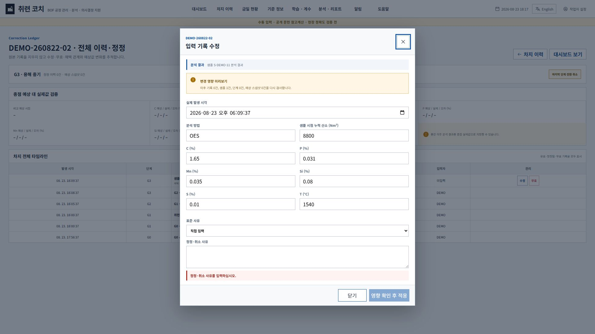

### 11.2 잘못 입력했을 때

| 상황 | 사용할 기능 | 단계 처리 |
| --- | --- | --- |
| 방금 수치가 틀림 | 해당 기록 `수정` 또는 `무효` | 현재 단계 유지 |
| 마지막 단계 전환 오조작 | `마지막 단계 전환 취소` | 정확히 한 단계 복귀 |
| 몇 단계 전 값이 틀림 | 과거 기록만 수정 | 단계 복귀 없음, 이후 계산 재검증 |
| 실제 조업 중단 | 차지 `취소` | 취소 사유와 이력 보존 |
| 출강 시각 오류 | `출강 기록 정정` | 일반 단계 복귀 금지 |
| 출강 후 확정 분석 변경 | `종점 실제값` 재지정 | 오차대장 재계산 |

정정창의 `변경 영향 미리보기`는 이후 기록·샘플·단계·예상 스냅샷 수를 보여 줍니다. 표준 사유를 고르거나 직접 입력하고, 상세 사유를 적어야 적용할 수 있습니다. 원본은 삭제하지 않고 `정정됨` 또는 `무효`로 남습니다.

## 12. 차지 이력·금일 현황·알림

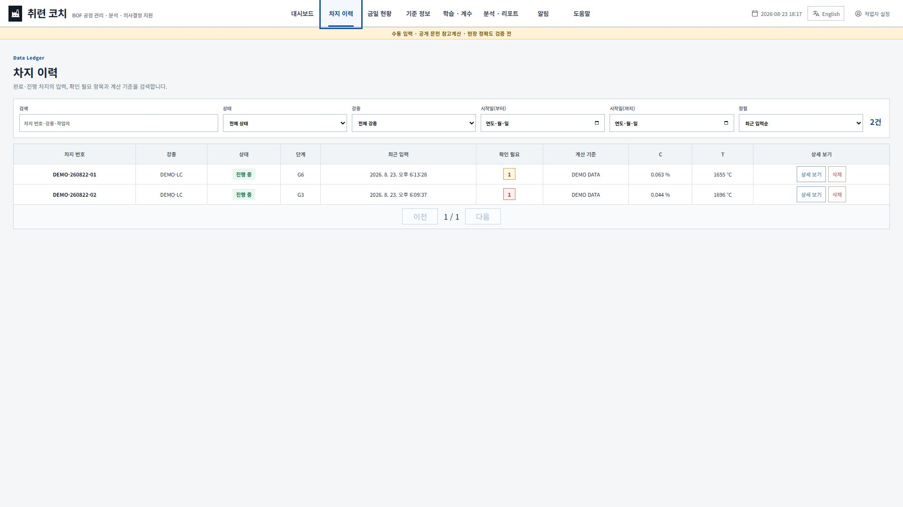

차지 이력에서는 차지 번호·강종·작업자 검색, 상태·강종·기간 필터, 최근 입력·위험·차지 번호·단계 정렬을 사용합니다. DEMO 또는 G0 무입력 초안은 삭제할 수 있습니다. 실제 진행 이력은 삭제 대신 취소, 완료·취소 차지는 보관을 사용합니다.

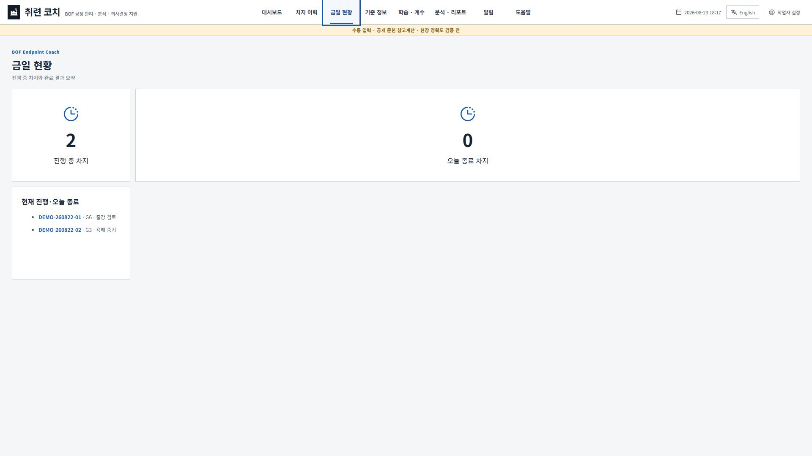

금일 현황은 진행 중 수, 오늘 종료 수, 해당 차지 목록을 빠르게 봅니다. 생산 공식 집계가 아니라 이 브라우저에 저장된 수동 기록 기준입니다.

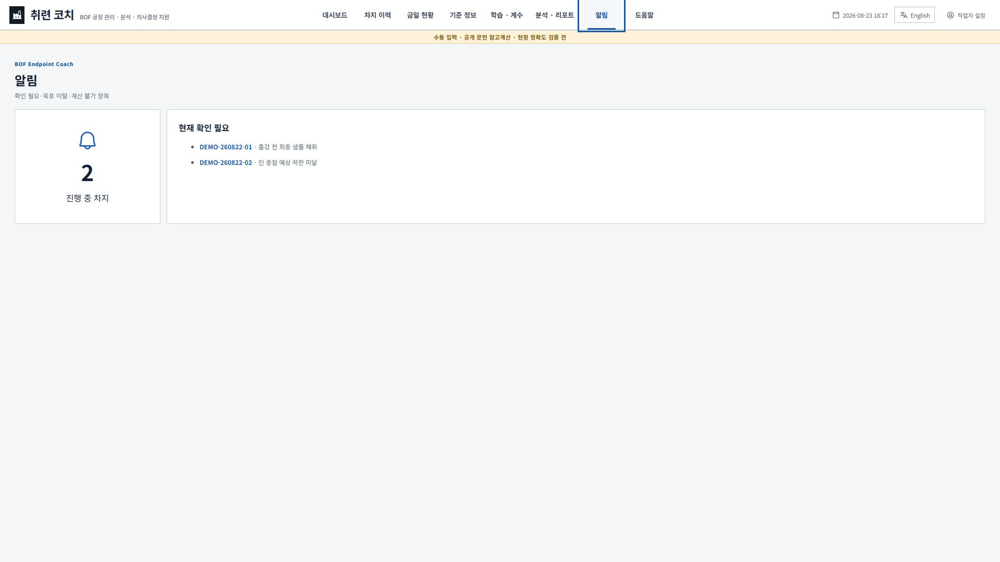

알림은 진행 차지의 미완료 행동, 목표 이탈, 계산 불가를 현재 상태에서 동적으로 만듭니다. 항목이 없다고 출강 승인된 것은 아닙니다.

## 13. 강종 목표 설정

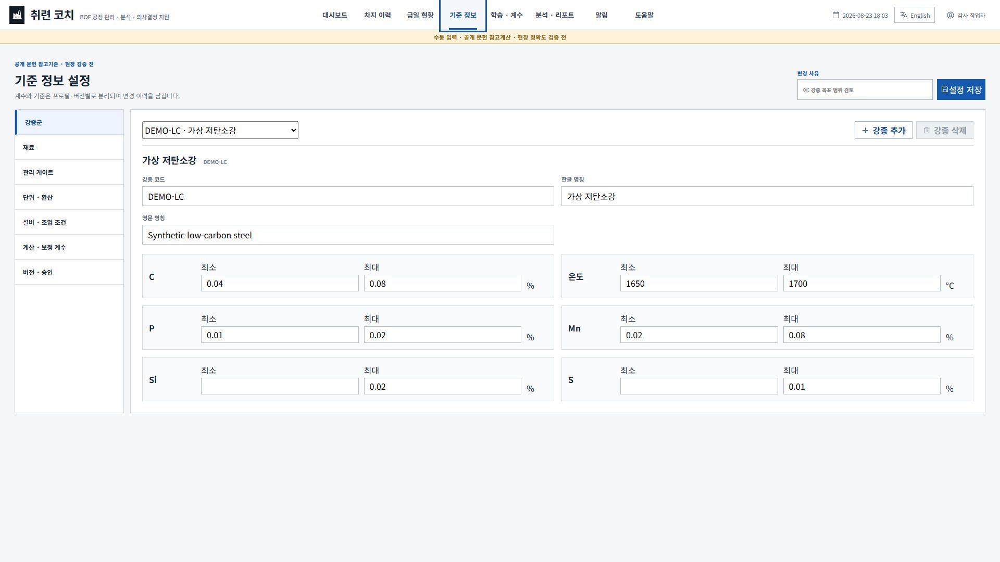

강종 코드와 한글·영문 명칭, C·온도·P·Mn·Si·S의 최소·최대를 설정합니다. 한쪽 경계만 있는 Si·S 같은 기준도 허용합니다. 최소가 최대보다 크거나 코드가 중복되면 저장하지 않습니다. 실제 변경을 저장할 때는 화면 상단 `변경 사유`가 필수입니다.

## 14. 재료·부원료 설정

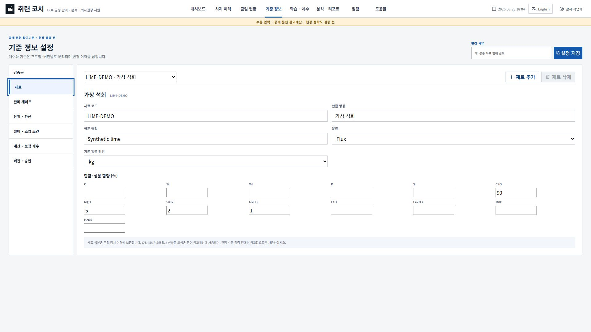

| 설정 | 뜻 |
| --- | --- |
| 재료 코드·한글·영문명 | 입력창과 백업의 식별값·표시명 |
| 분류 | Flux, Coolant, Alloy, Scrap, Other |
| 기본 입력 단위 | kg, t, g |
| C·Si·Mn·P·S | 금속·합금 성분 질량% |
| CaO·MgO·SiO2·Al2O3 | 염기도·황·인 계산의 슬래그 산화물 입력 |
| FeO·Fe2O3·MnO·P2O5 | 산화철 냉각재·슬래그 원소수지 입력 |

입력한 조성 합계가 100%를 넘으면 저장하지 않습니다. 회사 실제 원료 성분은 공개 저장소에 넣지 말고 현장 PC의 로컬 설정과 백업으로만 관리합니다.

## 15. 계산·보정계수와 날짜별 복구


### 15.1 계수 상태 우선순위

`현장 승인 수정값 → 사용자 수정·미승인값 → 보존된 문헌 원본값` 순서로 실제 계산값을 정합니다. 사용자 수정값도 저장하면 계산에 사용되지만 `미승인`을 명확히 표시합니다.

### 15.2 학습 보정 오프셋

C·P·Mn·Si·S 오프셋 단위는 `%p`, 온도 오프셋 단위는 `°C`입니다. 예를 들어 P 문헌예상이 0.015%이고 오프셋이 +0.002%p이면 화면 참고예상은 0.017%입니다.

### 15.3 저장과 복구

1. 값을 바꾸고 변경 사유를 입력합니다.
2. `설정 저장`을 누르면 현재 프로필이 날짜·작업자·사유와 함께 과거 버전으로 보관됩니다.
3. 새 버전 ID가 현재값이 됩니다.
4. 과거 행의 `초안으로 복구`는 현재 기록을 덮어쓰지 않고 과거 값을 새 설정 초안으로 복사합니다.
5. 복구 사유를 입력해 다시 저장하면 또 하나의 새 버전이 생깁니다.

CSV ZIP의 `coefficient_versions.csv`에는 현재·과거 버전이 함께 들어갑니다. 잘못된 학습값을 넣어도 이전 날짜 버전을 선택해 새 버전으로 복구할 수 있습니다.

## 16. 학습 · 계수 추천 화면


### 16.1 선순환 구조

```text
문헌 모델 예상
→ 출강 후 종점 실제값 지정
→ 오차(실제−예상) 누적
→ 같은 강종·설비·계산식·계수버전끼리 분리
→ 검토용 오프셋 후보
→ 작업자가 설정 초안에서 검토
→ 변경 사유와 승인 상태를 정해 새 계수버전 저장
→ 새 차지에서 다시 오차 검증
```

### 16.2 데이터 충분성 단계

| 같은 그룹의 실제 오차 행 수 | 화면 단계 | 허용 해석 |
| ---: | --- | --- |
| 1~9 | 오차 기록 단계 | 학습 금지, 사례 누적 |
| 10~29 | 편향 방향 참고 | 계속 높게/낮게 치우치는지 참고 |
| 30~49 | 임시 추천 후보 | 설정 초안으로 가져와 검토 가능, 현장 승인 근거 부족 |
| 50~69 | 검증표본 대기 | 독립 검증용 추가 표본 확보 |
| 70 이상 | 독립 검증 가능 | 앞쪽 n−20개 학습, 최신 20개 검증 |

DEMO 행은 개수가 많아도 현장 승인 추천에 사용할 수 없습니다. 과거 계수버전의 오차는 현재 버전과 섞지 않으며, 과거 버전 후보는 현재 설정 초안으로 가져갈 수 없습니다.

### 16.3 추천값 해석

- 현재: 해당 계수버전에 이미 들어 있던 오프셋
- 추천 변화량 Δ: 학습구간 오차의 양끝 10%를 제외한 절사평균
- 추천: `현재 오프셋 + Δ`
- 검증 MAE: 보정 전/후 독립 검증 평균절대오차
- 설정 초안으로: 추천을 자동 저장하지 않고 기준 정보의 편집 초안으로 전달

실제 적용 전에는 표본 분포, 강종·설비 변경, 센서·분석법 변경, 이상치 원인을 검토해야 합니다. 목표범위 자체를 자동 변경하지 않습니다.

## 17. 백업·복원·Excel 보고서


### 17.1 CSV ZIP 백업

복원용 ZIP에는 `manifest.csv`와 다음 9개 CSV가 들어갑니다.

| 파일 | 내용 |
| --- | --- |
| heats.csv | 차지 기초값·현재상태·단계·계산 스냅샷·정정·종점 실제값 |
| events.csv | 자재·체크포인트·재취련·출강 등 이벤트 |
| samples.csv | 샘플·채택 관계·샘플 시점 조업값 |
| analysis_results.csv | 복수 분석 결과·상태·정정 관계 |
| analysis_values.csv | C·온도·P·Mn·Si·S 값과 단위 |
| reference_values.csv | 전체 설정·작업자·언어·스키마 |
| operation_log.csv | 백업·복원·Excel·초기화 이벤트 |
| coefficient_versions.csv | 현재·과거 계수버전과 사유·작업자·시각 |
| calibration_residuals.csv | 종점 예상·실측·오차와 그룹 기준 |

다운로드 전에 프로그램이 방금 만든 ZIP을 다시 읽고 SHA-256, 행 수, 필수 파일, 참조 ID, 공정 시각·값 범위를 검사합니다. 성공 메시지의 차지 수와 해시 앞 12자리를 확인합니다.

복원은 합성 DEMO 또는 빈 저장소에서만 허용합니다. XLSX는 복원 입력으로 사용하지 않습니다.

### 17.2 Excel 9개 시트

`Heat summary`, `Events`, `Analysis`, `Corrections`, `Predictions`, `Residual ledger`, `Calibration candidates`, `Coefficient versions`, `Read me`를 만듭니다. 사람의 검토·보고용이며 원본 백업은 CSV ZIP입니다.

## 18. 도움말과 화면 크기

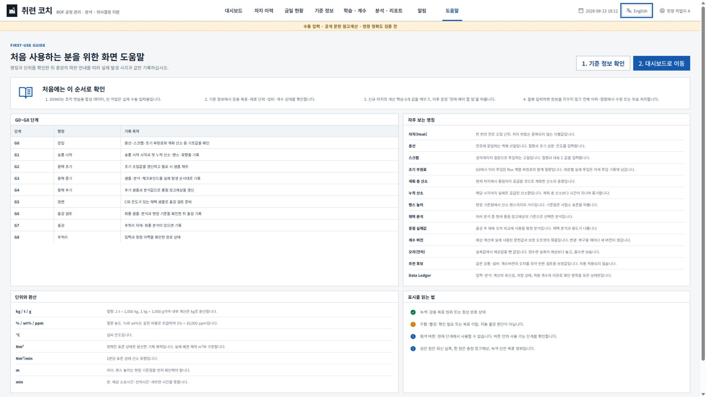

도움말은 앱 안에서 G0~G8, 용어, 단위, 색을 빠르게 확인하는 요약본입니다. 이 문서는 그보다 상세한 오프라인 설명서입니다.


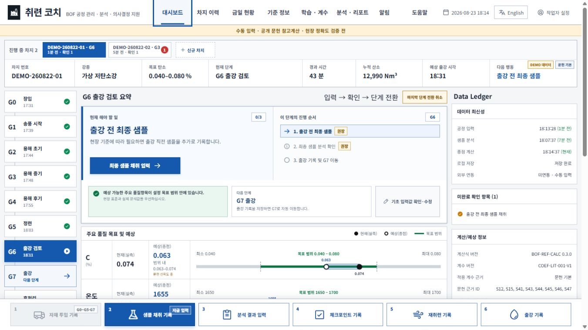

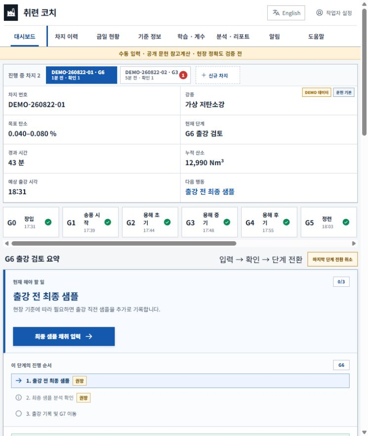

회사 1920×1080 모니터에서는 Edge 또는 Chrome, 배율 100%를 권장합니다. 1366×768에서도 핵심 조작은 유지됩니다. 760px에서는 상단 메뉴와 단계 카드가 가로 스크롤로 바뀌므로 현장 주사용은 데스크톱을 권장합니다.

## 19. 문제 해결 표

| 증상 | 먼저 확인 | 다음 조치 |
| --- | --- | --- |
| 예상이 `–` | 계산 핵심 6개, 계획 산소, 계수 오류 | 기초 입력 수정 |
| 예상이 0에 가까움 | 단위, 초기 성분, 슬래그·산소 조건 | %/ppm 혼동과 문헌대체 확인 |
| 종합판정 경고 | 6개 중 목표 이탈 행 | 해당 막대와 입력·목표·계수 확인 |
| 분석 저장 불가 | 분석값 하나 이상, 샘플 시점 산소 | 범위·단위 확인 |
| G5→G6 불가 | 채택 분석의 C와 온도 | 결과 입력 후 채택 |
| 누적 산소 저장 불가 | 이전 유효 기록보다 작음 | 실제 시각·값 순서 확인 |
| 설정 저장 불가 | 변경 사유, 중복 코드, 범위 역전, 조성 합계 | 화면 경고 수정 |
| 추천 버튼 비활성 | DEMO, 30건 미만, 과거 계수버전 | 실제 같은 그룹 데이터 축적 |
| 계수 복구가 현재를 덮지 않음 | 정상 동작 | 복구는 새 초안, 사유 입력 후 새 버전 저장 |
| 다른 창 변경 경고 | 동일 HTML을 여러 창에서 사용 | 입력 중지, 비상 백업 후 최신 상태 읽기 |
| 백업 실패 | 브라우저 다운로드·저장정책 | 저장 공간과 회사 정책 확인 |
| 결과가 현장 경험과 다름 | 현장 정확도 미검증 | 실제 분석 우선, 오차 기록·그림자 검증 |

## 20. English quick field reference

- **Do this now:** the single next recommended action for the selected heat.
- **Current actual:** latest adopted analysis result.
- **Endpoint estimate:** public-literature reference result after the selected coefficient offset and latest adopted-sample anchoring.
- **Scenario range:** literature low/base/high sensitivity range, not a statistical confidence interval.
- **Residual:** actual minus predicted.
- **Adopted analysis:** the analysis anchoring the current endpoint estimate.
- **Actual endpoint:** confirmed post-tap analysis used for model validation.
- **Correction candidate:** review-only offset suggestion; never auto-applied.
- **Coefficient version:** dated immutable calculation basis. Restore copies an old version into a new draft.
- **CSV ZIP:** integrity-checked restore package.
- **XLSX:** nine-sheet human-readable report, not a restore file.
- **Safety boundary:** C, temperature, P, Mn, Si, and S are unvalidated public-literature reference estimates. Always prioritize plant standards, laboratory results, interlocks, tap authorization, and operator judgment.
