# 취련 코치 v0.6.0 초상세 처음사용자 설명서

이 문서는 취련 코치를 처음 보는 작업자가 **파일 실행, 기준 확인, 차지 입력, 종점 참고예상 해석, 잘못 입력한 기록의 정정, 오차학습, JSON 백업과 복구**까지 혼자 따라 할 수 있도록 만든 화면별 설명서입니다.

> **안전·품질 경계:** 이 도구의 C·온도·P·Mn·Si·S 값은 공개 문헌 시나리오와 사용자가 입력한 값으로 계산한 참고예상입니다. 실제 BOF 차지 정확도와 사업소 적합성은 아직 검증되지 않았습니다. PLC·HMI·SCC·MES·LIMS와 연결되지 않으며, 설비 제어·인터록·표준작업·실험실 분석·출강 승인·취련사의 판단을 대체하지 않습니다.

## 1. 3분 안에 전체 구조 이해하기

취련 코치는 아래 순환을 관리하는 오프라인 보조도구입니다.

1. 작업자가 강종·설비·계수 기준을 확인합니다.
2. G0 장입값과 조업 중 자재·산소·랜스·샘플·분석·재취련·출강을 수동 기록합니다.
3. 문헌 기본모델이 C·온도·P·Mn·Si·S 종점 참고예상을 계산합니다.
4. 채택한 중간 샘플이 들어오면 `실측 − 문헌 궤적값` 오차로 현재 차지의 종점값을 다시 보정합니다.
5. 출강 후 확정 분석을 종점 실제값으로 지정하면 `실제 − 종점예상` 오차를 누적합니다.
6. 같은 강종·설비·모델·계수버전의 실제 완료차지가 충분하면 검토용 보정계수 후보와 재현 가능한 학습 실행이 생깁니다.
7. 작업자가 검토·승인하여 새 계수버전으로 저장하기 전에는 어떤 추천도 자동 적용되지 않습니다.
8. 평상시 데이터는 IndexedDB에 자동저장하고, 외부 보관은 단일 JSON으로 수동 저장합니다.

## 2. 실행과 첫 화면

### 2.1 권장 환경

- 파일: `BOF_Endpoint_Coach_v0.6.0.html`
- 브라우저: Microsoft Edge 또는 Google Chrome
- 회사 PC 권장 화면: 1920×1080, 배율 100%
- 서버·설치·인터넷: 필요 없음
- 데이터 위치: 해당 브라우저 프로필의 로컬 IndexedDB

같은 HTML을 다른 폴더로 복사하거나 다른 브라우저 프로필에서 열면 저장소가 다르게 보일 수 있습니다. 실제 사용 전에는 사용할 브라우저와 파일 위치를 고정하십시오.

### 2.2 처음 사용할 작업자 설정

`작업자 이름`은 로그인 계정이나 부서명이 아닙니다. 새 입력·단계 전환·정정·계수 승인 이력에 표시되는 로컬 이름입니다.

- `DEMO로 체험`: 공개 문헌 기반 합성 차지로 버튼과 단계 흐름을 연습합니다.
- `빈 작업으로 시작`: 실제 수동 기록을 위한 빈 작업공간을 만듭니다.
- 이름이 비어 있으면 두 시작 버튼을 사용할 수 없습니다.
- 우측 상단 `작업자 설정`에서 언제든 표시 이름을 바꿀 수 있습니다.

## 3. 공통 표시, 색, 단위

### 3.1 색과 기호

| 표시 | 뜻 | 작업자 행동 |
| --- | --- | --- |
| 파란색 | 현재 단계·현재 주 행동·선택 상태 | 지금 입력할 항목을 확인 |
| 녹색 | 목표 범위 안·저장 완료·완료된 단계 | 현장 기준과 실제 분석을 함께 확인 |
| 주황색 | 권장 입력 미완료·백업 필요·주의 | 누락값 또는 외부 JSON 상태 확인 |
| 빨간색 | 목표 이탈·위험 확인·입력 오류 | 값·단위·강종 목표·계수를 재확인 |
| 검은 점 | 최신 채택 실측 | 분석 원본과 시각 확인 |
| 흰 점 | 종점 참고예상 | 근거 펼침에서 계산 구성 확인 |
| 녹색 막대 | 강종 목표 범위 | 목표 최소·최대 또는 상한 확인 |
| 옅은 파란 범위 | 문헌 시나리오 저·고값 | 통계 신뢰구간으로 해석하지 않음 |

색만으로 판정하지 않도록 `범위 내`, `하한 미달`, `상한 초과`, `예상 불가` 문구를 함께 표시합니다.

### 3.2 입력 중요도

| 표지 | 뜻 |
| --- | --- |
| 필수 | 식별 또는 저장에 반드시 필요 |
| 계산 핵심 | 비면 C·온도 또는 다성분 종점예상이 불가능하거나 크게 제한됨 |
| 정확도 권장 | 비어도 저장되지만 문헌 대체값이 늘어남 |
| 선택 | 알고 있을 때 입력하면 이력과 해석이 좋아짐 |

### 3.3 단위 사전

| 명칭 | 선택 단위 | 내부 저장 | 설명 |
| --- | --- | --- | --- |
| 질량 | kg, t, g | kg | `1 t = 1,000 kg`, `1 kg = 1,000 g` |
| 성분 농도 | %, wt%, ppm | % | `%`와 `wt%`는 질량비로 동일, `1% = 10,000 ppm` |
| 누적·계획 산소 | Nm³ | Nm³ | 표준상태 기체 체적; 실제 배관 체적 m³와 구분 |
| 산소 유량 | Nm³/min | Nm³/min | 1분당 표준상태 산소 체적 |
| 온도 | °C | °C | 섭씨 |
| 시간 | min | min | 분 단위 지속시간 |
| 랜스 높이 | m | m | 현장 기준점이 무엇인지는 사업소 표준을 따름 |
| 성분 보정 오프셋 | %p | %p | 상대 %가 아니라 percentage point |
| 온도 보정 오프셋 | °C | °C | 종점예상에 더하는 절대 온도차 |

단위 선택을 바꾸면 입력값은 내부 기준단위로 환산됩니다. 원래 값과 선택 단위도 입력 메타데이터에 남습니다.

## 4. 대시보드 전체 읽기

| 구역 | 화면에서 확인할 것 |
| --- | --- |
| 상단 메뉴 | 대시보드·이력·현황·기준·학습·백업·알림·도움말 이동 |
| 자동저장 상태 | 완료/저장 중/오류, 저장 revision, 복구점 수 |
| 진행 차지 탭 | 여러 진행 차지를 클릭해 번갈아 확인 |
| 상단 차지 요약 | 차지·강종·목표 C·현재 단계·경과·산소·예상 출강·다음 행동 |
| 좌측 G0~G8 | 완료 단계, 현재 단계, 다음 단계와 실제 전환 시각 |
| 중앙 현재 해야 할 일 | 지금 필요한 입력과 파란 주 행동 버튼 |
| 주요 품질 막대 | 실측·종점예상·문헌범위·목표범위 비교 |
| 중간 샘플 오차 | 샘플별 문헌 궤적 기대값과 실제 오차 |
| Data Ledger | 입력·분석·계산·브라우저 저장 최신성, 외부 JSON 상태 |
| 하단 6개 버튼 | 자재·샘플·분석·체크포인트·재취련·출강 실제 입력 |

### 4.1 여러 차지를 동시에 볼 때

- 각 차지의 공정값·샘플·예상·단계는 별도로 저장됩니다.
- 탭의 `확인 n`은 해당 차지의 미완료 확인 건수입니다.
- 탭을 바꾸기 전 열린 입력창을 저장하거나 닫으십시오.
- 다른 차지 탭으로 갔다가 돌아와도 자동저장된 값이 유지되어야 합니다.
- 차지 삭제는 초안 또는 허용 상태만 가능하며, 중요한 변경 전에는 복구점이 생성됩니다.

### 4.2 G0~G8 단계

| 단계 | 기본 의미 | 대표 입력 |
| --- | --- | --- |
| G0 | 장입 | 기초값·초기 자재 |
| G1 | 송풍 시작 | 시작 시각·초기 체크포인트 |
| G2 | 용해 초기 | 누적 산소·랜스·유량 |
| G3 | 용해 중기 | 샘플·분석·체크포인트 |
| G4 | 용해 후기 | 샘플·분석·체크포인트 |
| G5 | 정련 | 최종계열 샘플·재취련 |
| G6 | 출강 검토 | 최종 샘플·출강 전 확인 |
| G7 | 출강 | 실제 출강·후첨 자재 |
| G8 | 후처리 | 완료·보관·종점 실제값 검증 |

게이트 이름과 필수조건은 `기준 정보 > 관리 게이트`에서 현장 기준에 맞게 확인해야 합니다.

## 5. 종점 참고예상과 근거 읽기

각 성분의 최종 표시값은 다음 세 층으로 설명됩니다.

`문헌 기본값 + 최신 채택 샘플 보정 + 승인된 현장 오프셋 = 표시 종점 참고예상`

근거 펼침에서 확인하는 항목은 다음과 같습니다.

| 항목 | 뜻 |
| --- | --- |
| 문헌 기본 | 공개 문헌 시나리오와 현재 장입·산소·시간으로 만든 기본값 |
| 샘플 보정 | 최신 채택 샘플의 `실측 − 궤적 기대값`을 현재 차지 종점에 반영한 값 |
| 현장 오프셋 | 현재 계수버전에 작업자가 승인해 저장한 성분별 편향 보정 |
| 최종 예상 | 위 세 값을 합친 화면 표시값 |
| 적용 그룹 | 강종·설비·계산식·계수버전·실제/DEMO 구분 |
| 학습 실행 | 같은 데이터셋으로 다시 만들 수 있는 SHA-256 식별 학습 결과 |
| 경고 | 문헌 대체값, 데이터 부족, 과거버전, DEMO, 승인 전 후보 등 |

P·Mn·Si·S도 숫자를 표시하지만 현장별 반응속도·슬래그·교반·원료 조성·회수율 의존성이 큽니다. 특히 S는 현재 문헌모델 신뢰도가 매우 낮으므로 실제 분석을 우선하십시오.

## 6. 중간 샘플 오차 읽기

표의 오차는 `실측 − 문헌 궤적 기대값`입니다.

- 양수: 실제값이 모델 궤적보다 높음
- 음수: 실제값이 모델 궤적보다 낮음
- `반영`: 최신 채택 분석이라 현재 종점예상 재고정에 사용
- `비교만`: 유효 이력에는 남지만 현재 종점 재고정에는 미사용
- 샘플 시점 누적 산소가 없으면 산소 진행률 기반 궤적 비교가 제한됩니다.
- 이전 샘플을 삭제해 오차를 숨기지 않고 수정·무효 관계를 남깁니다.

## 7. 신규 차지와 G0 기초값

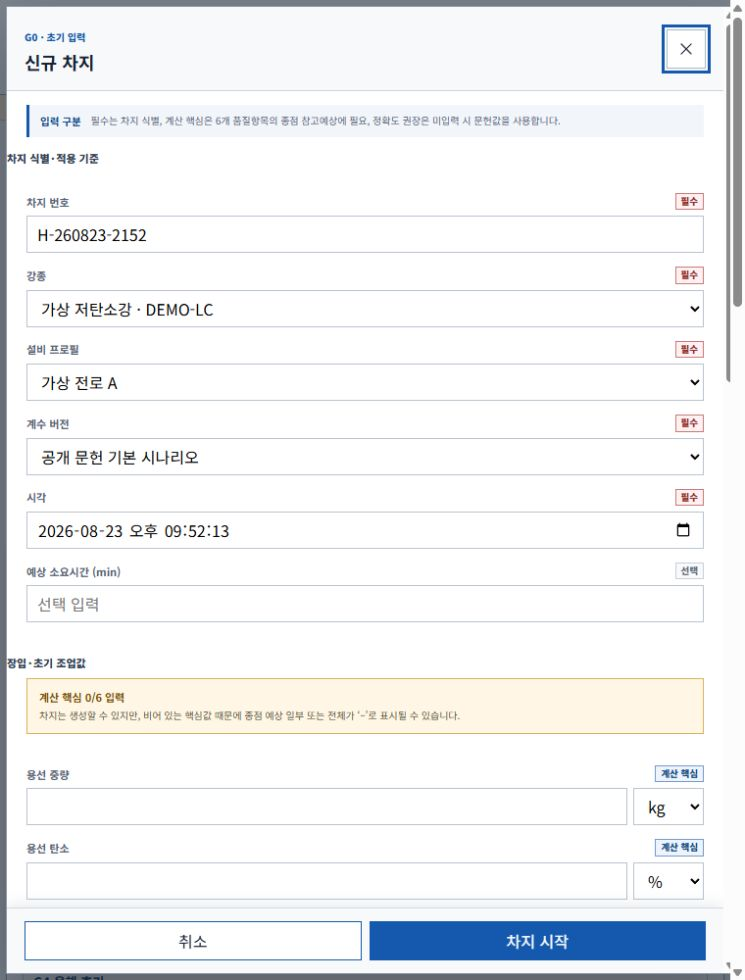

### 7.1 식별·적용 기준

| 필드 | 뜻 | 주의 |
| --- | --- | --- |
| 차지 번호 | 작업공간 안의 고유 ID | 중복 저장 불가 |
| 강종 | 품질 목표 세트 | 실제 사내 강종 목표는 사용자가 입력 |
| 설비 프로필 | 용량·취련·랜스·저취 조건 | 실제 대상 설비와 일치 확인 |
| 계수 버전 | 문헌/사용자/현장 승인 계산계수 | 차지 시작 후 기준 스냅샷 보존 |
| 시각 | 실제 G0 시작 시각 | 기본은 PC 현재시각, 수정 가능; 미래시각 금지 |
| 예상 소요시간 | 예상 출강 표시용 | 실제 단계시각이 우선 |

### 7.2 장입·초기 조업값

| 필드 | 단위 | 계산상 역할 |
| --- | --- | --- |
| 용선 중량 | kg/t/g | 전체 용탕 질량·물질수지 |
| 용선 C·Si·Mn·P·S | %/wt%/ppm | 원소별 초기량 |
| 용선 온도 | °C | 열수지 기준 |
| 스크랩 중량·성분 | kg/t/g, %/wt%/ppm | 냉각·희석·원소수지 |
| 초기 부원료 | kg/t/g | G0 flux 합계; 재료별 조성은 별도 기록 |
| 계획 총 산소 | Nm³ | 계획 종점과 산소 진행률 |
| 누적 산소 | Nm³ | 시작 시 이미 공급된 누적량이 있을 때 |
| 랜스 높이 | m | 현재 조업 조건 기록 |
| 산소 유량 | Nm³/min | 예상 잔여시간과 조건 기록 |

계산 핵심 6개 값은 용선 중량·용선 C·용선 온도·스크랩 중량·스크랩 C·계획 총 산소입니다.

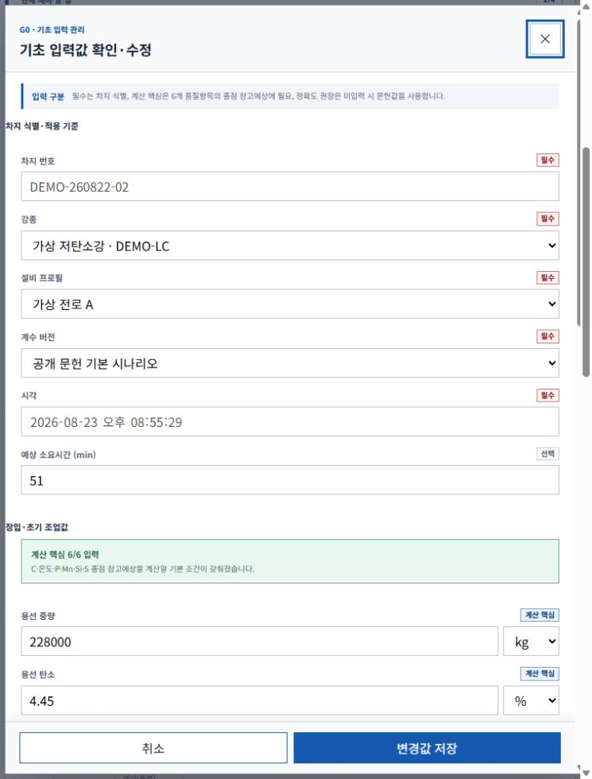

G0 이후 잘못 발견한 기초값은 `기초 입력값 확인·수정`에서 고칩니다. 저장하면 종점예상 스냅샷을 다시 만들고 운영로그에 남깁니다.

## 8. 실제 입력창 6종

### 8.1 자재 투입

자재는 등록한 재료와 이번 투입량을 기록합니다. Alloy·Scrap은 등록 조성과 질량을 명목 원소수지에 반영하지만 별도 현장 수율계수가 없으므로 100% 회수를 가정한 참고값입니다.

### 8.2 샘플 채취

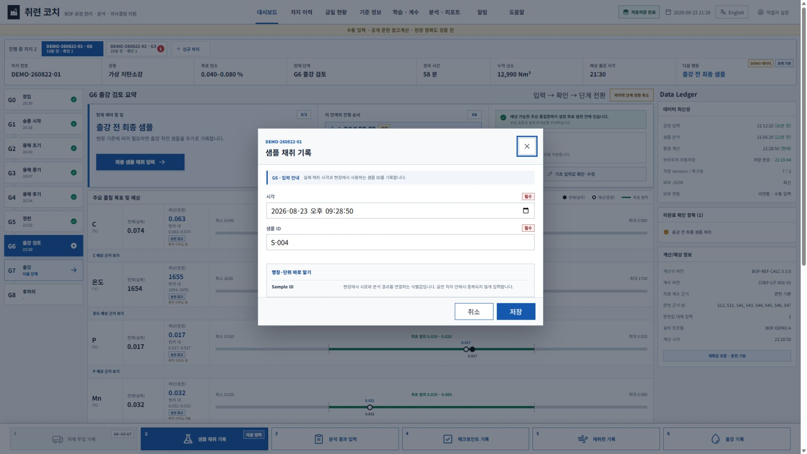

- 샘플 ID: 차지 안에서 식별할 이름
- 채취 시각: 실제 채취 시각
- 단계: 채취 당시 G 단계
- 메모: 채취 위치·상태 등 현장 해석 보조

샘플을 만든 뒤 분석 결과를 별도로 입력합니다. 채취 자체에는 성분값을 넣지 않습니다.

### 8.3 분석 결과

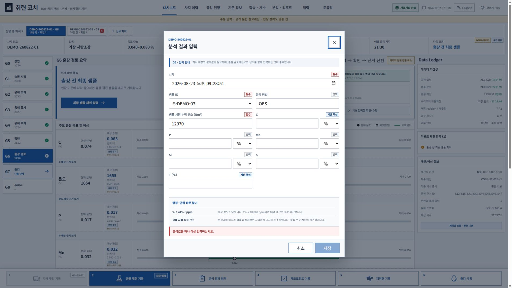

| 필드 | 단위 | 뜻 |
| --- | --- | --- |
| 샘플 | – | 어느 채취 기록의 결과인지 선택 |
| 분석 시각 | 로컬 날짜·시각 | 결과가 확인된 실제 시각 |
| 분석 방법 | 예: OES | 사용한 분석법 기록 |
| 샘플 시점 누적 산소 | Nm³ | 궤적 기대값 계산 기준 |
| C·P·Mn·Si·S | %/wt%/ppm | 입력 단위를 확인해 내부 %로 환산 |
| T | °C | 샘플 온도 |
| 채택 | – | 현재 종점예상 재고정에 사용할 결과 |

같은 샘플에 재분석 결과를 추가할 수 있습니다. 채택 결과 하나만 샘플 대표값으로 사용하며 원본과 과거 결과는 남습니다.

### 8.4 체크포인트

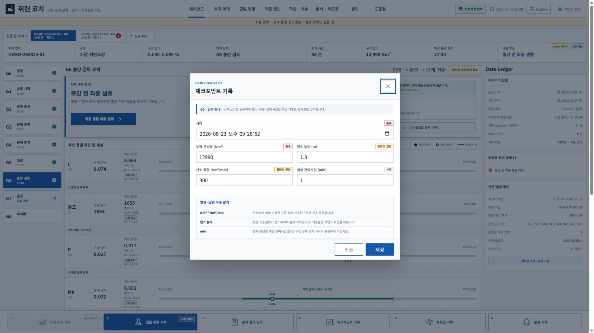

- 누적 산소는 이전 유효 기록보다 작을 수 없습니다.
- 랜스 높이와 산소 유량은 그 시점의 실제값을 기록합니다.
- 기본 시각은 현재 PC 시각이고 실제 발생시각으로 수정할 수 있습니다.
- 미래시각과 단계 이력보다 앞선 역행시각은 저장이 막힙니다.

### 8.5 재취련

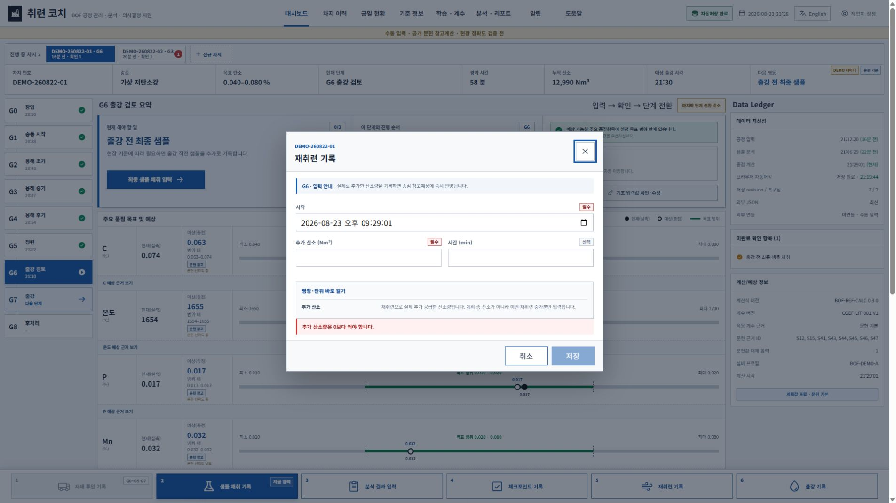

`추가 산소`는 누적값이 아니라 이번 재취련에서 더 공급한 양입니다. 지속시간을 입력하면 온도·시간 보정과 예상 이력에 사용됩니다. 재취련 입력 뒤 종점예상을 다시 확인하십시오.

### 8.6 출강

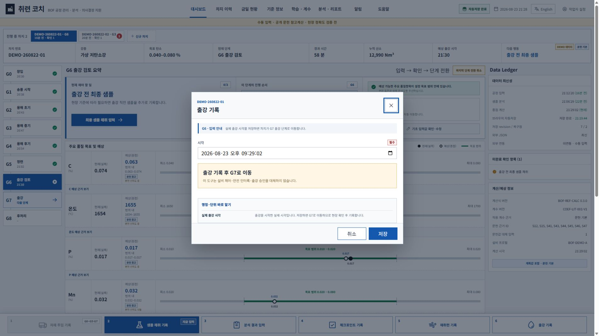

출강 버튼은 지시나 승인 버튼이 아닙니다. 실제 출강한 뒤 사실과 실제 시각을 기록하는 버튼입니다. 저장하면 G7로 이동하고 중요한 변경 직전 복구점이 자동 생성됩니다.

## 9. 단계 전환과 되돌리기

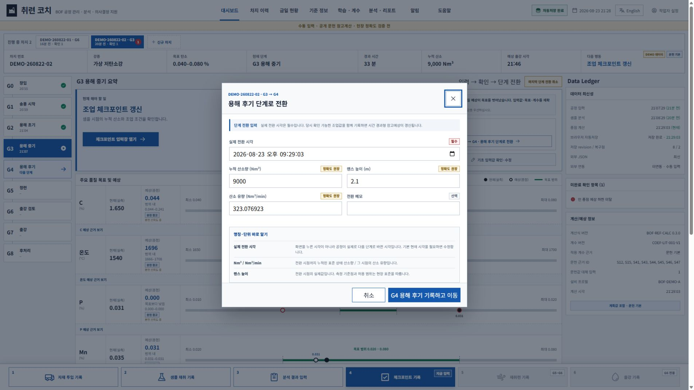

- 실제 공정이 다음 단계로 바뀐 뒤 `Gx → Gy`를 기록합니다.
- 전환 시각과 메모를 확인하고 `기록하고 이동`을 누릅니다.
- 전환 직전 자동 복구점이 생성되어 저장 실패 시 단계만 넘어가는 것을 방지합니다.
- 마지막 전환 오조작만 `마지막 단계 전환 취소`로 한 단계 복귀합니다.
- 몇 단계 전 수치 오류는 단계를 되감지 않고 해당 기록을 수정·무효 처리합니다.

| 상황 | 사용 기능 |
| --- | --- |
| 방금 입력한 수치 오류 | 해당 기록 `수정` 또는 `무효` |
| 마지막 단계 전환 오조작 | `마지막 단계 전환 취소` |
| 몇 단계 전 기록 오류 | 과거 기록 정정 후 이후 예상 재검증 |
| 실제 조업 중단 | `차지 취소` |
| 출강 시각 오류 | `출강 기록 정정` |
| 출강 후 확정 분석 변경 | 다른 분석을 `종점 실제값`으로 지정 |

## 10. 전체 이력, 정정, 종점 실제값

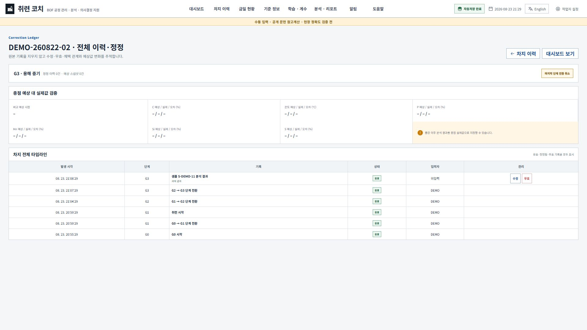

`전체 이력·정정` 화면은 유효·정정됨·무효 기록을 시간순으로 함께 보여줍니다. 원본을 물리 삭제하지 않으므로 누가 무엇을 왜 바꿨는지 추적할 수 있습니다.

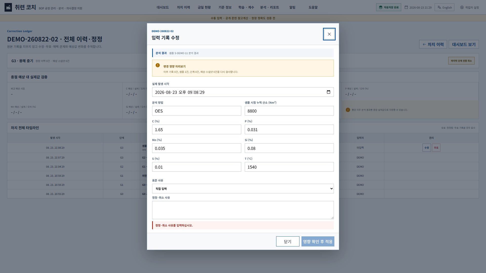

정정 절차:

1. 수정 또는 무효 대상 행을 선택합니다.
2. 이후 기록·샘플·단계·예상 스냅샷 영향 수를 확인합니다.
3. 실제값 또는 실제 발생시각을 고칩니다.
4. 표준 사유와 구체적인 정정·취소 사유를 입력합니다.
5. `영향 확인 후 적용`을 누릅니다.
6. 새 예상값과 정정대장을 다시 확인합니다.

출강 후에는 확정 분석 행의 `종점 실제값`을 눌러 실제값을 명시해야 오차학습에 들어갑니다. 단순히 마지막 샘플이라는 이유로 자동 확정하지 않습니다.

## 11. 차지 이력·금일 현황·알림·도움말

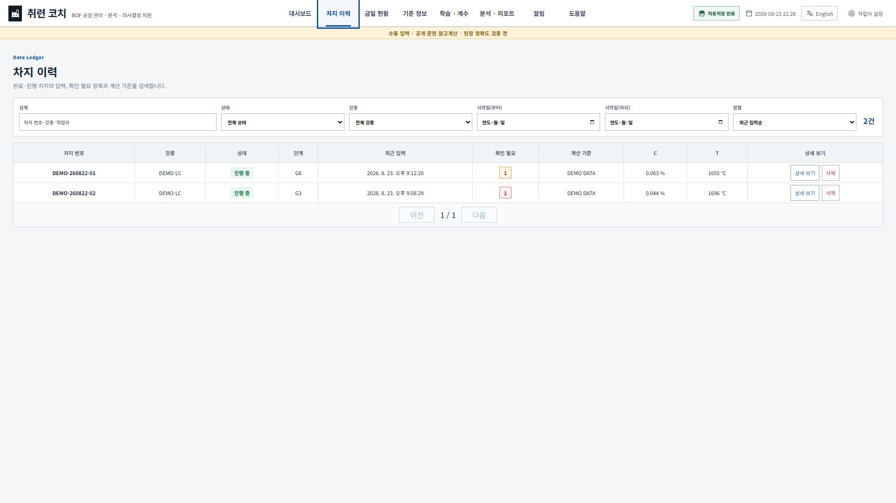

차지 이력은 검색, 상태, 단계, 강종, 설비, 날짜로 필요한 행을 좁힙니다. 취소·보관·삭제는 상태별 허용조건과 확인창을 거칩니다.

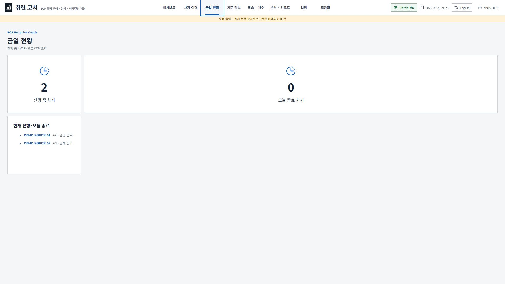

금일 현황은 오늘 발생한 차지·입력·위험·확인 필요를 빠르게 비교하는 화면입니다.

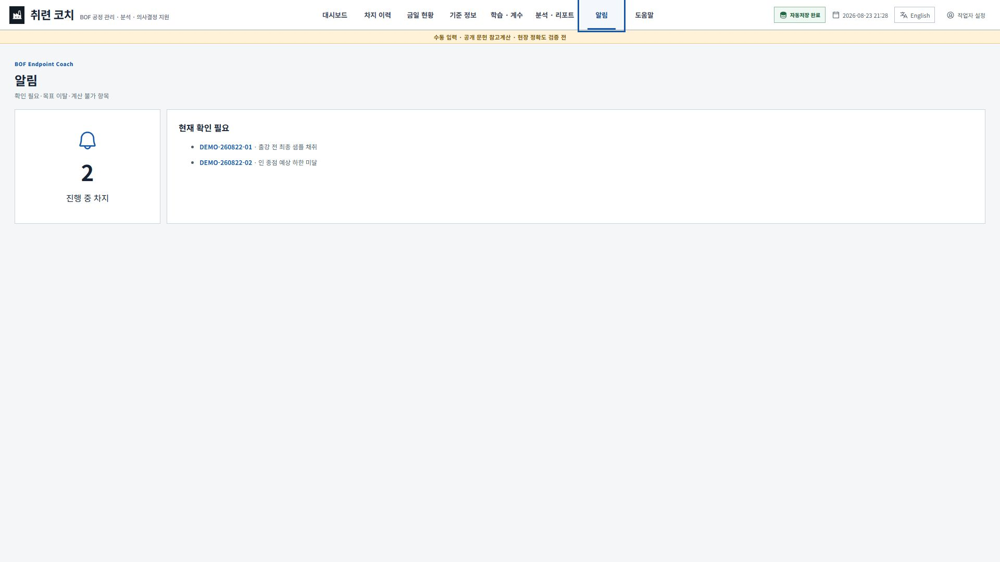

알림은 목표 이탈, 예상 불가, 필수 입력 누락, 출강 전 확인 등을 모읍니다. 자동 설비알람이 아니라 앱 내부 데이터에 대한 확인 목록입니다.

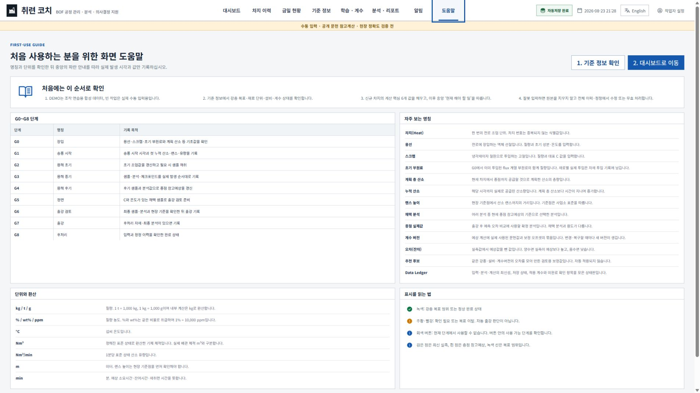

도움말은 단계별 처음 사용 순서, 명칭, 단위, 되돌리기 원칙, 안전 경계를 요약합니다.

## 12. 기준 정보 세부화면

### 12.1 강종

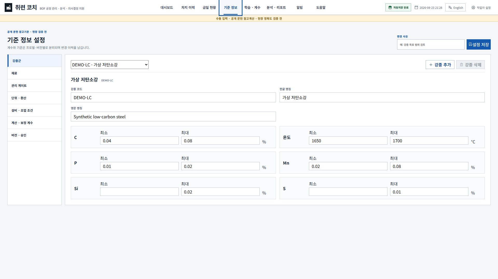

강종은 사용자가 계속 추가할 수 있습니다. 코드 중복, 빈 코드, 최소값이 최대값보다 큰 경우는 저장할 수 없습니다. C·온도·P·Mn·Si·S 각각 최소·최대 또는 상한을 설정합니다.

### 12.2 재료·부원료

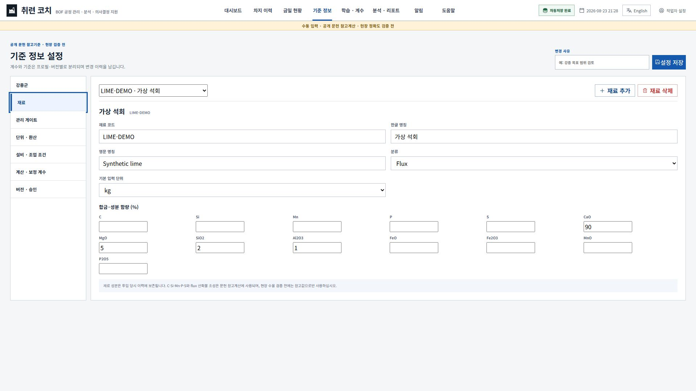

| 분류 예 | 입력 조성 |
| --- | --- |
| Hot metal·Scrap·Alloy | C·Si·Mn·P·S 등 금속 성분 |
| Flux·Ore | CaO·MgO·SiO2·Al2O3·FeO·Fe2O3·MnO·P2O5 등 |

재료별 기본단위를 선택하고 조성 합계가 100%를 넘지 않는지 확인합니다. 실제 회사 원료·스크랩·부원료 조성은 공개 파일에 넣지 말고 회사 PC의 로컬 설정 또는 백업 JSON에만 보관하십시오.

### 12.3 설비·조업 조건

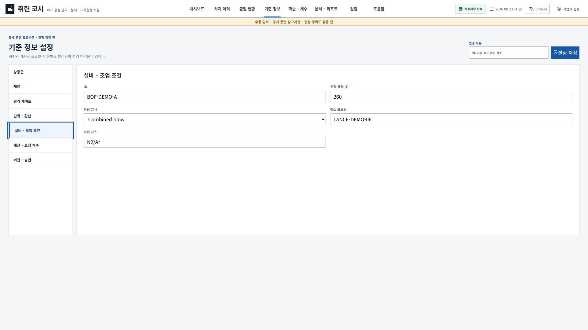

전로 용량, 취련 방식, 랜스 프로필, 저취 가스 등 설비 차이를 분리합니다. 학습 데이터도 설비 프로필이 다른 경우 같은 그룹으로 섞지 않습니다.

### 12.4 계산·보정계수

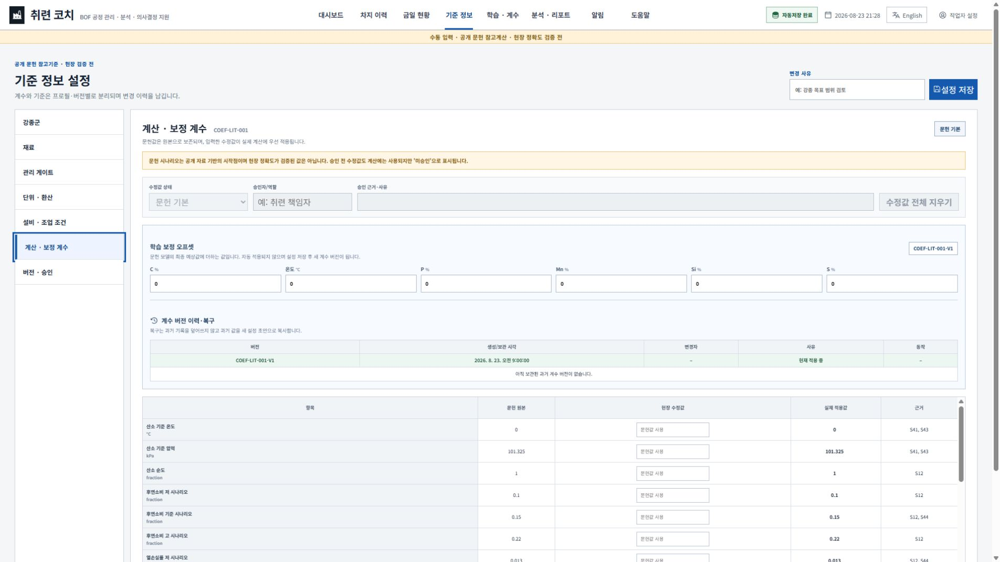

계수 상태 우선순위는 `현장 승인 > 사용자 수정 > 문헌 기본`입니다. P·Mn·Si·S와 온도·C 오프셋은 승인 전 자동 적용되지 않습니다.

### 12.5 버전·승인

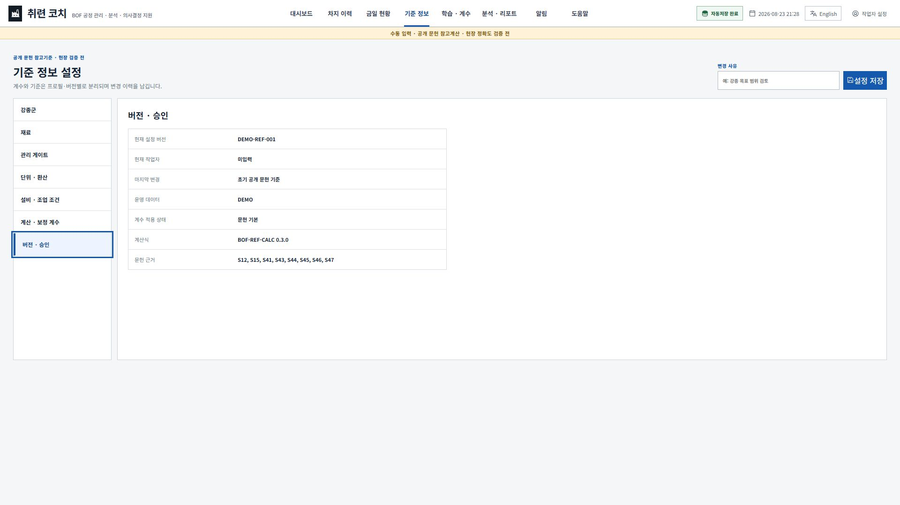

의미 있는 계수 변경은 변경 사유와 작업자 이름을 요구하고 이전값을 날짜형 버전 이력으로 보존합니다. 과거 버전의 `초안으로 복구`는 현재 이력을 지우지 않고 과거 값을 새 초안으로 복사합니다.

## 13. 학습 · 계수 추천

### 13.1 학습에 들어가는 차지

다음 조건을 모두 만족해야 합니다.

- 합성 DEMO가 아닌 실제 수동 차지
- 취소되지 않고 출강·완료된 차지
- 출강 전 종점예상 스냅샷 존재
- 출강 후 확정 종점 분석을 명시적으로 지정
- 해당 성분에 예상값과 실제값이 모두 존재
- 강종·설비·계산식·계수버전이 같은 그룹

제외된 차지와 이유도 숨기지 않고 표시합니다.

### 13.2 데이터 충분성 관문

| 같은 그룹 실제 오차 수 | 상태 |
| ---: | --- |
| 1~9 | 원장 축적 |
| 10~29 | 편향 방향 참고 |
| 30~49 | 임시 후보, 작업자 검토 필요 |
| 50~69 | 독립 검증표본 대기 |
| 70 이상 | 앞쪽 n−20 학습 + 최신 20 검증 가능 |

후보는 최신 20개 검증표본에서 MAE·편향·목표 적중률이 기존보다 좋아져야 승인 가능으로 표시됩니다. 70건은 충분한 정확도를 보장하는 숫자가 아니라 자동 추천을 시작하기 위한 최소 운영 관문입니다.

### 13.3 재현 가능한 학습 실행

학습 실행은 다음을 고정합니다.

- 데이터 행 ID와 차지 ID
- 제외 차지와 이유
- 데이터 기간
- 학습/검증 분할 수
- 현재·후보 MAE, 편향, 중앙절대오차, 목표 적중률
- 현재 오프셋, 추천 변화량, 후보 오프셋
- 계산식·계수버전·그룹키
- 데이터셋 SHA-256과 실행 SHA-256

같은 데이터로 다시 계산하면 같은 식별값을 얻습니다. 새 실제 차지, 실제값 정정, 강종·설비·계수 변경으로 데이터셋이 달라지면 이전 실행은 삭제하지 않고 `오래됨`으로 표시합니다.

### 13.4 승인 순서

1. 완료 실제차지와 확정 종점 분석을 점검합니다.
2. 후보가 현재 계수버전·같은 그룹인지 확인합니다.
3. 학습과 최신 20개 검증 성능을 비교합니다.
4. 이상치·정정·단위오류·설비변경 여부를 검토합니다.
5. 후보를 설정 초안으로 보냅니다.
6. 현장 승인자·사유와 함께 새 계수버전으로 저장합니다.
7. 다음 차지부터 새 버전을 명시적으로 선택합니다.

## 14. 자동저장, 외부 JSON, 내부 복구점

### 14.1 자동저장

- 상태가 바뀐 뒤 약 250ms 동안 추가 변경이 없으면 IndexedDB에 저장합니다.
- 우측 상단과 Data Ledger에 완료/저장 중/오류, 최근 저장시각, revision을 표시합니다.
- 브라우저를 닫았다 다시 열면 마지막 저장상태를 불러옵니다.
- 다른 창이 더 최신 revision을 저장하면 오래된 창은 쓰기를 막고 최신 상태 다시 읽기를 요구합니다.
- 자동저장은 같은 PC·브라우저 안의 편의 기능이며 외부 백업이 아닙니다.

### 14.2 단일 JSON 저장

`전체 데이터 JSON으로 저장`은 아래를 한 파일에 넣습니다.

- 모든 차지·단계·이벤트·샘플·분석·정정·예상 스냅샷
- 강종·재료·설비·관리게이트·단위·계수·버전 이력
- 오차대장·학습 실행·모델 레지스트리
- 작업자 표시 이름·운영로그·복구 메타데이터
- 유효한 내부 복구점

파일은 UTF-8 JSON이며 정렬된 내용에 SHA-256을 계산합니다. 생성 직후 다시 읽어 스키마·해시·행 참조·설정·조업시각·학습 실행을 검증한 뒤 다운로드합니다. 최대 불러오기 크기는 50 MiB입니다.

### 14.3 JSON 전체 불러오기

1. `JSON 백업 불러오기`를 누르고 파일을 선택합니다.
2. 해시·schema·app 버전과 현재/백업 차지·이벤트·오차·학습·복구점 수를 비교합니다.
3. 자동 병합하지 않고 전체 교체한다는 경고를 읽습니다.
4. 필요하면 `현재 데이터 JSON 저장`으로 현재 상태를 먼저 보관합니다.
5. 확인 체크 후 `검증된 백업으로 전체 교체`를 누릅니다.
6. 적용 직전 현재 작업공간은 보호 복구점으로 남습니다.
7. 7일 동안 `마지막 불러오기 취소`로 직전 작업공간을 되돌릴 수 있습니다.

해시가 맞아도 내부 상태·단위·참조·시각·설정·학습 구조가 틀리면 적용하지 않습니다. 구형 복구점 하나가 정합성에 실패하면 현재 작업공간 전체 백업을 막지 않고 그 복구점만 로컬에 보존한 채 외부 JSON에서 제외합니다. 해당 행은 복원 버튼도 비활성화됩니다.

### 14.4 내부 복구점

- 단계 전환, 출강, 계수 변경, 차지 취소·삭제, 전체 복원·초기화 등 중요 작업 직전에 자동 생성합니다.
- 일반 복구점은 최대 20개, 30일 순환 보관합니다.
- 보호 복구점은 자동 순환에서 제외합니다.
- 사용자가 현재 상태 복구점을 수동 생성하고 보호/해제할 수 있습니다.
- 복원은 다시 안전 복구점을 만든 뒤 원자적으로 작업공간과 복구점 목록을 교체합니다.

### 14.5 호환 ZIP과 Excel

- `호환용 CSV ZIP`: v0.5 계열 복원과 사람이 CSV를 확인할 때 사용
- `구형 ZIP 불러오기`: 빈 저장소 또는 DEMO 작업공간에서만 허용
- `Excel 보고서`: 열람·보고용 XLSX; 복원 입력으로 사용하지 않음
- Excel에는 차지요약, 이벤트, 분석, 정정, 예상, 오차대장, 계수후보, 계수버전, 경고 시트가 포함됩니다.

## 15. 백업 운영 권장

| 시점 | 권장 작업 |
| --- | --- |
| 매 차지 중 | IndexedDB 자동저장 상태 확인 |
| 교대 종료 | 전체 JSON 저장, 파일명·시각 확인 |
| 계수 변경 전후 | 각각 JSON 저장 + 내부 보호 복구점 확인 |
| 브라우저 데이터 정리 전 | 최신 JSON을 회사 허용 저장소에 복사 |
| PC 이동 | 원본 JSON 보관 후 새 PC에서 미리보기·전체 복원 |
| 복원 직후 | 차지 수·현재 단계·계수버전·학습 실행 수 확인 |

JSON 파일을 메모장으로 수정한 뒤 다시 쓰지 마십시오. 내용이 바뀌면 SHA-256 검증에서 차단됩니다.

## 16. 보안과 데이터 취급

- 네트워크 전송, 원격 분석, 클라우드 동기화는 없습니다.
- 회사 실제 차지·사내 기준·개인정보·현장 계수·자격증명을 공개 GitHub에 올리지 마십시오.
- JSON은 작업공간 전체를 포함하므로 사내 데이터 분류와 보관기간을 적용해야 합니다.
- 브라우저 프로필 삭제, 사이트 데이터 삭제, Windows 계정 교체 시 IndexedDB가 사라질 수 있습니다.
- 외부 JSON 저장 성공 여부는 실제 파일 존재·크기·수정시각으로 확인하십시오.
- 공용 PC에서는 승인되지 않은 USB·개인 클라우드·개인 메일로 백업하지 마십시오.

## 17. 화면 크기와 접근성 확인

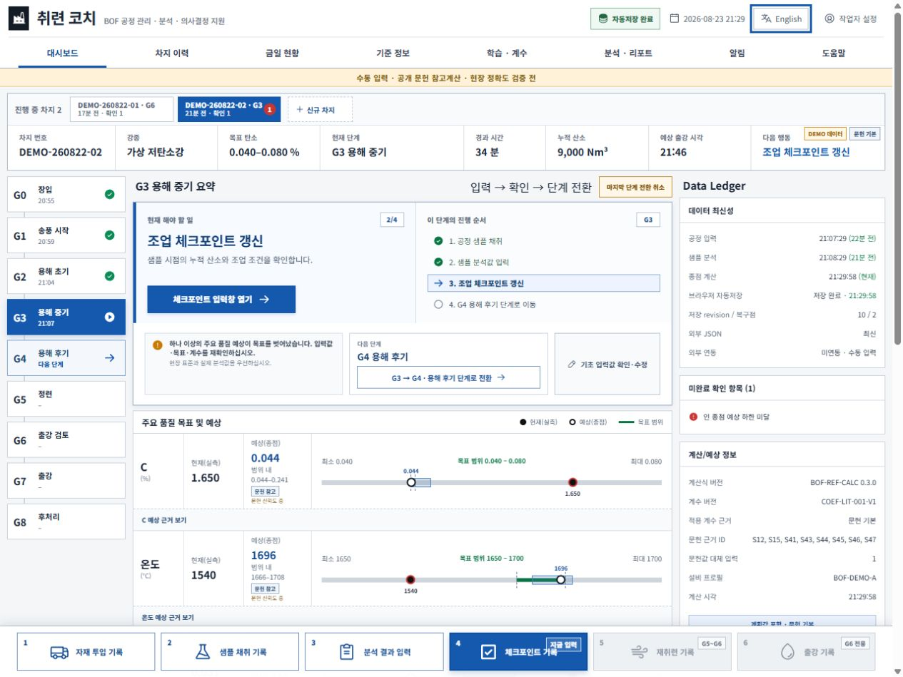

1280px 이하에서는 헤더가 두 줄로 바뀌어 우측 작업자·자동저장 버튼 잘림을 방지합니다.

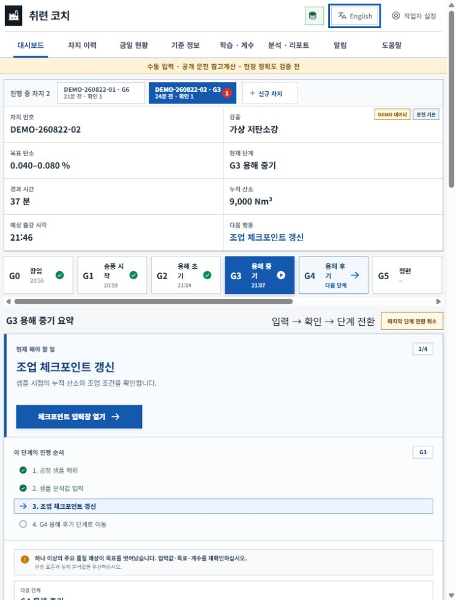

760px에서는 공정 게이트와 품질표 일부가 내부 가로 스크롤로 바뀝니다. 실제 회사 PC는 1920×1080을 권장하며 좁은 화면은 조회·긴급 입력 보조용입니다.

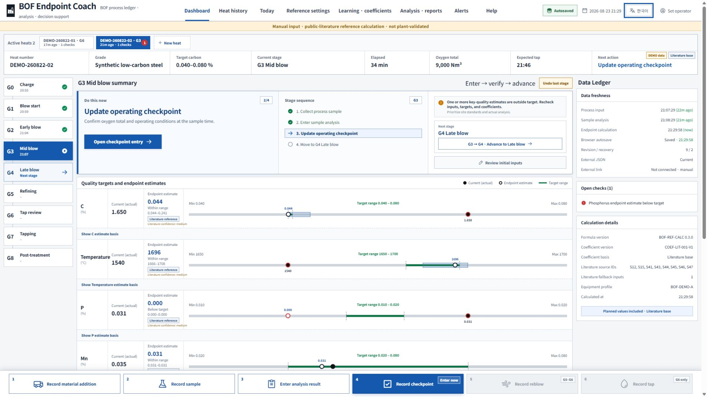

한영 전환은 같은 데이터와 현재 화면 위치를 유지합니다. 단위와 수치 기준은 언어에 따라 바뀌지 않습니다.

## 18. 문제 해결

| 증상 | 먼저 확인 | 조치 |
| --- | --- | --- |
| 예상값이 `–` | 계산 핵심값·계획 산소·계수 유효성 | 중앙 기초입력 버튼으로 누락값 확인 |
| 예상이 목표와 크게 다름 | 단위·강종 목표·샘플 채택·계수버전 | 근거 펼침과 입력 원본 대조 |
| 저장 중이 계속됨 | 다른 창·브라우저 저장소·디스크 정책 | 입력 중지, 비상 JSON 저장, 최신 상태 다시 읽기 |
| 다른 창 변경 경고 | 같은 파일을 여러 창에서 열었는지 | 오래된 창에서 쓰지 말고 최신 저장소 다시 읽기 |
| JSON 불러오기 실패 | 파일 크기·해시·schema·수정 여부 | 원본 백업 재선택; 파일을 수동 수정하지 않음 |
| 복구점 복원 비활성 | 구형 정합성 오류 표지 | 해당 점은 외부 백업/복원 제외; 유효한 최신 점 사용 |
| 학습 후보 없음 | 완료 실제차지·확정 종점·그룹 수 | 제외 사유와 데이터 관문 확인 |
| 후보가 승인 불가 | 최신 20개 검증 성능·과거버전·DEMO | 데이터와 그룹을 재검토; 강제 자동 적용 금지 |
| 버튼이 회색 | 현재 단계·필수 선행입력·저장 잠금 | 버튼 주변 활성조건 문구부터 처리 |
| 화면이 오른쪽으로 넘침 | 브라우저 배율·화면폭 | 100%로 복원; 권장 1920×1080 사용 |

## 19. 작업자 인수인계 점검표

- 현재 진행 차지 수와 선택 차지가 맞다.
- 각 차지의 현재 G 단계와 마지막 실제 입력시각이 맞다.
- 누적 산소의 단위가 Nm³이고 최근값보다 역행하지 않는다.
- 최신 채택 샘플과 분석 결과가 실제 결과와 맞다.
- C·온도·P·Mn·Si·S 목표와 종점예상 상태를 확인했다.
- 재취련·출강은 실행 사실을 기록한 것이며 지시로 오해하지 않았다.
- 자동저장 완료 revision을 확인했다.
- 최신 전체 JSON을 허용된 폴더에 저장했다.
- JSON 저장 완료 메시지의 차지 수와 파일의 수정시각을 확인했다.
- 다음 작업자에게 정정·취소·복구·계수 후보 상태를 전달했다.

## 20. English quick field reference

| Korean UI | English meaning | Unit / rule |
| --- | --- | --- |
| 계획 총 산소 | Planned total oxygen | Nm³ to planned endpoint |
| 누적 산소 | Cumulative oxygen | Nm³ supplied so far; non-decreasing |
| 산소 유량 | Oxygen flow | Nm³/min |
| 랜스 높이 | Lance height | m from the site-defined reference |
| 중간 샘플 모델 오차 | Intermediate sample residual | actual − literature trajectory |
| 종점 오차 | Endpoint residual | confirmed actual − saved endpoint estimate |
| 문헌 기본 | Literature baseline | public-literature scenario, not plant validated |
| 샘플 보정 | Sample adjustment | latest adopted sample residual anchor |
| 현장 오프셋 | Site offset | manually reviewed, versioned correction |
| 내부 복구점 | Internal recovery point | local IndexedDB rollback snapshot |
| 전체 데이터 JSON으로 저장 | Save all data as JSON | canonical UTF-8 + SHA-256 + read-back verification |
| 마지막 불러오기 취소 | Undo last JSON restore | available for seven days if its protected point exists |

**Final boundary:** all endpoint values remain unvalidated field-reference estimates until independent hand calculations, synthetic cases, completed heat shadow runs, and plant approval are complete. Always prioritize plant standards, laboratory results, interlocks, tap authorization, and operator judgment.
