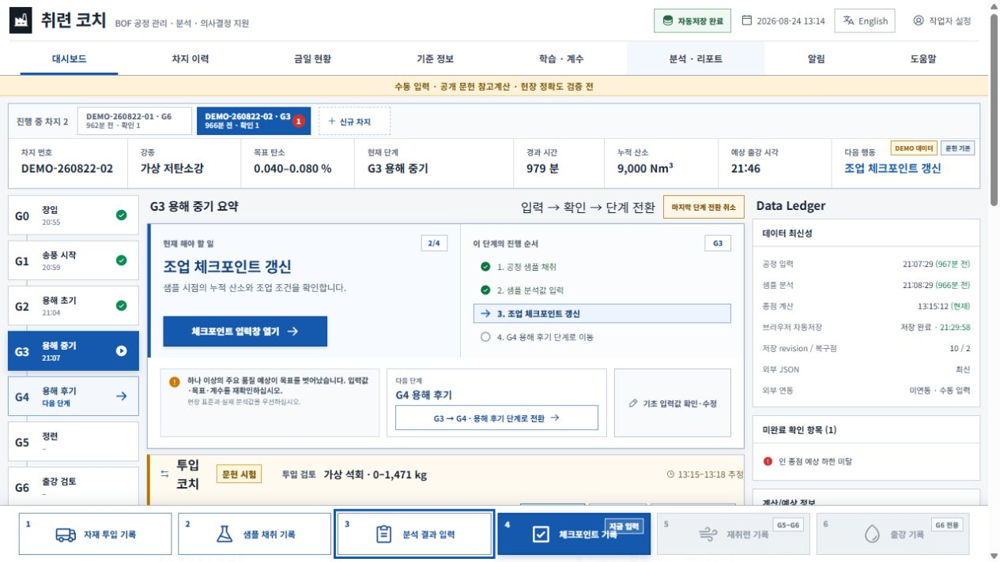
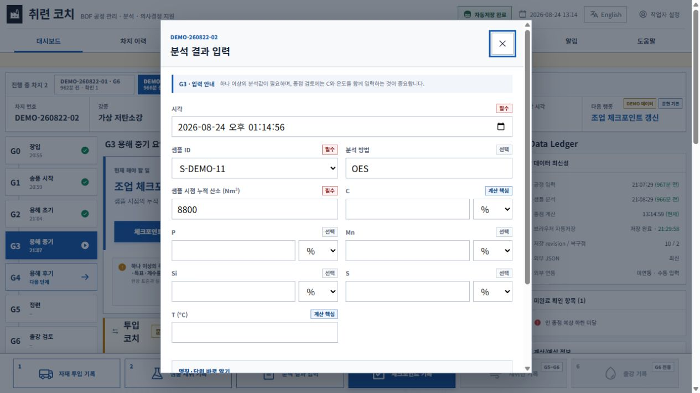

# v0.7.3 선택형 용존산소 기록 기획안

상태: **상세 기획 확정 후보 / 제품 코드 미구현**  
기준일: 2026-08-24  
기준 버전: v0.7.2  
변경 성격: 기존 계산을 바꾸지 않는 선택형 데이터 수집 보강

## 1. 결론

v0.7.3은 다음 한 가지를 안전하게 추가하는 패치 버전으로 잡는다.

> 분석 결과 입력 때 `용존산소 [O] (ppm)`를 선택해서 기록할 수 있고, 값이 없으면 아무것도 입력하지 않은 채 정상 저장·단계 진행할 수 있게 한다.

`v0.7.3`이 적절하다. 기존 v0.7.2의 종점예상·투입 코치·학습계수를 바꾸지 않고, 하위 호환되는 선택 필드와 저장·백업·정정 기능만 보강하기 때문이다.

이번 버전에서 하지 않는 것은 다음과 같다.

- 용존산소를 종점예상 계산에 자동 반영
- 용존산소 목표범위나 합격·불합격 판정
- 용존산소 보정계수 추천
- 총산소 `T.O.` 입력
- 용존산소 미입력을 경고·미완료 항목·단계 차단 사유로 사용

## 2. 산소 관련 두 값을 명확히 구분한다

현재 취련 코치에는 공급한 산소량을 기록하는 기능이 이미 있다. 새 값과 이름·단위·의미가 다르므로 같은 입력으로 합치지 않는다.

| 구분 | 의미 | 단위 | 현재/신규 | 사용 목적 |
| --- | --- | --- | --- | --- |
| 공급 산소량 | 취련 중 투입한 기체 산소의 누적량·추가 송산량 | `Nm³` | 기존 기능 유지 | 공정 진행률, 종점 참고예상, 재취련 기록 |
| 용존산소 `[O]` | 샘플 또는 종점 용강 안에 녹아 있는 산소 농도 | `ppm` | v0.7.3 선택 기록 | 미래 상관분석·모델 검토용 데이터 축적 |

화면 도움말에는 다음 문구를 고정한다.

> 공급 산소량(Nm³)과 용강의 용존산소 농도(ppm)는 서로 다른 값입니다.

## 3. 사용자 경험 원칙

### 3.1 초보자가 반드시 알아야 하는 것

- 필드명 옆에 항상 `선택` 배지를 표시한다.
- 펼치기 전에도 `값이 없으면 입력하지 않고 저장해도 됩니다`를 보이게 한다.
- 빈칸으로 저장할 때 확인창·경고·오류를 띄우지 않는다.
- 미입력 때문에 `저장` 버튼이나 G단계 이동을 막지 않는다.
- 현재 계산에 사용하지 않는다는 사실을 입력창 안에서 바로 알린다.

권장 문구는 다음과 같다.

> **추가 측정값 (선택)**  
> 용존산소 측정값이 있을 때만 입력하세요. 없으면 펼치지 않거나 빈칸으로 저장해도 됩니다. 현재 종점예상과 단계 진행에는 사용하지 않습니다.

### 3.2 숙련 작업자의 기존 속도를 유지한다

- `추가 측정값 (선택)` 영역은 기본적으로 접혀 있다.
- 기존 C·P·Mn·Si·S·온도만 입력하는 작업자는 클릭과 키보드 이동이 늘지 않는다.
- 하단 저장 버튼의 위치와 의미를 바꾸지 않는다.
- 최근 샘플 표에 새 열을 억지로 추가하지 않아 1920×1080 화면 폭을 유지한다.

## 4. 현재 화면 감사와 제안 흐름

### 4.1 현재 대시보드 진입점



1. 작업자는 기존대로 하단 `3 분석 결과 입력`을 누른다.
2. 이 버튼은 현재 단계 안내와 별개로 항상 같은 위치에 있다.
3. v0.7.3에서도 진입 버튼을 추가하거나 위치를 옮기지 않는다.

### 4.2 현재 분석 입력창



1. 현재 화면에는 시각·샘플 ID·분석 방법·누적 산소와 C·P·Mn·Si·S·온도가 이미 있다.
2. 새 필드를 기존 성분과 같은 강도로 바로 노출하면 초보자가 필수값으로 오해할 가능성이 있다.
3. 따라서 온도 입력 아래, `명칭·단위 바로 알기` 위에 접힌 선택 영역을 둔다.
4. 이 문서는 구현 전 기획 감사이므로 새 화면 자체의 캡처는 아직 없다. 구현 뒤 동일 위치·문구·접힘 상태를 실제 브라우저에서 다시 검증한다.

## 5. 화면 상세 설계

### 5.1 접힌 상태

| 항목 | 표시 내용 |
| --- | --- |
| 제목 | `추가 측정값 (선택)` |
| 한 줄 설명 | `용존산소 값이 있을 때만 입력 · 비워두고 저장 가능` |
| 상태 | 입력 전에는 `미측정` |
| 조작 | 전체 행을 누르면 펼침, 키보드 Enter·Space 지원 |

접힌 영역에는 빨강·노랑 경고색을 쓰지 않는다. `선택`이라는 글자와 설명으로 상태를 전달해 색만으로 의미를 구분하지 않는다.

### 5.2 펼친 상태

| 필드 | 형식 | 기본값 | 필수 여부 | 설명 |
| --- | --- | --- | --- | --- |
| 용존산소 `[O]` | 숫자 | 빈칸 | 선택 | 용강 안에 녹아 있는 산소 농도 |
| 단위 | 고정 표시 | `ppm` | 고정 | 초기에 단위 선택기를 두지 않아 오입력을 줄임 |
| 측정 출처 | 선택 목록 | `미상/미입력` | 선택 | `산소 프로브`, `분석실`, `기타`, `미상/미입력` |
| 측정 메모 | 짧은 텍스트 | 빈칸 | 선택 | 장비명·특이사항이 꼭 필요할 때만 사용 |

값을 입력하지 않았으면 출처·메모도 요구하지 않는다. 값만 있고 출처가 비어 있으면 `미상/미입력`으로 저장하며 진행을 막지 않는다.

### 5.3 도움말 문구

> 용존산소 `[O]`는 용강 안에 녹아 있는 산소 농도이며 단위는 ppm입니다. 취련에 공급한 누적 산소량(Nm³)과는 다릅니다. 이 입력은 선택사항이며 v0.7.3에서는 기록·백업용으로만 사용합니다.

### 5.4 저장 뒤 표시

- 값이 있으면 분석 이력의 상세 보기·수정창에서 `[O] 520 ppm`처럼 표시한다.
- 값이 없으면 상세 보기에서는 `용존산소: 미측정`으로 표시한다.
- 최근 샘플 기본 표에는 열을 추가하지 않는다. 표가 넓어지고 핵심 C·온도가 밀리는 것을 막기 위해서다.
- 저장 완료 메시지는 값이 있을 때만 `용존산소 선택값 포함`을 덧붙인다.
- Data Ledger의 `미완료 확인 항목`에는 올리지 않는다.

## 6. 저장 데이터 계약

### 6.1 핵심 원칙

- 빈칸을 숫자 `0`으로 저장하지 않는다.
- 화면에는 이해하기 쉬운 `미측정`을 표시한다.
- 내부 데이터에는 사실을 과장하지 않도록 `not_recorded`를 저장한다. 프로그램은 실제로 측정하지 않은 것인지, 측정했지만 작업자가 옮겨 적지 않은 것인지 알 수 없기 때문이다.
- 기존 분석 이벤트에 선택 객체를 추가하며 별도의 가짜 분석 이벤트를 만들지 않는다.

### 6.2 제안 스키마

```json
{
  "dissolvedOxygen": {
    "recordStatus": "not_recorded",
    "valuePpm": null,
    "source": null,
    "note": null
  }
}
```

값을 입력한 예시는 다음과 같다.

```json
{
  "dissolvedOxygen": {
    "recordStatus": "recorded",
    "valuePpm": 520,
    "source": "oxygen_probe",
    "note": null
  }
}
```

분석 이벤트가 이미 가진 차지 ID·샘플 ID·분석 시각·단계·수정이력과 연결하므로 같은 정보를 중복 저장하지 않는다.

### 6.3 입력·검증 규칙

- 빈칸: 정상 저장, `not_recorded`, `valuePpm: null`
- 0 이상 유한 숫자: 저장 허용
- 음수·문자·무한대: 해당 필드 오류를 표시하고 저장하지 않음
- 0 또는 현저히 이례적인 값: 입력 실수 가능성 경고는 하되 사용자가 확인하면 저장 허용
- 쉼표·공백: 숫자 해석 규칙을 기존 입력과 통일
- 용존산소만 입력한 경우: 분석 이벤트 저장은 허용하되 C·온도가 필요한 기존 종점 검토 조건을 충족한 것으로 보지 않음

현장별 정상범위가 확정되지 않은 상태에서 공개 문헌값으로 강제 최소·최대를 만들지 않는다.

## 7. 자동저장·백업·내보내기

### 7.1 IndexedDB와 JSON

- 기존 자동저장 revision에 분석 이벤트와 함께 포함한다.
- 전체 JSON 백업·복원에 값·상태·출처·메모·정정이력을 포함한다.
- v0.7.2 이하 JSON에는 필드가 없으므로 복원 시 `not_recorded/null`로 해석한다.
- 새 JSON을 저장하고 다시 불러왔을 때 값과 `null` 상태가 모두 동일해야 한다.

### 7.2 CSV·엑셀 출력

기존 분석 결과 출력에 다음 열을 끝부분에 추가한다.

| 열 이름 | 예시 |
| --- | --- |
| `dissolved_oxygen_status` | `recorded` 또는 `not_recorded` |
| `dissolved_oxygen_ppm` | `520` 또는 빈칸 |
| `dissolved_oxygen_source` | `oxygen_probe` |
| `dissolved_oxygen_note` | 선택 메모 |

숫자가 없을 때 CSV 숫자 칸에는 `미측정` 문자열을 넣지 않고 빈칸을 둔다. 상태 열을 따로 두어 나중에 통계 계산을 방해하지 않게 한다.

### 7.3 인쇄와 비상복구

- 차지 인쇄 보고서에는 값이 있을 때만 `용존산소 [O] 520 ppm`을 표시한다.
- 값이 없으면 주요 품질 영역에 `미측정`을 반복 표시하지 않는다.
- 용존산소 실측값은 보정계수가 아니므로 보정계수 비상복구 카드나 투입코치 비상복구 카드에 넣지 않는다.
- 정상 복구 수단은 전체 JSON이며, CSV·인쇄물은 사람이 확인하는 보조 기록이다.

## 8. 정정·무효 처리

- 기존 `분석 결과 수정`에서 용존산소 값·출처·메모를 함께 수정할 수 있어야 한다.
- 숫자를 지우고 저장하면 `recorded → not_recorded` 정정으로 남긴다.
- 분석 이벤트를 무효 처리하면 연결된 용존산소도 학습·통계 대상에서 제외한다.
- 정정 전 값, 정정 후 값, 작업자, 시각, 사유를 기존 correction ledger에 남긴다.
- 과거 값을 고쳤다고 단계 자체를 되돌리지는 않는다.

## 9. 현재 계산과의 격리

v0.7.3에서는 용존산소를 다음에 사용하지 않는다.

- C·온도·P·Mn·Si·S 종점예상
- 투입 코치 권장량·권장 시각
- 추가 송산량 추천
- 합격·불합격·위험 판정
- 학습 후보·보정계수 생성

따라서 같은 차지에서 용존산소 값만 입력·수정·삭제해도 기존 여섯 품질 예상값과 투입 코치 결과의 계산 해시는 바뀌지 않아야 한다. 데이터 기록 시각과 저장 revision만 바뀐다.

## 10. 미래 활용 승격 조건

v0.7.3의 목적은 **먼저 부담 없이 데이터를 모으는 것**이다. 계산 반영은 별도 버전·별도 승인을 거친다.

### 10.1 데이터 품질 확인

- DEMO가 아닌 실제 완료 차지
- 차지·단계·샘플·시각 연결이 정상
- ppm 숫자가 있고 무효 처리되지 않음
- 측정 출처별 건수와 누락률 확인
- 강종군·설비군·측정 시점이 한쪽에만 몰리지 않음
- 정정률·이상치·장비 변경 이력 확인

### 10.2 분석 단계

1. 용존산소와 종점 C·온도·재취련·추가 송산의 관계를 보고서로만 확인한다.
2. 측정 출처가 다른 값은 섞지 않고 따로 비교한다.
3. 단순 상관관계를 원인이나 권장 조작으로 단정하지 않는다.
4. 기존 모델보다 실제 독립 검증 오차가 개선되는 후보만 다음 단계로 올린다.
5. 현장 승인 전에는 어떤 후보도 자동 적용하지 않는다.

### 10.3 버전 제안

- `v0.7.3`: 선택 기록·정정·백업·출력만 제공
- `v0.7.4` 후보: 데이터 충족률·분포·이상치 보고서
- 이후 별도 승인 버전: 검증된 경우에만 용존산소를 설명변수 후보로 시험

## 11. 접근성·인간공학 기준

- 접기 버튼은 `aria-expanded`와 연결 영역 ID를 가진다.
- 제목·설명·단위는 화면낭독기에서 하나의 의미 있는 라벨로 읽혀야 한다.
- `선택`, `미측정`, `현재 계산에 미사용`을 색뿐 아니라 글자로 표시한다.
- 입력 오류는 필드 바로 아래에 표시하고 오류 요약에도 연결한다.
- 펼치기 조작 영역은 최소 44×44px를 목표로 한다.
- 접힌 상태에서 Tab 순서가 늘어나지 않아야 한다.
- 1920×1080 100%와 1280px 폭에서 모달 가로 넘침이 없어야 한다.
- 200% 확대에서는 영역이 한 열로 재배치되고 저장 버튼이 가려지지 않아야 한다.

## 12. 구현 모듈 경계

실제 구현을 승인받으면 한 파일에 몰아넣지 않는다.

```text
domain/measurements/
  dissolvedOxygenRecord
  dissolvedOxygenValidation

components/measurements/
  OptionalMeasurementSection
  DissolvedOxygenField

storage/migrations/
  dissolvedOxygenV073

export/
  dissolvedOxygenColumns
```

기존 분석 이벤트 모달은 위 모듈을 조합하고, 용존산소의 검증·직렬화·내보내기 규칙을 직접 중복 구현하지 않는다.

## 13. 구현 후 필수 시험

| 범주 | 시험 시나리오 | 합격 조건 |
| --- | --- | --- |
| 기본 흐름 | 선택 영역을 열지 않고 기존 분석 저장 | 기존과 동일하게 저장·단계 진행 |
| 빈칸 | 영역을 열고 값 없이 저장 | 오류 없음, `not_recorded/null` |
| 단일 입력 | `[O] 520 ppm` 저장 | 상세 이력·수정창·JSON에 동일 값 |
| O 단독 | C·온도 없이 `[O]`만 저장 | 이벤트 저장 가능, 기존 C·온도 게이트는 미충족 |
| 오류 입력 | 음수·문자·무한대 | 필드 오류, 기존 입력 손실 없음 |
| 정정 | 520→480, 480→빈칸 | 전후 값과 사유 보존 |
| 무효 | 분석 이벤트 무효 | 용존산소도 통계 대상 제외 |
| 자동저장 | 입력 후 새로고침 | IndexedDB에서 동일 복구 |
| JSON | 신규 백업 왕복 | 값·null·상태·출처·메모 일치 |
| 구버전 복원 | v0.7.2 JSON 불러오기 | 오류 없이 미기록 상태 생성 |
| CSV/XLSX | 값 있음·없음 혼합 출력 | 숫자 열과 상태 열이 구분됨 |
| 다중 차지 | 두 차지에 서로 다른 값 | 차지 간 값 혼합 없음 |
| 계산 격리 | O 값만 변경 | 기존 종점·투입 결과 불변 |
| 접근성 | 키보드·화면낭독 이름 | 펼침·입력·오류·저장 조작 가능 |
| 반응형 | 1920×1080, 1280px, 200% | 가로 넘침·가림·중첩 없음 |

## 14. 완료 판정

v0.7.3은 다음을 모두 만족해야 배포 후보가 된다.

1. 초보자가 선택값임을 입력 전에 알아볼 수 있다.
2. 빈칸 저장이 정상 흐름이며 경고·미완료·단계 차단을 만들지 않는다.
3. `Nm³` 공급 산소량과 `ppm` 용존산소를 혼동하지 않는다.
4. 값·미기록 상태·정정이 JSON과 출력에서 손상 없이 왕복한다.
5. 용존산소 입력이 현재 계산·학습·보정계수를 바꾸지 않는다.
6. 기존 분석 입력·정정·다중 차지·백업 회귀시험이 통과한다.
7. 실제 브라우저 화면과 상세 설명서를 갱신하고 새 캡처로 사용성을 재감사한다.

## 15. 최종 권고

이 기능은 많이 입력하게 만드는 기능이 아니라, **값이 생겼을 때 놓치지 않고 쌓아두는 얇은 기록층**이어야 한다. 따라서 v0.7.3에서는 용존산소 한 항목만 선택 입력으로 추가하고, 빈칸을 정상 상태로 다루며, 계산과 완전히 분리한다. 데이터가 실제로 쌓인 뒤에만 별도 보고서와 모델 반영 여부를 판단한다.

## 16. 구현 상태

2026-08-24 구현·재감사를 완료했다.

- 도메인 모듈: `app/src/domain/measurements/dissolvedOxygen.js`
- 공용 UI 모듈: `app/src/components/measurements/OptionalDissolvedOxygenSection.jsx`
- 분석 입력·정정·이력·JSON·CSV·Excel 연결 완료
- 단위·통합 182시험과 Chromium·Chrome·Edge 각각 31개 E2E PASS
- 실제 화면 5장과 상세 결과: [v0.7.3 종합감사](../audits/v0.7.3_선택형_용존산소_기능_UI_UX_데이터_회귀감사_2026-08-24.md)
