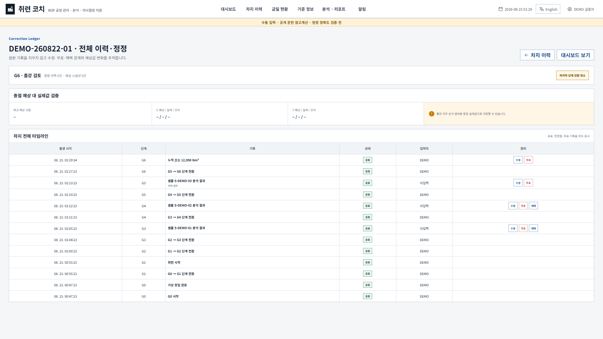
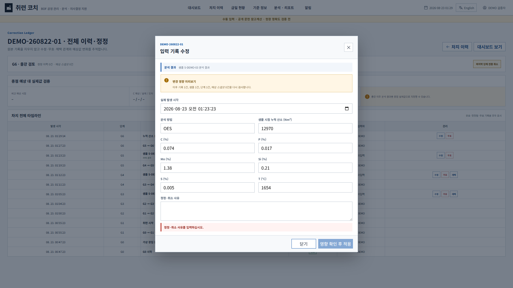

# 정정·이력 관리 화면 흐름과 버튼 배치

상태: v0.3.0 P0 구현 기준  
목적: 오입력을 고칠 때 공정 단계와 계산 이력이 꼬이지 않도록, 정정 기능을 한 묶음으로 관리한다.

## 1. 한 묶음의 범위

`정정·이력 관리`는 다음 기능을 함께 뜻한다.

1. 최근 입력 수정
2. 최근 입력 무효 처리
3. 마지막 단계 전환 취소
4. 차지 조업 취소
5. 출강 이후 출강 기록 정정
6. 복수 분석 결과 보존과 명시적 채택
7. 종점 예상 스냅샷과 출강 후 실제값 비교
8. 차지 시작 시점 기준·설비·계수 스냅샷 보존

## 2. 작업자 상황별 처리

| 작업자의 상황 | 처리 방법 | 단계 변화 | 원본 처리 |
| --- | --- | --- | --- |
| 방금 입력한 수치가 틀림 | 해당 기록의 `수정` 또는 `무효` | 유지 | `정정됨` 또는 `무효`로 보존 |
| 마지막 단계 전환을 잘못 누름 | `마지막 단계 전환 취소` | 정확히 한 단계만 복귀 | 전환과 그 단계에서 만든 기록을 무효로 보존 |
| 몇 단계 전 값이 틀림 | 전체 타임라인에서 해당 기록 정정 | 유지 | 이후 예상값과 무결성을 다시 검사 |
| 실제 조업을 중단함 | 차지 이력의 `취소` | 취소 상태 | 취소 사유와 입력자 보존 |
| 출강 시각이 틀림 | G7·G8의 `출강 기록 정정` | 유지 | 원 출강 이벤트·G7 전환을 정정됨으로 보존 |
| 출강 후 최종 분석이 확정됨 | 분석 행의 `종점 실제값` | 유지 | 예상 스냅샷과 오차 비교에 사용 |

몇 단계 전으로 공정 자체를 되감는 기능은 제공하지 않는다. 과거 값만 고치고 현재 단계는 유지한다. 이 원칙은 이미 발생한 후속 기록을 숨기거나 새 공정 흐름으로 오인하는 일을 막는다.

## 3. 권장 버튼 배치

| 위치 | 버튼 | 이유 |
| --- | --- | --- |
| 대시보드 제목 오른쪽 | `마지막 단계 전환 취소` | 현재 단계 오전환을 즉시 발견했을 때 한 번에 접근 |
| 최근 분석 표 각 행 | `수정`, `무효` | 가장 자주 확인하는 최신 분석의 오입력 처리 |
| 최근 분석 표 제목 오른쪽 | `전체 이력·정정` | 과거 투입·샘플·분석·체크포인트를 한 화면에서 검색 |
| 전체 타임라인 상단 | `마지막 단계 전환 취소`, `출강 기록 정정` | 차지 상태에 따라 가능한 복귀/출강 정정을 분리 |
| 전체 타임라인 분석 행 | `수정`, `무효`, `채택`, `종점 실제값` | 분석 생명주기를 한 행에서 관리 |
| 차지 이력 | `삭제`, `취소`, `보관` | 초안 삭제와 실제 조업 취소를 정정 기능과 혼동하지 않도록 분리 |

삭제는 합성 DEMO 또는 입력이 거의 없는 G0 초안에만 쓴다. 실제 조업 기록에는 삭제 대신 무효·취소·보관을 쓴다.

## 4. 화면 흐름

```text
대시보드 최근 분석
  → 수정/무효 또는 전체 이력·정정
  → 대상과 영향받는 후속 기록 수 확인
  → 실제 발생 시각·값·사유 입력
  → 영향 확인 후 적용
  → 원본 상태 변경 + 대체 기록 추가
  → 현재값·종점 예상·예상 스냅샷·저장 이력 재계산
```

단계 전환 취소는 다음 흐름을 쓴다.

```text
현재 단계의 마지막 전환 선택
  → 현재 단계에서 생성한 기록 목록 영향 확인
  → 취소 사유 입력
  → 한 단계 전환과 현재 단계 기록을 무효 처리
  → 이전 단계로 복귀
```

## 5. 입력 방어와 정합성

- 정정·무효·채택·단계 취소·출강 정정에는 사유가 필수다.
- 실제 발생 시각은 차지 시작보다 빠르거나 현재보다 미래일 수 없다.
- 분석 시각은 샘플 채취보다 빠를 수 없고, 샘플 시각 정정은 연결 분석보다 늦을 수 없다.
- 출강 시각은 이미 기록된 마지막 G6 입력보다 빠르거나 첫 G7·G8 후처리 입력보다 늦을 수 없다.
- 과거 기록의 시각을 바꾸면 그 시점의 공정 단계를 다시 계산하고, 당시 허용되지 않은 기록 종류는 저장하지 않는다.
- 성분은 0~100%, 온도는 0~2500°C, 질량·산소·유량·높이는 음수가 될 수 없다.
- 체크포인트 누적 산소는 앞뒤 유효 기록의 순서를 깨면 저장하지 않는다.
- 샘플을 무효 처리하면 연결된 분석 결과와 분석 이벤트도 함께 무효 처리한다.
- 분석을 수정하면 원 분석·원 이벤트는 `정정됨`, 새 분석·새 이벤트는 `유효`로 연결한다.
- 정정 전후 예상값은 스냅샷으로 남기며 기존 스냅샷을 덮어쓰지 않는다.

## 6. 화면 상태 표현

- `유효`: 현재 계산·표시에 사용할 수 있는 기록
- `정정됨`: 새 대체 기록이 있는 원본
- `무효`: 사용하지 않지만 감사 추적을 위해 남은 기록
- `채택 결과`: 현재 종점 참고예상에 사용하는 분석
- `종점 실제값`: 출강 후 예상 정확도 비교에 사용하는 확정 분석

상태는 색상만으로 구분하지 않고 텍스트와 함께 표시한다.

## 7. 화면 근거





## 8. 남은 현장 확인

- 사유를 자유 입력만 둘지, 표준 사유 목록과 자유 메모를 병기할지
- 출강 후 `종점 실제값`으로 인정할 분석 방법과 승인 절차
- 교대 상황에서 정정 작업자 표시명만으로 충분한지
- 실제 작업 중 버튼 크기·표 밀도·보호구 착용 상태에서의 클릭성

이 항목은 현장 의견 없이 임의 확정하지 않는다.
