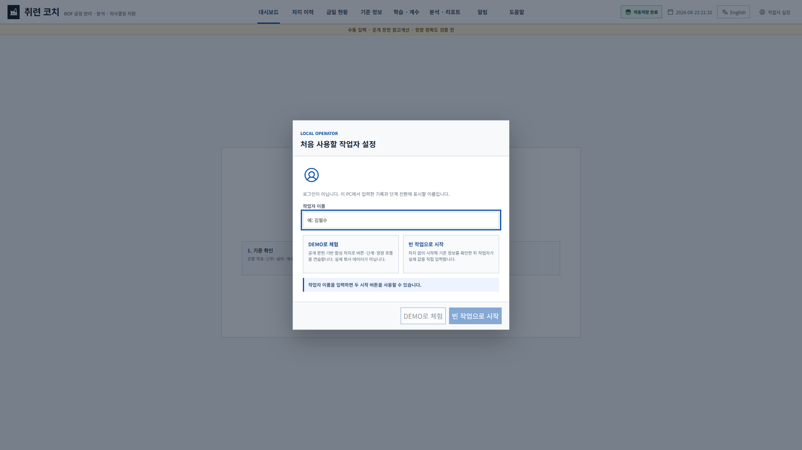
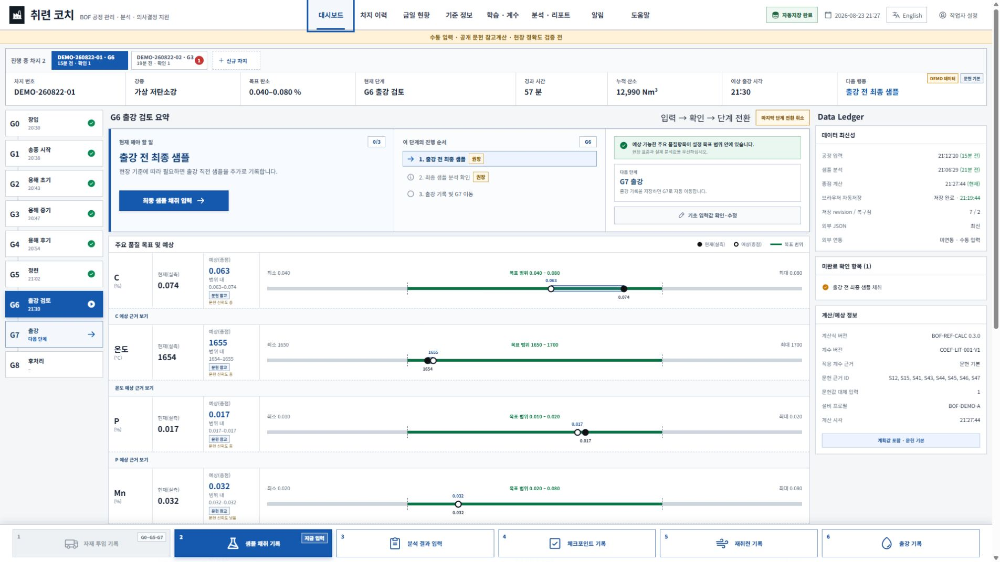
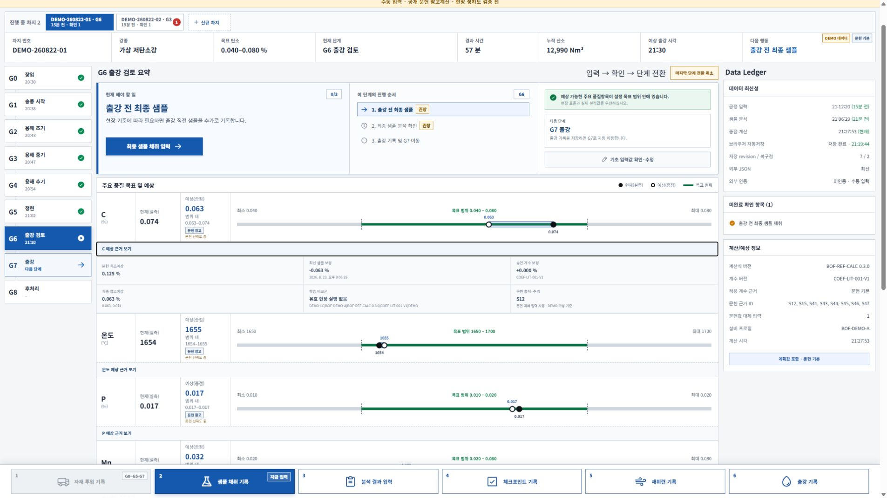
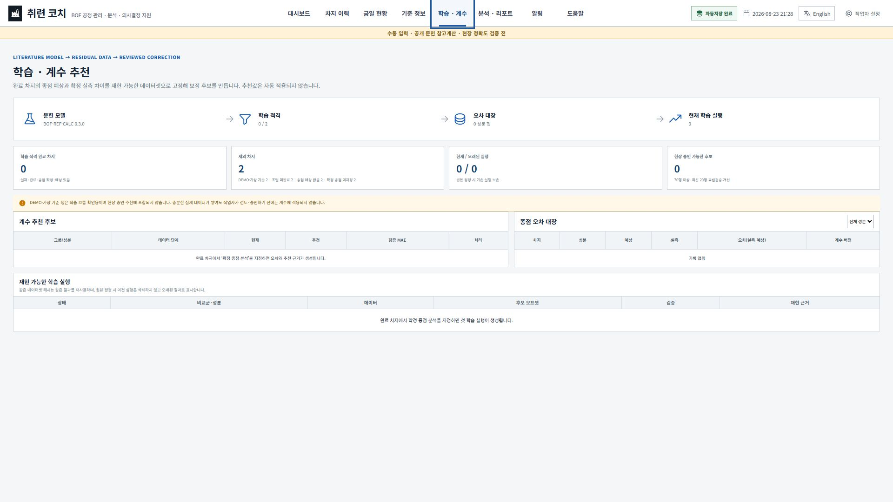
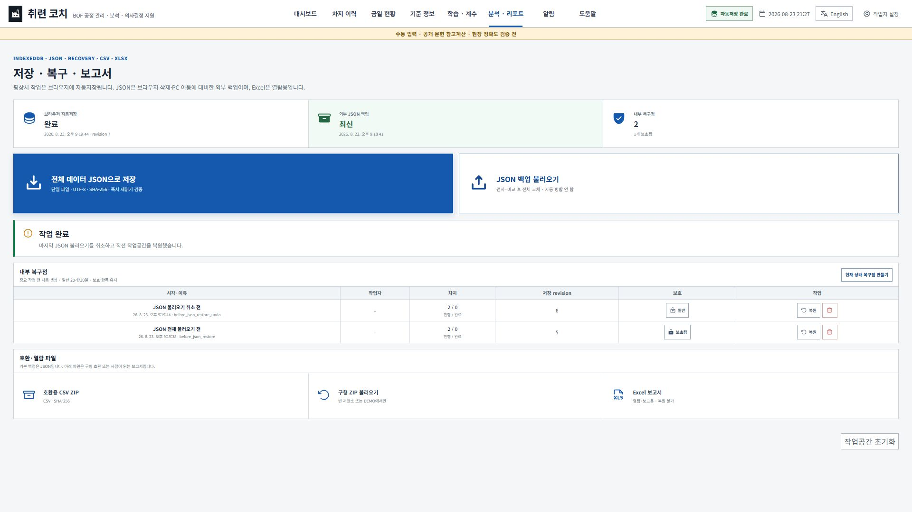
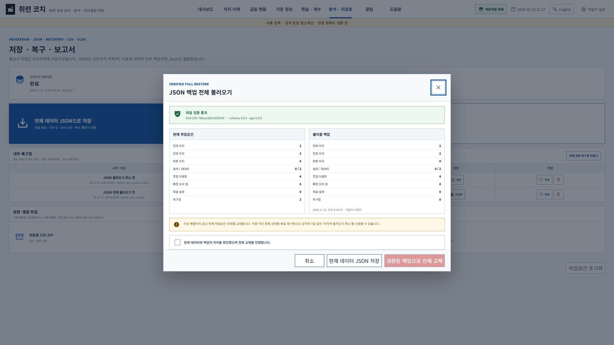

# 취련 코치 v0.6.0 사용 설명서 / BOF Endpoint Coach v0.6.0 User Guide

이 문서는 현장에서 작업 순서를 빠르게 확인하는 한영 요약 설명서입니다. 모든 필드·단위·입력 예·오류 조건·정정·학습·JSON 복구 설명은 [초상세 처음사용자 설명서](manual/취련코치_초상세_처음사용자_설명서_v0.6.0.md)를 사용하십시오. 이미지가 포함된 오프라인 설명서는 `BOF_Endpoint_Coach_DETAILED_USER_GUIDE_v0.6.0.html`입니다.

> **안전·품질 경계:** C·온도·P·Mn·Si·S는 공개 문헌 시나리오와 수동 입력으로 계산한 참고예상입니다. 실제 BOF 정확도는 아직 검증되지 않았습니다. 설비 제어, 인터록, 표준작업, 실험실 분석, 출강 승인, 취련사의 판단을 대체하지 않습니다.

## 한국어

### 1. 실행 전 준비

1. `BOF_Endpoint_Coach_v0.6.0.html`을 회사 PC의 고정 작업 폴더에 저장합니다.
2. Microsoft Edge 또는 Google Chrome에서 파일을 엽니다. 설치·서버·인터넷 연결은 필요하지 않습니다.
3. 1920×1080, 브라우저 배율 100%를 권장합니다.
4. 첫 화면에서 기록에 표시할 작업자 이름을 입력합니다. 로그인 계정이나 조직명이 아닙니다.
5. 기능 연습은 `DEMO로 체험`, 실제 수동 기록은 `빈 작업으로 시작`을 선택합니다.
6. 첫 실제 차지 전에 `기준 정보`의 강종·재료·설비·계수를 확인합니다.

### 2. 대시보드 읽기

| 구역 | 역할 |
| --- | --- |
| 상단 차지 탭 | 여러 진행 차지를 클릭해 전환하고 확인 필요 수 비교 |
| 상단 요약 | 차지·강종·단계·경과·산소·예상 출강·다음 행동 |
| 좌측 G0~G8 | 장입부터 후처리까지 공정 단계와 실제 전환시각 |
| 중앙 현재 해야 할 일 | 지금 입력할 항목, 큰 주 행동 버튼, 단계 완료조건 |
| 품질 막대 | 실측·종점 참고예상·문헌 시나리오·강종 목표 비교 |
| Data Ledger | 입력·분석·계산·자동저장 최신성과 외부 JSON 상태 |
| 하단 버튼 | 자재·샘플·분석·체크포인트·재취련·출강 기록 |

검은 점은 최신 채택 실측, 흰 점은 종점 참고예상, 녹색 구간은 강종 목표입니다. 문헌 시나리오 저·고값은 통계적 신뢰구간이 아닙니다.

### 3. 신규 차지와 G0

`신규 차지`에서 차지 번호·강종·설비·계수·실제 시작시각을 선택합니다.

| 계산 핵심값 | 단위 | 뜻 |
| --- | --- | --- |
| 용선 중량·C·온도 | kg/t/g, %/wt%/ppm, °C | 초기 물질·열수지 |
| 스크랩 중량·C | kg/t/g, %/wt%/ppm | 냉각·탄소 수지 |
| 초기 부원료 | kg/t/g | G0 이전 flux 합계 |
| 계획 총 산소 | Nm³ | 계획 종점 산소량 |

용선과 스크랩의 Si·Mn·P·S를 알면 함께 입력하십시오. 공란이면 문헌 대체값이 늘어납니다.

### 4. G0부터 G8까지

1. 중앙 파란 버튼을 눌러 현재 권장 입력을 엽니다.
2. 기본 시각은 PC 현재시각이며 실제 발생시각으로 바꿀 수 있습니다.
3. 자재는 이번 투입량, 체크포인트는 현재까지 누적 산소·랜스·유량을 기록합니다.
4. 샘플 채취 뒤 분석 결과에 샘플 시점 누적 산소와 가능한 C·온도·P·Mn·Si·S를 입력합니다.
5. 최신 채택 분석 하나가 현재 종점예상을 다시 고정합니다. 이전 샘플은 비교 이력에 남습니다.
6. 실제 공정이 바뀐 뒤에만 단계 전환을 기록합니다.
7. 재취련은 이번 추가 산소량, 출강은 이미 실행된 출강 사실과 시각을 기록합니다.

### 5. 종점예상 근거

`문헌 기본 + 최신 채택 샘플 보정 + 승인된 현장 오프셋 = 표시 종점 참고예상`

근거 펼침에서 적용 그룹, 계산식·계수버전, 학습 실행, 문헌 대체값과 경고를 확인합니다. P·Mn·Si·S도 숫자를 표시하지만 현장별 슬래그·교반·원료·회수율 의존성이 크므로 실제 분석을 우선합니다.

### 6. 잘못 입력했을 때

| 상황 | 기능 |
| --- | --- |
| 방금 수치 오류 | 해당 기록 `수정` 또는 `무효` |
| 마지막 단계 전환 오조작 | `마지막 단계 전환 취소` |
| 몇 단계 전 기록 오류 | 단계 유지, 과거 기록 정정, 이후 계산 재검증 |
| 실제 조업 중단 | `차지 취소` |
| 출강 시각 오류 | `출강 기록 정정` |
| 출강 후 확정 분석 변경 | 다른 분석을 `종점 실제값`으로 지정 |

정정에는 영향 미리보기와 사유가 필요하며 원본은 정정대장에 남습니다.

### 7. 학습·계수 추천

오차는 `확정 실제 − 저장된 종점예상`으로 누적하고 강종·설비·계산식·계수버전·실제/DEMO 기준으로 분리합니다.

| 같은 그룹 실제 오차 수 | 해석 |
| ---: | --- |
| 1~9 | 원장 축적 |
| 10~29 | 편향 방향 참고 |
| 30~49 | 임시 후보 |
| 50~69 | 검증표본 대기 |
| 70 이상 | 앞쪽 n−20 학습, 최신 20 검증 가능 |

각 학습 실행은 사용 데이터, 제외 이유, 학습/검증 성능, 후보 오프셋, SHA-256을 저장합니다. 새 데이터가 들어오면 과거 실행은 삭제하지 않고 `오래됨`으로 표시합니다. 추천은 자동 적용되지 않으며 설정 초안·작업자 검토·현장 승인·새 버전 저장을 거쳐야 합니다.

### 8. 자동저장·JSON·복구점

- IndexedDB 자동저장: 상태 변경 약 250ms 후 저장, 재실행 시 자동 복원
- 단일 JSON: 작업공간·설정·오차·학습·모델·유효 복구점을 한 파일에 저장
- 저장 검증: canonical UTF-8, SHA-256, 즉시 재읽기, 스키마·참조·시각·설정 검증
- 내부 복구점: 중요 작업 직전 자동 생성, 일반 20개/30일, 보호 항목 유지
- 호환 CSV ZIP: v0.5 계열 호환용
- XLSX: 열람·보고용이며 복원 입력이 아님

JSON 불러오기는 자동 병합하지 않고 전체 교체합니다. 현재/백업 요약과 해시를 비교하고 확인 체크를 해야 적용됩니다. 적용 직전 현재 상태를 보호 복구점으로 만들며 7일 동안 `마지막 불러오기 취소`를 사용할 수 있습니다.

### 9. 데이터와 보안

- 네트워크 전송과 PLC·HMI·SCC·MES·LIMS 연동은 없습니다.
- 자동저장은 같은 브라우저 안의 편의 기능일 뿐 외부 백업이 아닙니다.
- 교대·계수변경·브라우저 초기화·PC 이동 전에 전체 JSON을 저장하십시오.
- 실제 회사 차지, 사내 기준, 개인정보, 현장 계수, 자격증명을 공개 저장소에 올리지 마십시오.
- 같은 HTML을 여러 창에서 열어 충돌이 감지되면 오래된 창은 쓰기가 막힙니다. 최신 상태를 다시 읽으십시오.

## English quick guide

1. Open `BOF_Endpoint_Coach_v0.6.0.html` in Microsoft Edge or Google Chrome at 100% zoom; 1920×1080 is recommended.
2. Enter a local operator display name. It is not a login or a fixed department label.
3. Choose synthetic **DEMO** for practice or an empty workspace for manual field entry.
4. Review grade, material, equipment, gate, unit, and coefficient settings before creating a heat.
5. Create the heat with actual G0 data and follow the central **Do this now** action.
6. Record actual event times. Use Nm³ for cumulative oxygen and Nm³/min for oxygen flow.
7. Enter samples and analyses. Only the latest adopted result anchors the current endpoint estimate; earlier valid results remain in the residual ledger.
8. Read the estimate as **literature baseline + adopted-sample adjustment + approved site offset**.
9. After tapping, explicitly mark a confirmed analysis as the actual endpoint before it can enter learning.
10. Review reproducible learning runs and coefficient candidates. No candidate is applied automatically.
11. Routine work is autosaved to IndexedDB. Export the full integrity-checked JSON before handover, settings changes, browser cleanup, or PC transfer.
12. JSON restore is a verified full replacement, not a merge. A protected pre-restore point enables a seven-day undo.

**Field limits:** all six endpoint values remain unvalidated public-literature reference estimates. Scenario ranges are not confidence intervals. Always prioritize plant standards, laboratory results, interlocks, tap authorization, and operator judgment.
