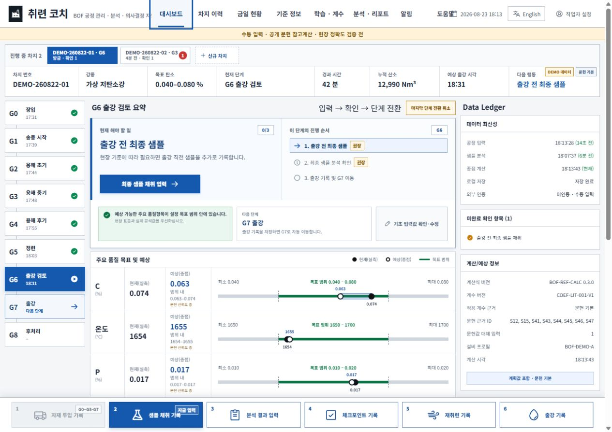
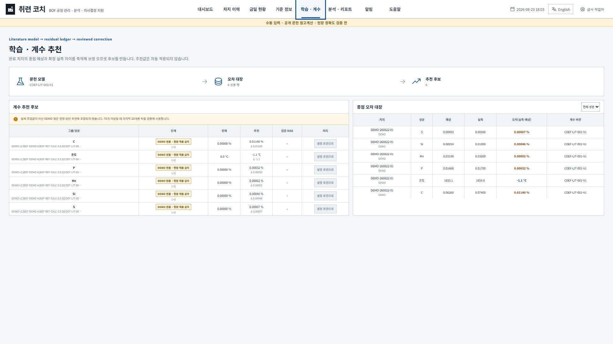
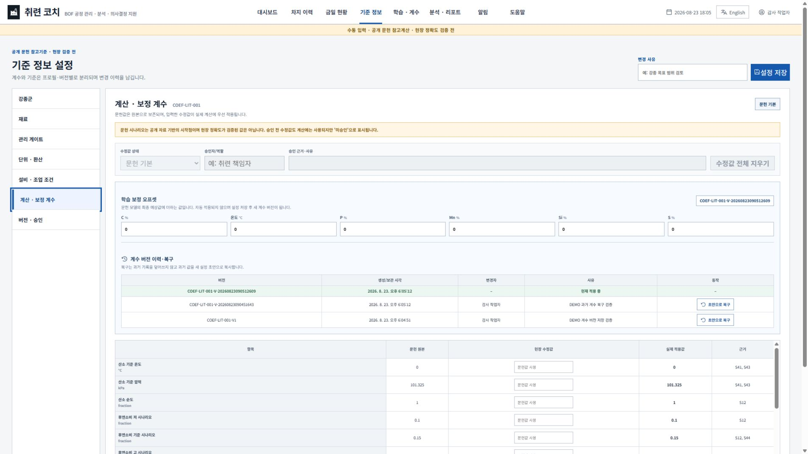
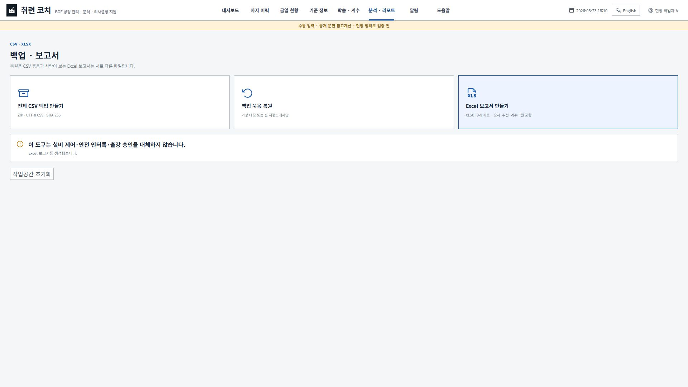

# 취련 코치 v0.5.0 사용 설명서 / BOF Endpoint Coach v0.5.0 User Guide

이 문서는 작업 순서를 빠르게 확인하는 한영 요약 설명서입니다. 화면의 모든 필드·단위·입력 예·오류 조건·정정·학습계수 해석은 [초상세 처음사용자 설명서](manual/취련코치_초상세_처음사용자_설명서_v0.5.0.md)를 사용하십시오. 이미지가 포함된 오프라인 설명서는 `release/BOF_Endpoint_Coach_DETAILED_USER_GUIDE_v0.5.0.html`입니다.

> **안전·품질 경계:** C·온도·P·Mn·Si·S는 공개 문헌과 합성 DEMO 계수로 계산한 참고예상입니다. 실제 BOF 정확도는 아직 검증되지 않았습니다. 설비 제어, 인터록, 표준작업, 실험실 분석, 출강 승인, 취련사의 판단을 대체하지 않습니다.

## 한국어

### 1. 실행 전 준비

1. `BOF_Endpoint_Coach_v0.5.0.html`을 회사 PC의 작업 폴더에 저장합니다.
2. Microsoft Edge 또는 Google Chrome에서 엽니다. 설치·서버·인터넷 연결은 필요하지 않습니다.
3. 회사 기준 1920×1080, 브라우저 배율 100%를 권장합니다.
4. 첫 화면에서 새 기록에 표시할 작업자 이름을 입력합니다. 로그인 계정이나 조직명이 아닙니다.
5. 기능 연습은 `DEMO로 체험`, 실제 수동 입력 준비는 `빈 작업으로 시작`을 선택합니다.
6. 첫 실제 차지 전에 `기준 정보`에서 강종·재료·설비·계수를 검토합니다.

### 2. 대시보드 읽기

| 구역 | 역할 |
| --- | --- |
| 상단 차지 탭 | 여러 진행 차지를 전환하고 최근 입력·확인 필요·위험 수를 비교 |
| 상단 요약 | 차지·강종·현재 단계·경과시간·누적 산소·예상 출강·다음 행동 |
| 좌측 G0~G8 | 장입부터 후처리까지 실제 공정 단계와 전환 시각 |
| 중앙 현재 해야 할 일 | 지금 입력할 항목과 버튼, 단계 완료조건, 다음 단계 |
| 품질 막대 | 실측, 종점 참고예상, 문헌 시나리오, 강종 목표를 같은 축에서 비교 |
| 우측 Data Ledger | 입력·저장·계산 최신성, 계수버전, 외부연동 여부, 확인 필요 |
| 하단 입력 버튼 | 자재, 샘플, 분석, 체크포인트, 재취련, 출강 기록 |

품질 막대의 검은 점은 최신 채택 실측, 흰 점은 종점 참고예상, 녹색 구간은 강종 목표입니다. 옅은 문헌 시나리오는 민감도 범위이며 통계적 신뢰구간이 아닙니다.

### 3. 기준 정보

- 강종: C·온도·P·Mn·Si·S의 양측 또는 단측 목표를 설정합니다.
- 재료: 질량 기본단위와 C·Si·Mn·P·S·CaO·MgO·SiO2·Al2O3·FeO·Fe2O3·MnO·P2O5 조성을 관리합니다. 조성 합계가 100%를 넘으면 저장할 수 없습니다.
- 취련 중 `Alloy`·`Scrap` 투입은 등록 조성과 질량을 원소수지에 넣되, 별도 수율계수가 없어 명목 100% 금속 회수를 가정합니다. 실제 합금 수율이 아닙니다.
- 설비: 전로 용량, 취련 방식, 랜스 프로필, 저취가스를 구분합니다.
- 계산·보정계수: 문헌 원본, 사용자 수정, 현장 승인 상태와 C·온도·P·Mn·Si·S 오프셋을 관리합니다.
- 설정 변경은 사유를 요구하며, 의미 있는 계수 변경은 이전값을 보존한 새 날짜형 버전을 만듭니다.

### 4. 신규 차지와 G0

`신규 차지`에서 차지 번호·강종·설비·계수·시작 시각과 계산 핵심값을 입력합니다.

| 계산 핵심값 | 단위 | 뜻 |
| --- | --- | --- |
| 용선 중량·탄소·온도 | kg/t/g, %/wt%/ppm, °C | 초기 물질·열수지 |
| 스크랩 중량·탄소 | kg/t/g, %/wt%/ppm | 냉각·탄소 수지 |
| 초기 부원료 | kg/t/g | G0 이전 flux 합계 |
| 계획 총 산소 | Nm³ | 계획 종점 산소량 |

용선과 스크랩의 Si·Mn·P·S를 알고 있으면 함께 입력하십시오. 공란이면 일부 항목은 문헌 대체값을 사용하므로 정확도는 더 낮습니다.

### 5. G0부터 G8까지

1. 중앙의 큰 파란 버튼을 눌러 현재 권장 기록을 엽니다.
2. 기본 시각은 현재 로컬 시각이며, 실제 발생 시각으로 수정할 수 있습니다.
3. 자재 투입은 이번 투입량, 체크포인트는 지금까지의 누적 산소·랜스·유량을 기록합니다.
4. 샘플 채취 후 분석 결과에 샘플 시점 누적 산소와 C·온도, 가능한 P·Mn·Si·S를 입력합니다.
5. 최신 채택 분석 하나가 종점 참고예상을 다시 고정합니다. 이전 샘플은 오차 비교에 남습니다.
6. 실제 공정이 바뀐 뒤에만 `Gx → Gy` 단계 전환을 기록합니다.
7. 재취련은 이번 추가 산소량을 기록하고, 출강은 이미 실행된 출강 사실을 기록합니다.

버튼이 회색이면 아래 표시된 활성 조건을 먼저 충족해야 합니다. 버튼은 장식이 아니며 가능한 단계에서 실제 입력창을 엽니다.

### 6. 잘못 입력했을 때

| 상황 | 기능 |
| --- | --- |
| 방금 수치 오류 | 해당 기록 `수정` 또는 `무효` |
| 마지막 단계 전환 오조작 | `마지막 단계 전환 취소`로 한 단계 복귀 |
| 몇 단계 전 기록 오류 | 단계는 유지하고 과거 기록 정정, 이후 계산 재검증 |
| 실제 조업 중단 | `차지 취소` |
| 출강 시각 오류 | `출강 기록 정정` |
| 출강 후 확정 분석 변경 | 다른 분석을 `종점 실제값`으로 지정 |

정정에는 영향 미리보기와 사유가 필요합니다. 원본은 삭제되지 않고 정정대장에 남습니다.

### 7. 오차대장과 계수 추천

출강 직전 저장된 예상과 출강 후 지정한 확정 실제값의 오차를 `실제 − 예상`으로 누적합니다. 데이터는 강종·설비·계산식·계수버전·DEMO/실제 기준으로 분리합니다.

| 같은 그룹 실제 오차 수 | 화면 해석 |
| ---: | --- |
| 1~9 | 원장 축적만 가능 |
| 10~29 | 편향 방향 참고 |
| 30~49 | 임시 추천 후보, 작업자 검토 필요 |
| 50~69 | 독립 검증표본 대기 |
| 70 이상 | 앞쪽 n−20 학습, 최신 20 독립 검증 가능 |

DEMO와 과거 계수버전 추천은 현재 현장 계수에 적용할 수 없습니다. 추천은 `설정 초안으로`만 전달되며 자동 저장·자동 승인·자동 배포되지 않습니다.

### 8. 계수 버전과 복구

오프셋 단위는 성분 `percentage point(%p)`, 온도 `°C`입니다. 과거 버전의 `초안으로 복구`는 현재 이력을 덮지 않고 과거 값을 새 편집 초안으로 복사합니다. 변경 사유와 함께 저장하면 새 버전이 생기므로 잘못 조정한 계수도 날짜별 이력을 이용해 되돌릴 수 있습니다.

### 9. 백업·복원·Excel

- CSV ZIP은 복원용입니다. `manifest.csv`와 차지·이벤트·샘플·분석·기준·운영로그·계수버전·오차대장 CSV 9종을 포함합니다.
- 프로그램이 생성 직후 ZIP을 다시 읽어 SHA-256, 행 수, 참조, 공정 시각과 값을 검사한 뒤 다운로드합니다.
- 복원은 현재 작업공간을 바꾸는 작업이므로 경고와 검증을 거칩니다.
- XLSX는 `Heat summary`부터 `Read me`까지 9개 시트의 열람·보고용 파일이며 복원 입력이 아닙니다.
- 교대, 브라우저 초기화, PC 이동, 계수 변경 전에 CSV ZIP 백업을 저장하십시오.

### 10. 데이터와 보안

- 운영 데이터는 브라우저의 로컬 IndexedDB에 저장되고 외부 서버로 전송되지 않습니다.
- PLC·HMI·SCC·MES·LIMS 연동은 없으며 모든 값은 작업자가 수동 입력합니다.
- 실제 회사 차지, 사내 기준, 개인 정보, 현장 계수, 자격 증명을 공개 저장소에 올리지 마십시오.
- 같은 HTML을 여러 창에서 열어 충돌이 감지되면 오래된 창은 읽기 전용이 됩니다. 비상 백업 후 최신 저장소를 다시 읽으십시오.

## English quick guide

1. Open `BOF_Endpoint_Coach_v0.5.0.html` in Microsoft Edge or Google Chrome at 100% zoom.
2. Enter an operator display name. It is not a login or fixed department name.
3. Choose synthetic **DEMO** for practice or an empty workspace for manual field entry.
4. Review grade, material, equipment, and coefficient settings before creating a heat.
5. Create the heat with actual G0 data and follow the central **Do this now** action.
6. Record actual event times. Use Nm³ for cumulative oxygen and Nm³/min for oxygen flow.
7. Enter samples and analyses. Only the latest adopted analysis anchors the current endpoint estimate; all valid samples remain in the trajectory residual table.
8. After tapping, mark a confirmed analysis as **Actual endpoint** to compare C, temperature, P, Mn, Si, and S.
9. Review residual-based coefficient candidates. They are never applied automatically.
10. Export an integrity-checked CSV ZIP before shift handover or settings changes. XLSX is for reporting, not restore.

**Field limits:** all six endpoint values are unvalidated public-literature reference estimates. Scenario ranges are not confidence intervals. Always prioritize plant standards, laboratory results, interlocks, tap authorization, and operator judgment.
